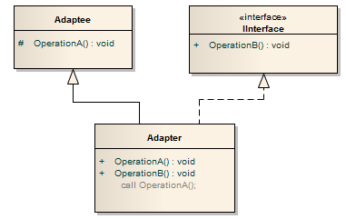

# Adapter




> The Adapter Design Pattern allows you to make an existing class work with other existing class libraries without changing the code of the existing class.

- The `Adaptee` is the existing class.

- The `IInterface` is the interface defined in the existing library.

- The `Adapter` is the class that you create, it is inherited from the `Adaptee` class and it implements the `IInterface` interface. Notice that it can call the `OperationA` method(inherited from the `Adaptee`) inside its `OperationB` method(implemented by the `IInterface`).

_Muitas vezes, precisamos usar os métodos de uma classe existente para trabalhar com outras bibliotecas existentes. A maneira de fazer isso é criando outra classe, denominada Adapter, que herda da classe existente ao implementar a interface da biblioteca existente. O resultado final é que o Adapter pode chamar o método da classe existente (uma vez que o Adapter herda da classe existente) e pode trabalhar na biblioteca existente (uma vez que o Adapter implementa a interface da biblioteca existente)._

- O Adapter, como o próprio nome já diz, é um adaptador utizado para classes que contenham interfaces incompatíveis.

- O objetivo do Adapter é promover a conversão da interface de uma classe para outra interface utilizável para o cliente, fazendo com que várias classes possam trabalhar em conjunto independentemente das interfaces originais, cujas classes não pode ser alteradas por alguma razão. Ele é definido como “um padrão que converte uma interface de uma classe para outra interface que o cliente espera manipular/conhecer. O Adapter aceita que classes com interfaces conflitantes trabalhem juntas”.

- Converter a interface de uma classe em outra interface, esperada pelo cliente. O Adapter permite que interfaces incompatíveis trabalhem em conjunto – o que, de outra forma, seria impossível.

- O padrão de design do Adapter é um padrão estrutural e usado para que duas interfaces não relacionadas possam funcionar juntas. O objeto que une essa interface não relacionada é chamado de Adapter.

- Já tentou usar um cartão de memória da sua câmera no seu laptop. Você não pode usá-lo diretamente simplesmente porque não há porta no laptop que o aceite. Você deve usar um leitor de cartão compatível. Você coloca seu cartão de memória no leitor de cartões e, em seguida, injete o leitor de cartão no laptop. Este leitor de cartões pode ser chamado de Adapter. O padrão de Adapter é usado para fins semelhantes. Permite que duas interfaces incompatíveis funcionem sem problemas umas com as outras.

- Converta a interface de uma classe em outra interface que os clientes esperam. O Adapter permite que as classes trabalhem juntas que não poderiam ser feitas por causa de interfaces incompatíveis.

- O design do Adapter é muito útil para a integração do sistema quando alguns outros componentes existentes precisam ser adaptados pelo sistema existente sem modificações no código fonte.

- Converte a interface de uma classe em outra interface que um cliente deseja. Em outras palavras, fornecer uma interface de acordo com o requisito do cliente ao usar os serviços de uma classe com uma interface diferente.

- Permite que classes com interfaces diferentes funcionem juntas criando um objeto comum pelo qual eles podem se comunicar e interagir.

- O padrão do Adapter é um padrão de design estrutural que permite que você reutilize uma classe com uma interface diferente, permitindo que ela seja usada por um sistema que use diferentes métodos de chamada.

- um Adapter converte uma classe de `Adaptee` já existente que apresenta uma interface não utilizável (talvez implícita) para outra interface de `Target`, que outros componentes de `Clients` estão prontos para usar.

- Não considere um Adapter apenas como um patch para fazer bibliotecas diferentes funcionarem juntas: seu uso é muitas vezes mandado no mesmo aplicativo, para conectar áreas de diferentes responsabilidades.

## Onde usar o padrão de design?

O uso principal desse padrão é quando uma classe que você precisa usar não atende aos requisitos de uma interface.

- Quando um objeto precisa utilizar uma classe existente com uma interface incompatível.

- Quando você deseja criar uma classe reutilizável que coopera/interaja com classes que não possuem interfaces compatíveis.

- Uma classe a ser usada não atende aos requisitos da interface.

- Condições complexas relacionam o comportamento do objeto com seu estado.

- As transições entre estados precisam ser explícitas.

## Vantagens do padrão

- Permite que dois ou mais objetos anteriormente incompatíveis interajam.

- Permite a reutilização das funcionalidades existentes.

## Intenção

- Converta a interface de uma classe para uma outra interface que os clientes esperam.

- O Adapter permite que as classes funcionem juntas, o que não poderia ser contrário por causa de interfaces incompatíveis.

## Participantes

- **`Target`**
    - Interface específica do `Client`.
    - Define a interface específica do aplicativo que o `Cliente` usa diretamente.
    - Esta é a classe de interface desejada que será usada pelos clientes.
    - Esta é a interface que é utilizada pelo cliente para alcançar a funcionalidade.

- **`Client`**
    - Os objetos compatíveis com a interface de `Target`.
    - Sua aplicação que funcionando com a interface `Target`.
    - Faz uso de um objeto que implementa a interface de `Target`.
    - Esta é a classe que quer alcançar alguma funcionalidade usando o código do `Adaptee`.

- **`Adaptee`**
    - Interface que precise ser adaptada.
    - Define uma interface incompatível existente que precisa ser adaptada antes de usar na aplicação.
    - Esta é a classe que é usada pela classe `Adapter` para reutilizar a funcionalidade existente e modificá-los para o uso desejado.
    - Esta é a funcionalidade que o cliente deseja, mas sua interface não é compatível com o cliente.

- **`Adapter`**
    - Adapta a interface `Adaptee` para a interface `Target`. É o intermediário.
    - Interface do `Adaptee`, adaptada à interface do `Target`.
    - Esta classe é uma classe de wrapper que implementa a interface `Target` e modifica a solicitação específica disponível da classe `Adaptee`.
    - Implementação do `Target` que encaminha o real trabalho para o `Adaptee`, enquanto o esconde totalmente.
    - Esta é a classe que implementaria o `ITarget` e chamaria o código `Adaptee` que o cliente deseja chamar.

## Exemplos

### Modelo estrutural

```csharp
using System;

namespace Adapter
{
    public class Program
    {
        static void Main(string[] args)
        {
            // Create adapter and place a request
            Target target = new Adapter();
            target.Request();
        }
    }

    // The 'Target' class
    class Target
    {
        public virtual void Request()
        {
            Console.WriteLine("Called Target Request()");
        }
    }

    // The 'Adapter' class
    class Adapter : Target
    {
        private Adaptee _adaptee = new Adaptee();

        public override void Request()
        {
            // Possibly do some other work and then call SpecificRequest
            _adaptee.SpecificRequest();
        }
    }

    // The 'Adaptee' class
    class Adaptee
    {
        public void SpecificRequest()
        {
            Console.WriteLine("Called SpecificRequest()");
        }
    }
}
```

**Output**

```
Called SpecificRequest()
```

### Modelo de conta bancária

```csharp
using System;

namespace Adapter
{
    public class Program
    {
        static void Main(string[] args)
        {
            CreditCard targetInterface = new BankCustomer();
            targetInterface.GiveBankDetails();

            Console.WriteLine();
            Console.WriteLine(targetInterface.GetCreditCard());
        }
    }

    //  Target interface
    public interface CreditCard
    {
        void GiveBankDetails();
        String GetCreditCard();
    }

    // Adaptee Class
    public class BankDetails
    {
        protected string BankName { get; set; }
        protected string AccHolderName { get; set; }
        protected long AccNumber { get; set; }
    }

    // Adapter class
    public class BankCustomer : BankDetails, CreditCard
    {
        public void GiveBankDetails()
        {
            try
            {
                Console.WriteLine("Enter the account holder name: ");
                string customerName = Console.ReadLine();

                Console.WriteLine();

                Console.WriteLine("Enter the account number: ");
                if (!long.TryParse(Console.ReadLine(), out long accno)) {
                    throw new Exception("Invalid account number entered");
                }

                Console.WriteLine();

                Console.WriteLine("Enter the bank name: ");
                string bankName = Console.ReadLine();

                this.BankName = bankName;
                this.AccHolderName = customerName;
                this.AccNumber = accno;

            } catch (Exception e) {
                Console.WriteLine(e);
            }
        }

        public string GetCreditCard()
        {
            return ($"The Account number {this.AccNumber} of {this.AccHolderName} in {this.BankName} bank is valid and authenticated for issuing the credit card.");
        }
    }
}
```

**Output**

```
Enter the account holder name:
Allyson

Enter the account number:
1234

Enter the bank name:
Nome do Banco

The Account number 1234 of Allyson in Nome do Banco bank is valid and authenticated for issuing the credit card.
```

### Modelo de banco de dados químicos

- _Target_ (`ChemicalCompound`)
- _Adapter_ (`Compound`)
- _Adaptee_ (`ChemicalDatabank`)
- _Client_ (`AdapterApp`)

```csharp
using System;

namespace Adapter
{
    public class Program
    {
        static void Main(string[] args)
        {
            // Non-adapted chemical compound
            Compound unknown = new Compound("Unknown");
            unknown.Display();

            // Adapted chemical compounds
            Compound water = new RichCompound("Water");
            water.Display();

            Compound benzene = new RichCompound("Benzene");
            benzene.Display();

            Compound ethanol = new RichCompound("Ethanol");
            ethanol.Display();
        }
    }

    // The 'Target' class
    class Compound
    {
        protected string _chemical;
        protected float _boilingPoint;
        protected float _meltingPoint;
        protected double _molecularWeight;
        protected string _molecularFormula;

        public Compound(string chemical)
        {
            this._chemical = chemical;
        }

        public virtual void Display()
        {
            Console.WriteLine("\nCompound: {0} ------ ", _chemical);
        }
    }

    // The 'Adapter' class
    class RichCompound : Compound
    {
        private ChemicalDatabank _bank;

        public RichCompound(string name) : base(name)
        {
        }

        public override void Display()
        {
            // The Adaptee
            _bank = new ChemicalDatabank();

            _boilingPoint = _bank.GetCriticalPoint(_chemical, "B");
            _meltingPoint = _bank.GetCriticalPoint(_chemical, "M");
            _molecularWeight = _bank.GetMolecularWeight(_chemical);
            _molecularFormula = _bank.GetMolecularStructure(_chemical);

            base.Display();

            Console.WriteLine(" Formula: {0}", _molecularFormula);
            Console.WriteLine(" Weight : {0}", _molecularWeight);
            Console.WriteLine(" Melting Pt: {0}", _meltingPoint);
            Console.WriteLine(" Boiling Pt: {0}", _boilingPoint);
        }
    }

    // The 'Adaptee' class
    class ChemicalDatabank
    {
        // The databank 'legacy API'
        public float GetCriticalPoint(string compound, string point)
        {
            // Melting Point
            if (point == "M") {

                switch (compound.ToLower()) {
                    case "water": return 0.0f;
                    case "benzene": return 5.5f;
                    case "ethanol": return -114.1f;
                    default: return 0f;
                }
            }
            // Boiling Point
            else {
                switch (compound.ToLower()) {
                    case "water": return 100.0f;
                    case "benzene": return 80.1f;
                    case "ethanol": return 78.3f;
                    default: return 0f;
                }
            }
        }

        public string GetMolecularStructure(string compound)
        {
            switch (compound.ToLower())
            {
                case "water": return "H20";
                case "benzene": return "C6H6";
                case "ethanol": return "C2H5OH";
                default: return "";
            }
        }

        public double GetMolecularWeight(string compound)
        {
            switch (compound.ToLower())
            {
                case "water": return 18.015;
                case "benzene": return 78.1134;
                case "ethanol": return 46.0688;
                default: return 0d;
            }
        }
    }
}
```

**Output**

```
Compound: Unknown ------

Compound: Water ------
 Formula: H20
 Weight : 18.015
 Melting Pt: 0
 Boiling Pt: 100

Compound: Benzene ------
 Formula: C6H6
 Weight : 78.1134
 Melting Pt: 5.5
 Boiling Pt: 80.1

Compound: Ethanol ------
 Formula: C2H5OH
 Weight : 46.0688
 Melting Pt: -114.1
 Boiling Pt: 78.3
```

### Exemplo para interfaces de collections no PHP

```php
/**
 * The Target interface: a small Collection, since php lacks a native one.
 * The bigger the interface, the greater the hassle while writing Adapters.
 */
interface Collection extends IteratorAggregate
{
    public function add($element);

    /**
     * @return boolean
     */
    public function contains($element);

    public function remove($element);
}

/**
 * The Adaptee is not a class but an array.
 * This is the Adapter. Adapters for procedural structures are common in php,
 * much more than for classes. If it composed an object instead of an array
 * it would still be an implementation of the Adapter pattern.
 */
class ArrayAdapter implements Collection
{
    private $_array;

    public function __construct(array $array)
    {
        $this->_array = $array;
    }

    public function add($element)
    {
        $this->_array[] = $element;
    }

    /**
     * @return boolean
     */
    public function contains($element)
    {
        return in_array($element, $this->_array);
    }

    public function remove($element)
    {
        $index = array_search($element, $this->_array);

        if ($index !== false) {
            unset($this->_array[$index]);
        }

    }

    public function getIterator()
    {
        return new ArrayIterator($this->_array);
    }
}

/**
 * The Client. It would love to print an array, but it only accepts Collections.
 */
class Printer
{
    public function printAndRemove(Collection $c)
    {
        foreach ($c as $index => $element) {
            $c->remove($element);
            printf("| %.6s => %.6s |", $index, $element);
        }

        echo "\n";
    }
}

// the Adaptee
$array = array('foo', 'bar', 'baz');
$adapter = new ArrayAdapter($array);

$printer = new Printer();
$printer->printAndRemove($adapter);

var_dump($adapter->contains('foo'));
```

**Output**

```
| 0 => foo || 1 => bar || 2 => baz |
bool(false)
```

### Exemplo de interfaces incompatíveis entre diferentes sistemas(Loja online)

Agora, vejamos um exemplo para ver como funciona o padrão de Adapter. Imagine um portal de compras online que exiba os produtos para venda em sua página inicial. Esses produtos são provenientes de um fornecedor de terceiros com o qual o portal fez um acordo para vender produtos. O fornecedor já possui um sistema de inventário que pode dar a lista de produtos que está vendendo. Não há nenhuma interface disponível para o portal de compras online com o qual o portal pode chamar o código de inventor do fornecedor.

Uma vez que queremos chamar o código do fornecedor que é incompatível com o código do cliente (portal de compras online), podemos então, aplicar o "padrão de design do Adapter". Vamos primeiro ajustar os participantes de um padrão de Adapter em nosso cenário.

- **`ITarget`**: Método que o portal de compras online chama para obter a lista de produtos. Aqui, obter a lista de produtos é a funcionalidade que este portal deseja alcançar e esta solicitação foi encapsulada nesta interface. Em resumo - A funcionalidade para alcançar é exposta através desta interface.

- **`Adaptee`**: O código do fornecedor que nos fornece a lista de produtos.

- **`Adapter`**: O wrapper que implementa `ITarget` e chama o código do fornecedor.

- **`Client`**: O código do portal de compras online que obtém a lista de produtos e depois os exibe.

```csharp
using System;
using System.Collections.Generic;

namespace Adapter
{
    interface ITarget
    {
        List<string> GetProducts();
    }

    public class VendorAdaptee
    {
        public List<string> GetListOfProducts()
        {
            List<string> products = new List<string>();

            products.Add("Gaming Consoles");
            products.Add("Television");
            products.Add("Books");
            products.Add("Musical Instruments");

            return products;
        }
    }


    class VendorAdapter : ITarget
    {
        public List<string> GetProducts()
        {
            VendorAdaptee adaptee = new VendorAdaptee();

            return adaptee.GetListOfProducts();
        }
    }


    class ShoppingPortalClient
    {
        static void Main(string[] args)
        {
            ITarget adapter = new VendorAdapter();

            foreach (string product in adapter.GetProducts()) {
                Console.WriteLine(product);
            }

            Console.ReadLine();
        }
    }
}
```

*Output*

```
Gaming Consoles
Television
Books
Musical Instruments
```

No código acima, os participantes são mapeados como:

- `ITarget`: Interface Adapter.
- `VendorAdapter`: Implementa a interface `ITarget` e atuando como um wrapper/link entre `VendorAdaptee` e `ShoppingPortalClient`.
- `VendorAdaptee`: Este é o código que `ShoppingPortalClient` está interessado em chamar.
- `ShoppingPortalClient`: O cliente deseja chamar o código do `VendorAdptee`.

O código acima é auto-explicativo, o cliente que tem acesso à interface `ITarget` quer chamar o método `VendorAdaptee.GetListOfProduct()`, mas desde que `VendorAdaptee` não possui uma interface `ITarget`, foi necessário criar um adaptador `VendorAdapter`. O `VendorAdapter` implementa a interface `ITarget` e chama o método de adaptação.

Com base em como o adaptador chama a `adaptee`, ele pode ser nomeado como Adapter de classe, ou seja, quando o Adapter usa a herança de classe para chamar o código Adaptee. É chamado Adaptador de Objetos quando usa a composição do objeto para chamar o código de adaptação. Por exemplo, o `VendorAdapter` mostrado acima é um adaptador de objeto porque cria uma instância de (composição de objeto) `VendorAdaptee`.
