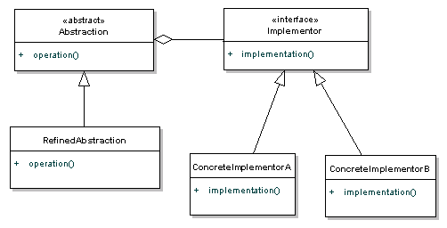

# Bridge





- Desacoplar uma abstração da sua implementação, de modo que as duas possam variar independentemente. Ou seja, o Bridge fornece um nível de abstração maior que o Adapter, pois são separadas a implementações e as abstrações, permitindo que cada uma varie independentemente.

- Permite separar a abstração da implementação. No padrão há 2 partes, a primeira parte é a Abstração, e a segunda parte é a Implementação. O padrão permite que a Abstração e a Implementação sejam desenvolvidas de forma independente, e o código do cliente só possa acessar a parte Abstração sem se preocupar com a parte da Implementação.

- O padrão é usado para desacoplar uma classe em duas partes - abstração e implementação - para que ambas possam evoluir no futuro sem afetar-se mutuamente. Diminui o acoplamento entre abstração de classe e sua implementação.

- *Desacoplar uma abstração de sua implementação para que os dois possam variar de forma independente.*

- Bridge é usado quando precisamos desacoplar uma abstração de sua implementação para que os dois possam variar de forma independente.

- *Este padrão envolve uma interface que atua como uma ponte que torna a funcionalidade de classes concretas independente das classes do implementador da interface. Ambos os tipos das classes podem ser alterados estruturalmente sem afetar-se mutuamente.*

- A `Abstraction` define a abstração e mantém a referência ao `Implementador`. `RefinedAbstraction` fornece uma extensão para a `Abstraction`, geralmente adicionando métodos extras que fornecem diferentes maneiras de obter a mesma funcionalidade. A interface `Implementor` define uma interface para as classes de implementação (as classes `ConcreateImplementor`). `RefinedAbstractions` são implementadas em termos de abstração, e não aquela interface de implementação. Isso significa que os detalhes de implementação estão ocultos do cliente. O padrão é semelhante ao padrão do _Adapter_, exceto que o padrão _Bridge_ separa a interface da implementação.

- _Bridge_ tem como principal função “Desacoplar uma abstração da sua implementação, de modo que as duas possam variar independentemente.” em outras palavras, o _Bridge_ provê um grau de abstração maior que o _Adapter_, pois as implementações e as abstrações, são feitas separadamente permitindo que elas funcionem independentemente.

- Quando uma abstração pode ter várias implementações geralmente define-se uma interface e deriva-se classes concretas com diferentes implementações Entretanto, a herança define uma dependência permanente, tornando difícil modificar, estender e reutilizar abstrações e implementações de forma independente. A intenção do _Bridge_ é justamente desacoplar uma abstração de sua implementação, de forma que as duas possam variar independentemente

O padrão de _Bridge_ é um padrão de design que separa os elementos abstratos de uma classe de sua implementação técnica. Isso proporciona uma implementação mais limpa de objetos do mundo real e permite que os detalhes de implementação sejam facilmente alterados. O padrão de _Bridge_ é um padrão muito valioso porque permite que você separe elementos abstratos de classe dos detalhes de implementação. Esse padrão pode ser usado, quando a classe varia frequentemente porque as mudanças na base do código podem ser feitas facilmente com um conhecimento mínimo sobre o programa.

Às vezes, uma implementação pode ter duas ou mais implementações diferentes. Consideremos um programa que manipule a persistência de objetos em diferentes plataformas. Alguns dos objetos devem ser salvos no banco de dados e outros objetos no sistema de arquivos. Quando simplesmente estende o programa com essa funcionalidade, isso pode causar problemas porque nós vinculamos a abstração com a implementação. Neste caso, é mais adequado usar o padrão _Bridge_ e abstração separada de sua implementação. Se não usarmos esse padrão, veremos que os detalhes de implementação estão incluídos dentro de uma abstração.

## Vantagens

O principal benefício do padrão é permite desenvolver as partes da Abstração e Implementação de forma independente. Também reduz o número de classes que você precisa criar para todas as possíveis combinações das Abstrações (conceitos de interface do usuário) e as Implementações (ações reais por trás da cena).

- Permite a separação da implementação da interface.
- Melhora a extensibilidade.
- Permite o esconder detalhes de implementação do cliente.

**Use quando**

- As abstrações e implementações não devem ser vinculadas no tempo de compilação.
- Abstrações e implementações devem ser extensíveis de forma independente.
- As mudanças na implementação de uma abstração não devem ter impacto nos clientes.
- Os detalhes de implementação devem ser ocultos do cliente.

## Participantes

- **`Abstraction`** (Classe abstrata)
    - Define a interface da abstração.
    - Mantém uma referência a um objeto de tipo `Implementor`.
    - Atua como classe base para outras classes de abstração refinada. Ele também faz referência a uma implementação particular que está usando para a funcionalidade específica da plataforma.

- **`RefinedAbstraction`**(Classe normal)
    - Estende a interface definida pela `Abstraction`.
    - Implementa a interface de abstração(`Abstraction`) usando uma referência a um objeto do tipo `Implementor`.
    - Fornece variações mais específicas da abstração, mas não contém detalhes de implementação. De fato, ele apenas amplia a abstração.

- **`Implementor`**(Interface)
    - Define a interface para classes de implementação. Esta interface não precisa corresponder diretamente à interface de abstração e pode ser muito diferente.
    - Define a interface para classes de implementação(`ConcreteImplementor`). Esta interface não precisa corresponder exatamente à interface da `Abstraction`; de fato, as duas interfaces podem ser bastante diferentes. Normalmente, a interface de implementação fornece apenas operações primitivas, e a Abstração define operações de nível superior com base nessas primitivas.

- **ConcreteImplementor**(Classe normal)
    - Implementa a interface `Implementor` e define sua implementação concreta.

## Exemplos

### Código Estrutural

#### 01

```csharp
using System;
using System.Collections.Generic;

namespace Bridge
{
    class Program
    {
        static void Main(string[] args)
        {
            Abstraction ab = new RefinedAbstraction();

            // Set implementation and call
            ab.Implementor = new ConcreteImplementorA();
            ab.Operation();

            // Change implemention and call
            ab.Implementor = new ConcreteImplementorB();
            ab.Operation();
        }
    }

    // The 'Abstraction' class
    abstract class Abstraction
    {
        protected Implementor implementor;

        public Implementor Implementor
        {
            set { implementor = value; }
        }

        public virtual void Operation()
        {
            implementor.Operation();
        }
    }

    // The 'Implementor' abstract class
    abstract class Implementor
    {
        public abstract void Operation();
    }

    // The 'RefinedAbstraction' class
    class RefinedAbstraction : Abstraction
    {
        public override void Operation()
        {
            implementor.Operation();
        }
    }

    // The 'ConcreteImplementorA' class
    class ConcreteImplementorA : Implementor
    {
        public override void Operation()
        {
            Console.WriteLine("ConcreteImplementorA Operation");
        }
    }

    // The 'ConcreteImplementorB' class
    class ConcreteImplementorB : Implementor
    {
        public override void Operation()
        {
            Console.WriteLine("ConcreteImplementorB Operation");
        }
    }
}
```

**Output**

```
ConcreteImplementorA Operation
ConcreteImplementorB Operation
```

#### 02

```csharp
using System;

namespace Bridge
{
    class Program
    {
        static void Main(string[] args)
        {
            Abstraction abstraction = new RefinedAbstraction
            {
                Implementor = new ConcreteImplementorA()
            };

            abstraction.Operation();
        }
    }

    abstract class Implementor
    {
        public abstract void Operation();
    }

    class Abstraction
    {
        protected Implementor implementor;

        public Implementor Implementor
        {
            set { implementor = value; }
        }

        public virtual void Operation()
        {
            implementor.Operation();
        }
    }

    class RefinedAbstraction : Abstraction
    {
        public override void Operation()
        {
            implementor.Operation();
        }
    }

    class ConcreteImplementorA : Implementor
    {
        public override void Operation()
        {
            Console.WriteLine("ConcreteImplementor's Operation");
        }
    }
}
```

**Output**

```
ConcreteImplementor's Operation
```

### Manipular arquivos em diferentes OSs

Digamos, estamos projetando um aplicativo que pode ser baixar e armazenar arquivos em qualquer sistema operacional . Eu quero projetar o sistema de tal maneira, eu poderia ser capaz de adicionar mais suporte de plataforma no futuro com uma mudança mínima. Além disso, se eu quiser adicionar mais suporte na classe do downloader (por exemplo, exclua o download apenas no Windows), então não deve afetar o código do cliente e o downloader do linux.

Aqui estou criando duas interfaces, `FileDownloaderAbstraction` que representa a abstração com a qual o cliente irá interagir; e `FileDownloadImplementor` que representa a implementação. Desta forma, ambas as hierarquias podem evoluir separadamente, sem afetar-se.

```csharp
using System;

namespace Bridge
{
    class Program
    {
        static void Main(string[] args)
        {
            String os = "linux";
            FileDownloaderAbstraction downloader = null;

            switch (os)
            {
                case "windows":
                    downloader = new FileDownloaderAbstractionImpl(new WindowsFileDownloadImplementor());
                    break;
                case "linux":
                    downloader = new FileDownloaderAbstractionImpl(new LinuxFileDownloadImplementor());
                    break;
                default:
                    Console.WriteLine("OS not supported !!");
                    break;
            }

            object fileContent = downloader.download("Some path");

            downloader.store(fileContent);
        }
    }

    public interface FileDownloaderAbstraction
    {
        object download(String path);
        bool store(object item);
    }

    public interface FileDownloadImplementor
    {
        object downloadFile(string path);
        bool storeFile(object item);
    }

    public class FileDownloaderAbstractionImpl : FileDownloaderAbstraction
    {
        private FileDownloadImplementor provider = null;

        public FileDownloaderAbstractionImpl(FileDownloadImplementor provider)
        {
            this.provider = provider;
        }

        public object download(string path)
        {
            return provider.downloadFile(path);
        }

        public bool store(object item)
        {
            return provider.storeFile(item);
        }
    }

    public class LinuxFileDownloadImplementor : FileDownloadImplementor
    {
        public Object downloadFile(string path)
        {
            return new object();
        }

        public bool storeFile(object item)
        {
            Console.WriteLine("File downloaded successfully in LINUX !!");

            return true;
        }
    }

    public class WindowsFileDownloadImplementor : FileDownloadImplementor
    {
        public object downloadFile(string path)
        {
            return new object();
        }

        public bool storeFile(object item)
        {
            Console.WriteLine("File downloaded successfully in WINDOWS !!");

            return true;
        }
    }
}
```

**Output**:

```
File downloaded successfully in LINUX !!
```

**A mudança na abstração não afeta a implementação**

Agora, digamos que você deseja adicionar mais uma capacidade (ou seja, excluir) na camada de abstração. Não deve forçar uma alteração nos implementadores e no cliente existentes também.

```csharp
public interface FileDownloaderAbstraction
{
    object download(String path);
    bool store(object item);
    bool delete(string item);
}

public class FileDownloaderAbstractionImpl : FileDownloaderAbstraction
{
    private FileDownloadImplementor provider = null;

    public FileDownloaderAbstractionImpl(FileDownloadImplementor provider)
    {
        this.provider = provider;
    }

    public bool delete(string item)
    {
        throw new NotImplementedException();
    }

    public object download(string path)
    {
        return provider.downloadFile(path);
    }

    public bool store(object item)
    {
        return provider.storeFile(item);
    }
}
```

A mudança acima não obriga a fazer qualquer alteração nas classes/interface implementadoras.

**A mudança na implementação não afeta a abstração**

Digamos que você deseja adicionar o recurso de exclusão na camada de implementação para todos os downloaders (um recurso interno) com o qual o cliente não deve saber.

```csharp
public interface FileDownloadImplementor
{
    object downloadFile(string path);
    bool storeFile(object item);
    bool delete(string item);
}

public class LinuxFileDownloadImplementor : FileDownloadImplementor
{
    public bool delete(string item)
    {
        throw new NotImplementedException();
    }

    public Object downloadFile(string path)
    {
        return new object();
    }

    public bool storeFile(object item)
    {
        Console.WriteLine("File downloaded successfully in LINUX !!");

        return true;
    }
}

public class WindowsFileDownloadImplementor : FileDownloadImplementor
{
    public bool delete(string item)
    {
        throw new NotImplementedException();
    }

    public object downloadFile(string path)
    {
        return new object();
    }

    public bool storeFile(object item)
    {
        Console.WriteLine("File downloaded successfully in WINDOWS !!");

        return true;
    }
}
```

A mudança acima não afeta a camada de abstração, então o cliente não será afetado.

1. O padrão desacoplará uma abstração de sua implementação para que os dois possam variar de forma independente.
2. Ele é usado principalmente para implementar o recurso de independência da plataforma.
3. Use o padrão para mapear hierarquias de classes ortogonais.
4. Projetada para permitir que a abstração e a implementação variem de forma independente.

### Modelo de diferentes cores em desenho de círculo

Estamos demonstrando o uso do padrão _Bridge_ por meio do exemplo a seguir em que um círculo pode ser desenhado em diferentes cores usando o mesmo método de classe abstrata, mas diferentes classes de implementadores de _Bridge_.

- Create bridge implementer interface.

```csharp
public interface DrawAPI
{
    void drawCircle(int radius, int x, int y);
}
```

- Create concrete bridge implementer classes implementing the `DrawAPI` interface.

```csharp
public class RedCircle : DrawAPI
{
    public void drawCircle(int radius, int x, int y)
    {
        Console.WriteLine("Drawing Circle[ color: red, radius: " + radius + ", x: " + x + ", " + y + "]");
    }
}

public class GreenCircle : DrawAPI
{
    public void drawCircle(int radius, int x, int y)
    {
        Console.WriteLine("Drawing Circle[ color: green, radius: " + radius + ", x: " + x + ", " + y + "]");
    }
}
```

- Create an abstract class `Shape` using the `DrawAPI` interface.

```csharp
public abstract class Shape
{
    protected DrawAPI drawAPI;

    protected Shape(DrawAPI drawAPI)
    {
        this.drawAPI = drawAPI;
    }

    public abstract void draw();
}
```

- Create concrete class implementing the `Shape` interface.

```csharp
public class Circle : Shape
{
    private int x, y, radius;

    public Circle(int x, int y, int radius, DrawAPI drawAPI) : base(drawAPI)
    {
        this.x = x;
        this.y = y;
        this.radius = radius;
    }

    public override void draw()
    {
        drawAPI.drawCircle(radius, x, y);
    }
}
```

- Use the `Shape` and `DrawAPI` classes to draw different colored circles.

```csharp
class Program
{
    static void Main(string[] args)
    {
        Shape redCircle = new Circle(100, 100, 10, new RedCircle());
        Shape greenCircle = new Circle(100, 100, 10, new GreenCircle());

        redCircle.draw();
        greenCircle.draw();
    }
}
```

**Output**

```
Drawing Circle[ color: red, radius: 10, x: 100, 100]
Drawing Circle[ color: green, radius: 10, x: 100, 100]
```

*Complete Program*

```csharp
using System;

namespace Bridge
{
    class Program
    {
        static void Main(string[] args)
        {
            Shape redCircle = new Circle(100, 100, 10, new RedCircle());
            Shape greenCircle = new Circle(100, 100, 10, new GreenCircle());

            redCircle.draw();
            greenCircle.draw();
        }
    }

    public interface DrawAPI
    {
        void drawCircle(int radius, int x, int y);
    }

    public class RedCircle : DrawAPI
    {
        public void drawCircle(int radius, int x, int y)
        {
            Console.WriteLine("Drawing Circle[ color: red, radius: " + radius + ", x: " + x + ", " + y + "]");
        }
    }

    public class GreenCircle : DrawAPI
    {
        public void drawCircle(int radius, int x, int y)
        {
            Console.WriteLine("Drawing Circle[ color: green, radius: " + radius + ", x: " + x + ", " + y + "]");
        }
    }

    public abstract class Shape
    {
        protected DrawAPI drawAPI;

        protected Shape(DrawAPI drawAPI)
        {
            this.drawAPI = drawAPI;
        }

        public abstract void draw();
    }

    public class Circle : Shape
    {
        private int x, y, radius;

        public Circle(int x, int y, int radius, DrawAPI drawAPI) : base(drawAPI)
        {
            this.x = x;
            this.y = y;
            this.radius = radius;
        }

        public override void draw()
        {
            drawAPI.drawCircle(radius, x, y);
        }
    }
}
```

### Exemplo de implementação de objetos de negócio e objetos de dados - (OOP)

- *Abstraction* (`BusinessObject`)
- *RefinedAbstraction* (`CustomersBusinessObject`)
- *Implementor* (`DataObject`)
- *ConcreteImplementor* (`CustomersDataObject`)

```csharp
using System;
using System.Collections.Generic;

namespace Bridge
{
    class Program
    {
        static void Main(string[] args)
        {
            // Create RefinedAbstraction
            Customers customers = new Customers("Chicago");

            // Set ConcreteImplementor
            customers.Data = new CustomersData();

            // Exercise the bridge
            customers.Show();
            customers.Next();
            customers.Show();
            customers.Next();
            customers.Show();
            customers.Add("Henry Velasquez");

            customers.ShowAll();
        }
    }

    // The 'Abstraction' class
    abstract class CustomersBase
    {
        private DataObject _dataObject;
        protected string group;

        public CustomersBase(string group)
        {
            this.group = group;
        }

        // Property
        public DataObject Data
        {
            set { _dataObject = value; }
            get { return _dataObject; }
        }

        public virtual void Next()
        {
            _dataObject.NextRecord();
        }

        public virtual void Prior()
        {
            _dataObject.PriorRecord();
        }

        public virtual void Add(string customer)
        {
            _dataObject.AddRecord(customer);
        }

        public virtual void Delete(string customer)
        {
            _dataObject.DeleteRecord(customer);
        }

        public virtual void Show()
        {
            _dataObject.ShowRecord();
        }

        public virtual void ShowAll()
        {
            Console.WriteLine("Customer Group: " + group);

            _dataObject.ShowAllRecords();
        }
    }

    // The 'RefinedAbstraction' class
    class Customers : CustomersBase
    {
        public Customers(string group) : base(group)
        {
        }

        public override void ShowAll()
        {
            // Add separator lines
            Console.WriteLine();
            Console.WriteLine("------------------------");

            base.ShowAll();

            Console.WriteLine("------------------------");
        }
    }

    // The 'Implementor' abstract class
    abstract class DataObject
    {
        public abstract void NextRecord();
        public abstract void PriorRecord();
        public abstract void AddRecord(string name);
        public abstract void DeleteRecord(string name);
        public abstract void ShowRecord();
        public abstract void ShowAllRecords();
    }

    // The 'ConcreteImplementor' class
    class CustomersData : DataObject
    {
        private List<string> _customers = new List<string>();

        private int _current = 0;

        public CustomersData()
        {
            // Loaded from a database
            _customers.Add("Jim Jones");
            _customers.Add("Samual Jackson");
            _customers.Add("Allen Good");
            _customers.Add("Ann Stills");
            _customers.Add("Lisa Giolani");
        }

        public override void NextRecord()
        {
            if (_current <= _customers.Count - 1) {
                _current++;
            }
        }

        public override void PriorRecord()
        {
            if (_current > 0) {
                _current--;
            }
        }

        public override void AddRecord(string customer)
        {
            _customers.Add(customer);
        }

        public override void DeleteRecord(string customer)
        {
            _customers.Remove(customer);
        }

        public override void ShowRecord()
        {
            Console.WriteLine(_customers[_current]);
        }

        public override void ShowAllRecords()
        {
            foreach (string customer in _customers) {
                Console.WriteLine(" " + customer);
            }
        }
    }
}
```

**Output**

```
Jim Jones
Samual Jackson
Allen Good

------------------------
Customer Group: Chicago
 Jim Jones
 Samual Jackson
 Allen Good
 Ann Stills
 Lisa Giolani
 Henry Velasquez
------------------------
```

### Exemplo de diferentes formatos de imagem em diferentes sistemas operacionais

A exibição de diferentes formatos de imagem em diferentes sistemas operacionais é um bom exemplo do padrão Bridge. Você pode ter abstrações de diferentes imagens para imagens jpeg e png. A estrutura da imagem é a mesma em todos os sistemas operacionais, mas a forma como é visualizada (a implementação) é diferente em cada sistema operacional. Este é o tipo de dissociação que o padrão _Bridge_ permite.

### Exemplo ligando/manipulando diferentes tipos de eletrodomesticos

```csharp
using System;
using System.Collections.Generic;

namespace Bridge
{
    class Program
    {
        static void Main(string[] args)
        {
            IAppliance tv = new TV("Bedroom TV");  // Implementation object
            IAppliance vacuum = new VaccumCleaner("My Vacuum Cleaner");  // Implementation object

            Switch s1 = GetSwitch(tv);  // Convert to abstraction
            Switch s2 = GetSwitch(vacuum);  // Convert to abstraction

            //*** client code works only with the abstraction objects, not the implementation objects ***//
            s1.TurnOn();
            s2.TurnOn();
        }

        // Convert implementation object to abstraction object
        static Switch GetSwitch(IAppliance a)
        {
            return new RemoteControl(a);
        }
    }

    // The Abstraction
    public abstract class Switch
    {
        protected IAppliance appliance;
        public abstract void TurnOn();
    }

    // The Implementation
    public interface IAppliance
    {
        void Run();
    }

    // Concrete Abstraction
    public class RemoteControl : Switch
    {
        public RemoteControl(IAppliance i)
        {
            this.appliance = i;
        }

        public override void TurnOn()
        {
            appliance.Run();
        }
    }

    // Concrete Implementation
    public class TV : IAppliance
    {
        private string name;

        public TV(string name)
        {
            this.name = name;
        }

        public void Run()
        {
            Console.WriteLine(this.name + " is running");
        }
    }

    // Concrete Implementation
    public class VaccumCleaner : IAppliance
    {
        private string name;

        public VaccumCleaner(string name)
        {
            this.name = name;
        }

        public void Run()
        {
            Console.WriteLine(this.name + " is running");
        }
    }
}
```

**Output**

```
Bedroom TV is running
My Vacuum Cleaner is running
```

### Exemplo de uma pequena aplicação de mensagens

Neste exemplo, decidi criar uma simples aplicação de mensagens. Para este propósito, a `Messageclasse` foi criada. Esta classe age como `Abstraction` para a classe `UserEditedMessage`. Esta classe possui um tipo `protected` do tipo `MessageSenderBase`. `MessageSenderbase` é Implementor e classe abstrata de todas as implementações concretas de remetentes de mensagens. Três remetentes de mensagens foram criadas `EmailSender`, `MsmqSender` e `WebServiceSender`. Este é apenas um exemplo demonstrativo e, portanto, nenhuma funcionalidade realista desses remetentes é implementada.

```csharp
using System;
using System.Collections.Generic;

namespace Bridge
{
    class Program
    {
        static void Main(string[] args)
        {
            var listOfMessages = new List<Message>
                {
                    new Message
                    {
                        Body = "Hello World 1",
                        Importance = 1,
                        Title = "Hello World Title 1"
                    },
                    new UserEditedMessage(new EmailSender())
                    {
                        Body = "User Edited Message",
                        Importance = 3,
                        UserComments = "Comments",
                        Title = "User Edited Title"
                    }
                };

            foreach (var message in listOfMessages) {
                message.Send();
            }
        }
    }

    public class Message
    {
        protected MessageSenderBase messageSender { get; set; }
        public string Title { get; set; }
        public string Body { get; set; }
        public int Importance { get; set; }

        public Message()
        {
            messageSender = new EmailSender();
        }

        public virtual void Send()
        {
            messageSender.SendMessage(Title, Body, Importance);
        }
    }

    public class EmailSender : MessageSenderBase
    {
        public override void SendMessage(string title, string body, int importance)
        {
            Console.WriteLine("Email\n{0}\n{1}\n{2}\n", title, body, importance);
        }
    }

    public class MsmqSender : MessageSenderBase
    {
        public override void SendMessage(string title, string body, int importance)
        {
            Console.WriteLine("MSMQ\n{0}\n{1}\n{2}\n", title, body, importance);
        }
    }

    public class WebServiceSender : MessageSenderBase
    {
        public override void SendMessage(string title, string body, int importance)
        {
            Console.WriteLine("Web Service\n{0}\n{1}\n{2}\n", title, body, importance);
        }
    }

    public abstract class MessageSenderBase
    {
        public abstract void SendMessage(string title, string details, int importance);
    }

    public class UserEditedMessage : Message
    {
        public string UserComments { get; set; }

        public UserEditedMessage(MessageSenderBase messageSender)
        {
            this.messageSender = messageSender;
        }

        public override void Send()
        {
            string fullBody = string.Format("{0}\nCOMMENTS\n{1}", Body, UserComments);
            messageSender.SendMessage(Title, fullBody, Importance);
        }
    }
}
```

**Output**

```
Email
Hello World Title 1
Hello World 1
1

Email
User Edited Title
User Edited Message
COMMENTS
Comments
3
```
