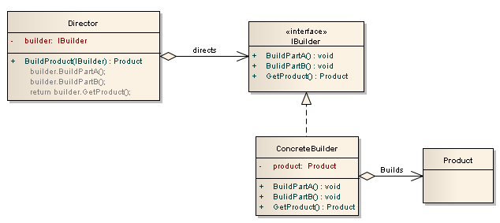
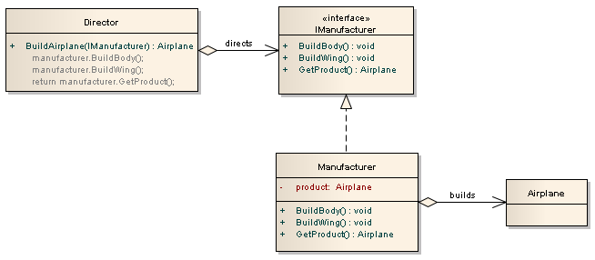
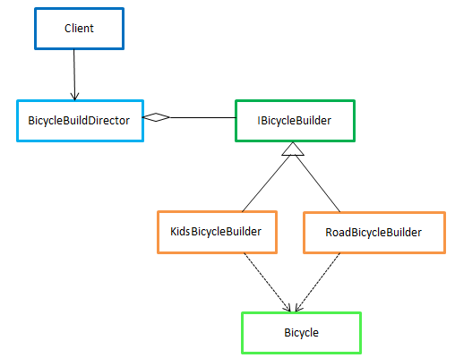

# Builder




> O _Builder_ é utilizado quando o algoritmo para criação de um objeto deve ser independente das partes que compõe o objeto em si e de como elas são construidas. Este padrão permite que seu processo de construção possa ser usado para criar diferentes representações do mesmo objeto. Builders constroem os seus produtos passo a passo. Portanto, a interface da classe `Builder` deve ser generalizada o bastante para permitir a construção de produtos para todos os tipos de construtores.

> A intenção do padrão _Builder_ é encapsular os detalhes do processo de criação do objeto em uma interface comum.

> Permiti separar a construção de um objeto complexo da sua representação de modo que o mesmo processo de construção posso criar diferentes representações.

> O _Builder_ é uma interface que define os passos para criação de um produto, geralmente usado quando a complexidade do projeto é muito alta.

> É um padrão que permite uma abordagem passo a passo sobre a criação de objetos complexos usando uma sequência correta de ações. A construção é controlado por um objeto `Director` que só precisa saber o tipo de objeto que deve ser criado.

> Em vez de utilizar muitos construtores para criação dos objeto, utiliza-se de outro objeto, um _Builder_, que conheçe o construtor do produto principal e recebe cada parâmetro de inicialização passo a passo e, em seguida, retorna o objeto resultante da construção.

> Permite criar um modelo geral sobre como criar um objeto e, em seguida, ter diferentes implementações sobre como criar partes do objeto.

> Útil quando precisa fazer muitas coisas(inerentes ao funcionalidade) para a construção do objeto-produto.

> A idéia básica é criar objetos complexos e ocultar os detalhes de implementação de como ele está sendo construído. Impõe um processo para criar um objeto como produto final.

> É uma maneira alternativa de construir objetos complexos. Deve ser usado somente quando desejar criar diferentes objetos imutáveis ​​usando o mesmo processo de construção de objetos - mais com implementações diferentes para cada tipo.

## Quando usar?

Este padrão pode ser usado onde precisamos fazer muito trabalho para construir um tipo semelhante de objetos complexos na forma "passo a passo"/etapas. De outra maneira, podemos dizer que _esse padrão é útil onde precisamos criar um objeto complexo montando pequenas partes por etapa usando um determinado procedimento ou algoritmo._

Em muitos cenários, temos que criar vários tipos de objetos complexos, mas _todos esses objetos seguem um procedimento de construção semelhante_.

## Vantagens

- Ele fornece uma clara separação entre a construção e a representação de um objeto.
- Fornece um melhor controle sobre o processo de construção.
- Ele suporta mudar a representação interna dos objetos.
- Permite variar a representação interna de um produto.
- Encapsula o código entre construção e representação.

## Participantes

**`Director`**

- Essa classe contém um conjunto de instruções (um algoritmo) que controla as ações do _Builder_. A instância específica de um _Builder_ pode ser passada como um construtor ou como um parâmetro para um método público na classe do diretor.
- Contêm os algoritmos para construir um produto passo a passo, respeitando as dependências entre partes na construção.
- Utiliza a interface fornecida pela `Builder`.
- Construi um objeto(`Product`) utilizando a interface de `Builder`.

**`ConcreteBuilder`**

- Essa classe é herdada da classe abstrata/interface _Builder_ e contém os métodos reais que criam o produto. Pode haver tantos _builders_ diferentes quanto necessário. This class will yield a specially created Product.
- Utiliza a interface de `Builder`, implementando todos as partes necessária para a construção do `Product`.
- Contêm uma referência ao `Product`.
- Define e mantém o controle da representação que cria.

**`Product`**

- This is a complex object, generally with lots of nuts and bolts or moving parts, and it is not easily constructed. It is likely made up of many different properties.
- Representa o objeto complexo que está sendo construido. Para cada `Product` tem muitos `ConcreteBuilder`.

**`Builder`**

- Esta é a classe base abstrata ou interface que possui todas as etapas listadas que podem ser usadas para construir um produto.
- Específica uma interface abstrata para criar partes de um objeto do tipo `Product`.
- Acordo sobre como criar um objeto para com `ConcreteBuilder` que é quem implementa a interface.
- Interface que apresenta uma abstração de alto nível.

## WorkFlow:

- O cliente cria o objeto `Director` e configura-o com o objeto `Builder`(`ConcreteBuilder1`, `ConcreteBuilder2` ...) desejado.
- O `Director` notifica o `Builder` sempre que uma parte do `Product` deve ser construída.
- O `Builder` manipula os pedidos do `Director` e adiciona partes ao `Product`.
- O cliente recupera o `Product` do `Builder`.

## Exemplos

### Código Estrutural

_Código apenas como modelo da implementação do padrão._

```csharp
using System;
using System.Collections.Generic;

namespace Builder
{
    class Program
    {
        static void Main(string[] args)
        {
            Director director = new Director();

            Builder b1 = new ConcreteBuilder1();
            Builder b2 = new ConcreteBuilder2();

            director.Construct(b1);

            Product p1 = b1.GetResult();
            p1.Show();

            director.Construct(b2);

            Product p2 = b2.GetResult();
            p2.Show();
        }
    }

    class Director
    {
        // Builder uses a complex series of steps
        public void Construct(Builder builder)
        {
            builder.BuildPartA();
            builder.BuildPartB();
        }
    }

    abstract class Builder
    {
        public abstract void BuildPartA();
        public abstract void BuildPartB();

        public abstract Product GetResult();
    }

    class ConcreteBuilder1 : Builder
    {
        private Product _product = new Product();

        public override void BuildPartA()
        {
            _product.Add("Part A");
        }

        public override void BuildPartB()
        {
            _product.Add("Part B");
        }

        public override Product GetResult()
        {
            return _product;
        }
    }

    class ConcreteBuilder2 : Builder
    {
        private Product _product = new Product();

        public override void BuildPartA()
        {
            _product.Add("Part X");
        }

        public override void BuildPartB()
        {
            _product.Add("Part Y");
        }

        public override Product GetResult()
        {
            return _product;
        }
    }

    class Product
    {
        private List<string> _parts = new List<string>();

        public void Add(string part)
        {
            _parts.Add(part);
        }

        public void Show()
        {
            Console.WriteLine("\nProduct Parts -------");

            foreach (string part in _parts)
                Console.WriteLine(part);
        }
    }
}
```

**Output**

```
Product Parts -------
Part A
Part B

Product Parts -------
Part X
Part Y
```

### Exemplo de construção de um avião



- A classe `Director` contém a lógica/etapas para construir e retornar o produto para o cliente. Neste caso, o método `BuildAirplane` específica que a estrutura de avião deve ser construído antes da asa. Portanto, o código para o método `BuildAirplane` seria:

```csharp
public Airplane BuildAirplane(IManufacturer manufacturer)
{
    manufacturer.BuildBody();  // We build the body first
    manufacturer.BuildWing();  // Then we build the wing

    return manufacturer.GetProduct();
}
```

- A interface de `IManufacturer` específica os métodos que todos os fabricantes de aviões devem suportar. Percebe-se que ele(`Director`) deve ser capaz de construir a estrutura do avião com o método `BuildBody` e construir a asa com o método `BuildWing`. O método `GetProduct` apenas retorna o produto que está sendo construído, que nesse caso é o próprio avião.

- A classe `Manufacturer` é a classe concreta de fabricação que possui a implementação na construção das partes de um avião, portanto implementa a interface `IManufacturer` e mantém uma referência à variável de `product`, que é o avião que está sendo construído.

- A classe `Airplane` é apenas o produto final a ser construído(Avião).

O código do cliente (código que chama o `Director`) para construir um avião será apenas:

```csharp
Airplane airplane = director.BuildAirplane(new Manufacture());
```

_Builder_ permite que você crie diferentes fabricantes de aviões concretos que especificam como as partes do avião devem ser construídas. Você pode então passar qualquer fabricante para o diretor que irá construir o avião de acordo com as especificações sem precisar alterar o código do cliente.

Abaixo estão o código de implementação e o resultado do nosso exemplo. Observe que podemos passar diferentes fabricantes de avião para o diretor e o avião será construído de acordo com as especificações:

```csharp
using System;

namespace Builder
{
    class Program
    {
        static void Main(string[] args)
        {
            Director director = new Director();

            Console.WriteLine("Build a jet airplane");
            Airplane jetAirplane = director.BuildAirplane(new JetManufacturer());

            jetAirplane.Show();

            Console.WriteLine("Build a propeller airplane");
            Airplane propellerAirplane = director.BuildAirplane(new PropellerManufacturer());

            propellerAirplane.Show();
        }
    }

    public class Director
    {
        public Airplane BuildAirplane(IManufacturer manufacturer)
        {
            manufacturer.BuildBody();
            manufacturer.BuildWing();

            return manufacturer.GetProduct();
        }
    }

    public interface IManufacturer
    {
        void BuildBody();
        void BuildWing();

        Airplane GetProduct();
    }

    public class JetManufacturer : IManufacturer
    {
        private Airplane product = new Airplane();

        public void BuildBody()
        {
            product.Body = "Metal Body for Jet airplane";
        }

        public void BuildWing()
        {
            product.Wing = "Metal Wing for Jet airplane";
        }

        public Airplane GetProduct()
        {
            return product;
        }
    }

    public class PropellerManufacturer : IManufacturer
    {
        private Airplane product = new Airplane();

        public void BuildBody()
        {
            product.Body = "Wood Body for Propeller airplane";
        }

        public void BuildWing()
        {
            product.Wing = "Wood Wing for Propeller airplane";
        }

        public Airplane GetProduct()
        {
            return product;
        }
    }

    public class Airplane
    {
        private string BodySpecification;
        private string WingSpecification;

        public string Body
        {
            get { return BodySpecification; }
            set { BodySpecification = value; }
        }

        public string Wing
        {
            get { return WingSpecification; }
            set { WingSpecification = value; }
        }

        // Show the airplane
        public void Show()
        {
            Console.WriteLine(Body);
            Console.WriteLine(Wing);
        }
    }
}
```

**Output**

```
Build a jet airplane
Metal Body for Jet airplane
Metal Wing for Jet airplane
Build a propeller airplane
Wood Body for Propeller airplane
Wood Wing for Propeller airplane
```

### Exemplo de construção de vários modelos de bicicletas



Suponhamos que queremos criar alguns objetos de bicicletas que são objetos bastante complexos. Para fazer uma bicicleta, precisamos de outros pequenos objetos que seriam suas partes como quadro, pneu, aro, guidão, engrenagens, correntes, etc. Para montar uma nova bicicleta, precisamos juntar todas as suas peças por etapas.

A seguir, a implementação do cenário acima mencionado:

Crie uma classe que represente o objeto do produto.

```csharp
// Product
public class Bicycle
{
    public string BicycleType { get; set; }
    public int BicycleHeight { get; set; }
    public string BicycleColour { get; set; }
}
```

Agora, crie uma interface chamada `IBicycleBuilder`, essa interface terá toda a definição de métodos necessária para criar a bicicleta.

```csharp
// IBicycleBuilder provides an interface for different Builders of Bicycle
// ConcreteBuilder are like KidsBicycleBuilder, RoadBicycleBuilder, LadiesBicycleBuilder, MountainBicycleBuilder
// A Concrete Builder have creation logic of parts which are assembled to create a particular type (of different Representations) of bicycle.
public interface IBicycleBuilder
{
    void SetHeight(int height);
    void SetFrame();
    void SetGears();
    void PutTires();
    void SetColour(string colour);
    void PutAccessaries();

    Bicycle GetBicycle();
}
```

Agora queremos montar bicicletas para crianças. Então, crie uma classe chamada `KidsBicycleBuilder`. Esta classe implementará a interface `IBicycleBuilder`, a implementação será de acordo com os requisitos para a bicicleta Kids.

```csharp
// Builds components and set them as per need of a Kids Bicycle
class KidsBicycleBuilder : IBicycleBuilder
{
    private Bicycle bicycle;

    public KidsBicycleBuilder()
    {
        bicycle = new Bicycle();

        bicycle.BicycleType = "Kids Bicycle";
    }

    public void SetHeight(int height)
    {
        Console.WriteLine("Bicycle is set with given height: {0}", height);

        bicycle.BicycleHeight = height;
    }

    public void SetFrame()
    {
        Console.WriteLine("Frame has been set.");
    }

    public void SetGears()
    {
        Console.WriteLine("Gears have been set.");
    }

    public void PutTires()
    {
        Console.WriteLine("Tires have been set.");
    }

    public void SetColour(string colour)
    {
        Console.WriteLine("Bicycle is set with given colour: {0}", colour);

        bicycle.BicycleColour = colour;
    }

    public void PutAccessaries()
    {
        Console.WriteLine("Accessaries have been set.");
    }

    public Bicycle GetBicycle()
    {
        return this.bicycle;
    }
}
```

Da mesma forma, crie mais classe chamada `RoadBicycleBuilder` e implemente a interface `IBicycleBuilder`. Esta classe irá construir uma bicicleta de estrada.

```csharp
class RoadBicycleBuilder : IBicycleBuilder {...}
```

Let's create Director called `BicycleBuildDirector` which contains flow or algorithm to construct `Bicycle` using a bicycle builder. Director calls method of builder class in a order as needed in creation process of bicycle.

```csharp
// Director encapsulate the process to construct a bicycle
// It sets required attribute and start building process using a concrete builder.
// It contains the flow or algorithm to be followed to create a bicycle
// i.e. assembling bicycle by getting parts from a builder
// and coordinating with inventory/departments and notifying stockholders
public class BicycleBuildDirector
{
    SellDepartment sellDepartment = new SellDepartment();

    public Bicycle Construct(IBicycleBuilder builder, string colour, int height)
    {
        // Start Process and Notify user
        Console.WriteLine("We have sarted process for Bicycle manufacturing");

        // Follow the process and set attributes given
        builder.SetFrame();
        builder.SetGears();
        builder.SetColour(colour);
        builder.SetHeight(height);
        builder.PutTires();
        builder.PutAccessaries();

        Bicycle bicycle = builder.GetBicycle();

        // Coordinate with other departments/inventories
        sellDepartment.GenerateInvoice(bicycle.BicycleType, colour, height);

        // End Process and Notify user
        Console.WriteLine("{0} is ready for your disposal.\n ** Happy Riding ! **", bicycle.GetType());

        return bicycle;
    }
}
```

Following code shows how client can create instance of `BicycleBuildDirector` class and calls Construct method by passing required parameter to get desired bicycle.

```csharp
static void Main(string[] args)
{
    BicycleBuildDirector buildDirector = new BicycleBuildDirector();

    Bicycle bicycle = buildDirector.Construct(new KidsBicycleBuilder(), "Red", 16);
}
```

if client want to get a road bicycle then he just need to modify arguments of Construct method of the `BicycleBuildDirector` as given below:

```csharp
Bicycle bicycle = buildDirector.Construct(new RoadBicycleBuilder(), "Blue", 24);
```

In this way, by using different builders with same director, client is able to create different types of bicycles.

### Exemplo de criação de uma refeição

```csharp
using System;

namespace Builder
{
    class Program
    {
        static void Main(string[] args)
        {
            MealDirector director = new MealDirector();

            Meal kidsMeal = director.createMeal(new KidsMealBuilder());
            Meal adultMeal = director.createMeal(new AdultMealBuilder());
        }
    }

    public class Meal
    {
        public string Drink { get; set; }
        public int Main { get; set; }
        public string Dessert { get; set; }
    }

    public class MealDirector
    {
        public Meal createMeal(MealBuilder builder)
        {
            builder.buildDrink();
            builder.buildMain();
            builder.buildDessert();

            return builder.getMeal();
        }
    }

    public abstract class MealBuilder
    {
        protected Meal meal = new Meal();

        public abstract void buildDrink();
        public abstract void buildMain();
        public abstract void buildDessert();

        public abstract Meal getMeal();
    }

    public class KidsMealBuilder : MealBuilder
    {
        public override void buildDrink()
        {
            // add drinks to the meal
        }

        public override void buildMain()
        {
            // add main part of the meal
        }

        public override void buildDessert()
        {
            // add dessert part to the meal
        }

        public override Meal getMeal() { return meal; }
    }

    public class AdultMealBuilder : MealBuilder
    {
        public override void buildDrink()
        {
            // add drinks to the meal
        }

        public override void buildMain()
        {
            // add main part of the meal
        }

        public override void buildDessert()
        {
            // add dessert part to the meal
        }

        public override Meal getMeal() { return meal; }
    }
}
```

### Exemplo de construção de carros

```csharp
using System;
using System.Collections.Generic;

namespace Builder
{
    class Program
    {
        static void Main(string[] args)
        {
            VehicleCreator vehicleCreator;
            Vehicle vehicle;

            vehicleCreator = new VehicleCreator(new FordExplorerBuilder());
            vehicleCreator.CreateVehicle();
            vehicle = vehicleCreator.GetVehicle();
            vehicle.ShowInfo();

            Console.WriteLine("---------------------------------------------");

            vehicleCreator = new VehicleCreator(new LincolnAviatorBuilder());
            vehicleCreator.CreateVehicle();
            vehicle = vehicleCreator.GetVehicle();
            vehicle.ShowInfo();
        }
    }

    public abstract class VehicleBuilder
    {
        protected Vehicle _vehicle;

        public Vehicle GetVehicle()
        {
            return _vehicle;
        }

        public void CreateVehicle()
        {
            _vehicle = new Vehicle();
        }

        public abstract void SetModel();
        public abstract void SetEngine();
        public abstract void SetTransmission();
        public abstract void SetBody();
        public abstract void SetDoors();
        public abstract void SetAccessories();
    }

    class FordExplorerBuilder : VehicleBuilder
    {
        public override void SetModel()
        {
            _vehicle.Model = "Ford Explorer";
        }

        public override void SetEngine()
        {
            _vehicle.Engine = "4.0 L Cologne V6";
        }

        public override void SetTransmission()
        {
            _vehicle.Transmission = "5-speed M5OD-R1 manual";
        }

        public override void SetBody()
        {
            _vehicle.Body = "SUV";
        }

        public override void SetDoors()
        {
            _vehicle.Doors = 5;
        }

        public override void SetAccessories()
        {
            _vehicle.Accessories.Add("Car Cover");
            _vehicle.Accessories.Add("Sun Shade");
        }
    }

    class LincolnAviatorBuilder : VehicleBuilder
    {
        public override void SetModel()
        {
            _vehicle.Model = "Lincoln Aviator";
        }

        public override void SetEngine()
        {
            _vehicle.Engine = "4.6 L DOHC Modular V8";
        }

        public override void SetTransmission()
        {
            _vehicle.Transmission = "5-speed automatic";
        }

        public override void SetBody()
        {
            _vehicle.Body = "SUV";
        }

        public override void SetDoors()
        {
            _vehicle.Doors = 4;
        }

        public override void SetAccessories()
        {
            _vehicle.Accessories.Add("Leather Look Seat Covers");
            _vehicle.Accessories.Add("Chequered Plate Racing Floor");
            _vehicle.Accessories.Add("4x 200 Watt Coaxial Speekers");
            _vehicle.Accessories.Add("500 Watt Bass Subwoofer");
        }
    }

    public class VehicleCreator
    {
        private readonly VehicleBuilder _builder;

        public VehicleCreator(VehicleBuilder builder)
        {
            _builder = builder;
        }

        public void CreateVehicle()
        {
            _builder.CreateVehicle();

            _builder.SetModel();
            _builder.SetEngine();
            _builder.SetBody();
            _builder.SetDoors();
            _builder.SetTransmission();
            _builder.SetAccessories();
        }

        public Vehicle GetVehicle()
        {
            return _builder.GetVehicle();
        }
    }

    public class Vehicle
    {
        public string Model { get; set; }
        public string Engine { get; set; }
        public string Transmission { get; set; }
        public string Body { get; set; }
        public int Doors { get; set; }

        public List<string> Accessories { get; set; }

        public Vehicle()
        {
            Accessories = new List<string>();
        }

        public void ShowInfo()
        {
            Console.WriteLine("Model: {0}", Model);
            Console.WriteLine("Engine: {0}", Engine);
            Console.WriteLine("Body: {0}", Body);
            Console.WriteLine("Doors: {0}", Doors);
            Console.WriteLine("Transmission: {0}", Transmission);
            Console.WriteLine("Accessories:");

            foreach (var accessory in Accessories) {
                Console.WriteLine("\t{0}", accessory);
            }
        }
    }
}
```

**Output**

```
Model: Ford Explorer
Engine: 4.0 L Cologne V6
Body: SUV
Doors: 5
Transmission: 5-speed M5OD-R1 manual
Accessories:
    Car Cover
    Sun Shade
---------------------------------------------
Model: Lincoln Aviator
Engine: 4.6 L DOHC Modular V8
Body: SUV
Doors: 4
Transmission: 5-speed automatic
Accessories:
    Leather Look Seat Covers
    Chequered Plate Racing Floor
    4x 200 Watt Coaxial Speekers
    500 Watt Bass Subwoofer
```

### Exemplo modelo de impressão de livros

A impressão de um livro envolve várias etapas, como imprimir o índice, o prefácio, a introdução, os capítulos e a conclusão. Finalmente, você obterá o objeto de um livro completo. Você pode escrever livros com diferentes propriedades. `BookWriter` instruirá a imprimir um livro por etapas e retornará o objeto final do livro `bookBuilder`.

Comparing to the generic UML diagram of builder pattern:

- `BookBuilder` (_Builder_)
- `TechnicalBookBuilder` (_ConcreteBuilder_)
- `FictionalBookBuilder` (_ConcreteBuilder_)
- `BookWriter` (_Director_)
- `Book` (_Product_)

_(Product)_

```csharp
public class Book
{
    public string introduction { get; set; }
    public string tableOfContent { get; set; }
    public string preface { get; set; }
    public string chapters { get; set; }
    public string glossary { get; set; }
}
```

The following interface is our builder interface. The builder interface provides steps or processes. Here we have five steps - `buidTableOfContent`, `buildPreface`, `buildIntroduction`, `buildChapters`, `buildGlossary`. It also has a method to return a book (`product`) object.

_(Builder)_

```csharp
public interface BookBuilder
{
    void buildTableOfContent();
    void buildPreface();
    void buildIntroduction();
    void buildChapters();
    void buildGlossary();

    Book getBook();
}
```

The following class is our first implementation of the builder interface. We are having multiple concrete builder classes to support the same construction process creating multiple representations.

_ConcreteBuilder_

```csharp
public class TechnicalBookBuilder : BookBuilder
{
    private Book book;

    public TechnicalBookBuilder()
    {
        book = new Book();
    }

    public void buildTableOfContent()
    {
        Console.WriteLine("Technical table of content");

        book.tableOfContent = "Technical table of content";
    }

    public void buildPreface()
    {
        Console.WriteLine("Preface");

        book.preface = "Preface";
    }

    public void buildIntroduction()
    {
        Console.WriteLine("Technical introduction");

        book.introduction = "Technical introduction";
    }

    public void buildChapters()
    {
        Console.WriteLine("Technical chapters");

        book.chapters = "Technical chapters";
    }

    public void buildGlossary()
    {
        Console.WriteLine("printing technical glossary");

        book.glossary = "Technical glossary";
    }

    public Book getBook()
    {
        return book;
    }
}
```

The following class is our second implementation of the builder interface.

_(ConcreteBuilder)_

```csharp
public class FictionalBookBuilder : BookBuilder
{
    private Book book;

    public FictionalBookBuilder()
    {
        book = new Book();
    }

    public void buildTableOfContent()
    {
        Console.WriteLine("Fictional table of content");

        book.tableOfContent = "Fictional table of content";
    }

    public void buildPreface()
    {
        Console.WriteLine("Preface");

        book.preface = "Preface";
    }
    public void buildIntroduction()
    {
        Console.WriteLine("Fictional introduction");

        book.introduction = "Fictional introduction";
    }

    public void buildChapters()
    {
        Console.WriteLine("Fictional chapters");

        book.chapters = "Fictional chapters";
    }

    public void buildGlossary()
    {
        Console.WriteLine("Fictional glossary");

        book.glossary = "Fictional glossary";
    }

    public Book getBook()
    {
        return book;
    }
}
```

The following class is our director class which will instruct `BookBuilder` to print parts of the book and return the final book object.

_(Director)_

```csharp
 public class BookWriter
{
    private readonly BookBuilder _bookBuilder;

    public BookWriter(BookBuilder bookBuilder)
    {
        _bookBuilder = bookBuilder;
    }

    public Book getBook()
    {
        return _bookBuilder.getBook();
    }

    public void printBook()
    {
        _bookBuilder.buildTableOfContent();
        _bookBuilder.buildPreface();
        _bookBuilder.buildIntroduction();
        _bookBuilder.buildChapters();
        _bookBuilder.buildGlossary();
    }
}
```

_(Main)_

```csharp
class Program
{
    static void Main(string[] args)
    {
        Console.WriteLine("Printing technical book:");
        Console.WriteLine();

        BookBuilder technialbookBuilder = new TechnicalBookBuilder();
        BookWriter technicalBookWriter = new BookWriter(technialbookBuilder);
        technicalBookWriter.printBook();
        Book technicalbook = technicalBookWriter.getBook();
        Console.WriteLine("Technical Book Printed: " + technicalbook);

        Console.WriteLine();
        Console.WriteLine("******************************************");
        Console.WriteLine();

        Console.WriteLine("Printing fictional book:");
        Console.WriteLine();

        BookBuilder fictionalbookBuilder = new FictionalBookBuilder();
        BookWriter fictionalBookWriter = new BookWriter(fictionalbookBuilder);
        fictionalBookWriter.printBook();
        Book fictionalbook = fictionalBookWriter.getBook();
        Console.WriteLine("Fictionalbook book printed: " + fictionalbook);
    }
}
```

For printing technical book, we have configured `bookWriter` object with `technicalBookBuilder`. `BookWriter` instructed to `technicalbookbuilder` to print book and return final book object. Same is true for a fictional book. So with help of the same construction process, we have printed two kinds of books, .i.e., technical and fictional.

**Output**

```
Printing technical book:

Technical table of content
Preface
Technical introduction
Technical chapters
printing technical glossary
Technical Book Printed: Builder.Book

******************************************

Printing fictional book:

Fictional table of content
Preface
Fictional introduction
Fictional chapters
Fictional glossary
Fictionalbook book printed: Builder.Book
```
