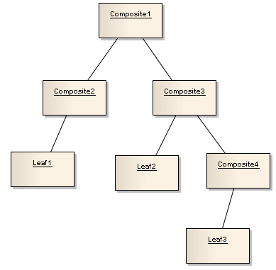
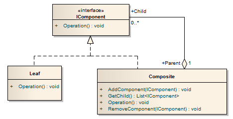
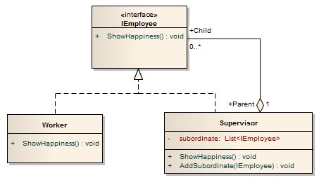

# Composite


- Permite configurar uma estrutura de árvore, onde cada elemento na estrutura da árvore executa uma determinada tarefa. _Depois que a estrutura da árvore é estabelecida, você pode solicitar a cada elemento que execute uma operação comum._

- A intenção deste padrão é compor objetos em estruturas de árvores para representar hierarquias parciais. _Composite_ permite aos clientes tratar objetos individuais e composições de objetos uniformemente.

- Seu objetivo é gerenciar uma hierarquia de objetos onde os objetos de _Leaf_ e _Composite_ de outros objetos estão em conformidade com uma interface comum. Esta hierarquia geralmente é constituída por relações parte-inteira (muitas vezes composição em sentido estrito ou agregação), e pode ser vista como uma árvore.

- Permitem que os clientes operem de maneira genérica em objetos que podem ou não representar uma hierarquia de objetos.

- Facilita a criação de hierarquias de objetos onde cada objeto pode ser tratado de forma independente ou como um conjunto de objetos aninhados através da mesma interface.

- O padrão _Composite_ é usado onde precisamos tratar um grupo de objetos de forma semelhante a um único objeto. O padrão _Composite_ compõe objetos em termos de uma estrutura de árvore para representar a parte, bem como a hierarquia total. Este tipo de padrão de design vem sob padrão estrutural, pois esse padrão cria uma estrutura de árvore de grupo de objetos. Esse padrão cria uma classe que contém o grupo de seus próprios objetos. Esta classe fornece maneiras de modificar seu grupo de mesmos objetos.

- Na sua forma mais simples, podemos pensar em um _Composite_ como uma coleção de objetos, onde qualquer um desses objetos poderia ser um objeto composto ou simples.

- O padrão _Composite_ classifica cada elemento na árvore como um _Composite_ ou uma _Leaf_. Um _Composite_ significa que pode haver outros elementos abaixo dele, enquanto que uma _Leaf_ não pode ter nenhum elemento abaixo. Portanto, _Leaf_ deve estar no final da árvore. O conceito é mostrado no diagrama abaixo:



Abaixo está a UML do Padrão de Design Composite, onde você vê a distinção entre um elemento _Composite_ e _Leaf_:



- A interface `IComponent` define os métodos que a classe `Composite` e a classe `Leaf` devem implementar. O método `Operation` é o método comum que todos os elementos na estrutura da árvore podem executar. O `IComponent` simplesmente representa um elemento na árvore.

- A classe `Leaf` é um elemento que não pode ter nenhum elemento abaixo, e possui apenas um método `Operation` para executar a tarefa do elemento.

- A classe `Composite` é um elemento que pode ter _0_ ou mais elementos abaixo dele. Os métodos que ele suporta são os seguintes:
    - O método `AddComponent` adiciona um elemento como seu filho.
    - O método `GetChild` obtém todos os seus elementos filhos.
    - O método `Operation` executa a tarefa para o próprio elemento.
    - O método `RemoveComponent` elimina um elemento filho.

## Vantagens

- Define hierarquias de classe que contêm objetos primitivos e complexos.
- Facilita adicionar novos tipos de componentes.
- Fornece flexibilidade de estrutura com classe gerenciável ou interface.
- O padrão _Composite_ define hierarquias de classe consistindo em objetos individuais e objetos compostos.
- Os clientes tratam objetos primitivos e compostos uniformemente através de uma interface de componente que torna o código do cliente simples.
- Adicionar novos componentes pode ser fácil e o código do cliente não precisa ser alterado, pois o cliente lida com os novos componentes através da interface do componente.
- A hierarquia composta pode ser percorrida com o padrão de design do `Iterator`.

## Quando Usar

- Quando o aplicativo possui estrutura hierárquica e precisa de funcionalidade genérica em toda a estrutura.
- Quando o aplicativo precisa agregar dados em uma hierarquia.
- Quando a aplicação quer tratar uniformemente os objetos compostos e individuais.
- Representações hierárquicas de objetos são necessárias.
- Objetos e composições de objetos devem ser tratados uniformemente.

## Participantes


- `Component`
    - Declara a interface para objetos na composição.
    - Implementa o comportamento padrão para a interface comum a todas as classes, conforme apropriado.
    - Declara uma interface para acessar e gerenciar seus componentes filho.
    - Declara a interface para objetos na composição.
    - É uma abstração para todos os componentes, incluindo os composites. Ele declara a interface para objetos na composição. Às vezes, define uma interface para acessar o pai de um componente na estrutura recursiva e implementa-o se for apropriado.

- `Leaf`
    - Define comportamento para objetos primitivos na composição.
    - Representa objetos de folha na composição. Uma folha não tem filhos.
    - Representa objetos de folha na composição e implementa todos os métodos de `Component`.

- `Composite`
    - Define comportamento para componentes que têm filhos.
    - Armazena componentes child.
    - Implements child-related operations in the `Component` interface.
    - Este é um elemento-chave deste padrão de design. Representa componentes Composite. Elemento Composite são elementos que têm elementos filho. Ele implementa os métodos para adicionar e remover elementos filhos e implementa todos os métodos do `Component`, geralmente, delegando-os aos seus filhos.

- `Client`
    - Manipula objetos na composição através da interface `Component`.


Há momentos em que um programa precisa manipular uma estrutura de dados de árvore e é necessário tratar uniformemente os ramos, bem como os nós das folhas. Considere, por exemplo, um programa que manipule um sistema de arquivos. Um sistema de arquivos é uma estrutura de árvore que contém os ramos que são pastas, bem como os nós da folha que são arquivos. Observe que um objeto de pasta geralmente contém um ou mais objetos de arquivo ou pasta e, portanto, é um objeto complexo onde um arquivo é um objeto simples. Observe também que, uma vez que os arquivos e as pastas têm muitas operações e atributos em comum, como mover e copiar um arquivo ou uma pasta, listando arquivos ou atributos de pasta, como nome e tamanho do arquivo, seria mais fácil e mais conveniente tratar os arquivos e objetos de pasta uniformemente definindo uma Interface de Recursos do Sistema de Arquivos.

- `Component`: Componente é a abstração para Leaf e Composites. Ele define a interface que deve ser implementada pelos objetos na composição. Por exemplo, um recurso de sistema de arquivos define métodos de mover, copiar, renomear e obter métodos para arquivos e pastas.

- `Leaf`: Leafs são objetos que não têm filhos. Eles implementam serviços descritos pela interface do `Component`. Por exemplo, um objeto de arquivo implementa mover, copiar, renomear, bem como métodos `getSize` relacionados à interface `Component`.

- `Composite`: Composite armazena componentes filho, além de implementar métodos definidos pela interface do `Component`. Composites implementam métodos definidos na interface Componente, delegando a componentes filho. Além disso, os composites fornecem métodos adicionais para adicionar, remover, além de obter componentes.

- `Client`: O cliente manipula objetos na hierarquia usando a interface `Component`.

## Exemplos

### Modelo de código estrutural


Este código estrutural demonstra o padrão composto que permite a criação de uma estrutura de árvore em que os nós individuais são acessados ​​uniformemente, quer sejam nós de Leaf ou nós de ramificação (compostos).

```csharp
using System;
using System.Collections.Generic;

namespace Composite
{
    class Program
    {
        static void Main(string[] args)
        {
            // Create a tree structure
            Composite root = new Composite("root");
            root.Add(new Leaf("Leaf A"));
            root.Add(new Leaf("Leaf B"));

            Composite comp = new Composite("Composite X");
            comp.Add(new Leaf("Leaf XA"));
            comp.Add(new Leaf("Leaf XB"));

            root.Add(comp);
            root.Add(new Leaf("Leaf C"));

            // Add and remove a leaf
            Leaf leaf = new Leaf("Leaf D");
            root.Add(leaf);
            root.Remove(leaf);

            // Recursively display tree
            root.Display(1);
        }
    }

    // The 'Component' abstract class
    abstract class Component
    {
        protected string name;

        public Component(string name)
        {
            this.name = name;
        }

        public abstract void Add(Component c);
        public abstract void Remove(Component c);
        public abstract void Display(int depth);
    }

    // The 'Composite' class
    class Composite : Component
    {
        private List<Component> _children = new List<Component>();

        public Composite(string name)
          : base(name)
        {
        }

        public override void Add(Component component)
        {
            _children.Add(component);
        }

        public override void Remove(Component component)
        {
            _children.Remove(component);
        }

        public override void Display(int depth)
        {
            Console.WriteLine(new String('-', depth) + name);

            // Recursively display child nodes
            foreach (Component component in _children) {
                component.Display(depth + 2);
            }
        }
    }

    // The 'Leaf' class
    class Leaf : Component
    {
        // Constructor
        public Leaf(string name) : base(name)
        {
        }

        public override void Add(Component c)
        {
            Console.WriteLine("Cannot add to a leaf");
        }

        public override void Remove(Component c)
        {
            Console.WriteLine("Cannot remove from a leaf");
        }

        public override void Display(int depth)
        {
            Console.WriteLine(new String('-', depth) + name);
        }
    }
}
```

**Output**

```
-root
---Leaf A
---Leaf B
---Composite X
-----Leaf XA
-----Leaf XB
---Leaf C
```

---------

```csharp
using System;
using System.Collections.Generic;

namespace Composite
{
    class Program
    {
        static void Main(string[] args)
        {
            var root = new Composite("root");
            root.AddChild(new Leaf("Leaf 1"));
            root.AddChild(new Leaf("Leaf 2"));

            var comp = new Composite("Composite C");
            comp.AddChild(new Leaf("Leaf C.1"));
            comp.AddChild(new Leaf("Leaf C.2"));

            root.AddChild(comp);
            root.AddChild(new Leaf("Leaf 3"));

            var leaf = new Leaf("Leaf 4");
            root.AddChild(leaf);
            root.RemoveChild(leaf);

            root.Display(1);
        }
    }

    public abstract class Component
    {
        protected readonly string name;

        protected Component(string name)
        {
            this.name = name;
        }

        public abstract void Operation();
        public abstract void Display(int depth);
    }

    class Composite : Component
    {
        private readonly List<Component> _children = new List<Component>();

        public Composite(string name) : base(name)
        {
        }

        public void AddChild(Component component)
        {
            _children.Add(component);
        }

        public void RemoveChild(Component component)
        {
            _children.Remove(component);
        }

        public override void Display(int depth)
        {
            Console.WriteLine(new String('-', depth) + name);

            foreach (Component component in _children)
            {
                component.Display(depth + 2);
            }
        }
        public override void Operation()
        {
            string message = string.Format("Composite with {0} child(ren).", _children.Count);
            Console.WriteLine(message);
        }
    }

    public class Leaf : Component
    {
        public Leaf(string name)
            : base(name)
        {
        }

        public override void Operation()
        {
            Console.WriteLine("Leaf.");
        }

        public override void Display(int depth)
        {
            Console.WriteLine(new String('-', depth) + name);
        }
    }
}
```

**Output**

```
-root
---Leaf 1
---Leaf 2
---Composite C
-----Leaf C.1
-----Leaf C.2
---Leaf 3
```

### Modelo de gerenciamentos de supervisores/empregados

Em uma empresa, temos supervisores e trabalhadores. Os supervisores podem gerenciar outros supervisores ou trabalhadores.

- Os supervisores serão os _Composites_.
- Os trabalhadores não controlam ninguém e serão as _Leaves_.

Todos os supervisores e trabalhadores são funcionários e, como funcionário, você sempre pode mostrar seu nível de felicidade na empresa (esta é a operação comum dos elementos).



- A interface `IEmployee` define a operação que todos os funcionários devem ser capazes de executar, que é o método `ShowHappiness`.
- A classe `Worker` são os funcionários que não gerenciam ninguém e implementam apenas o método `ShowHappiness`.
- A classe `Supervisor` são os funcionários que podem gerenciar outros funcionários e possuem as seguintes variáveis ​​e métodos:
    - The private variable `subordinate` é a lista de funcionários que o supervisor administra.
    - O método `AddSubordinate` adiciona um empregado para a cadeia do supervisor.
    - O método `ShowHappiness` mostra o nível de felicidade do supervisor.

Quando executado o método `ShowHappiness` de um supervisor, ele mostrará tanto a felicidade do supervisor quanto a felicidade dos seus subordinados ao executar cada um o método `ShowHappiness` do de cada subordinado a cadeia do supervisor.

O ponto chave, estratégico para o padrão de design _Composite_ é que ele permite que você configure uma estrutura com uma operação comum (como o método `ShowHappiness`) e, em seguida, você pode ter todos os elementos para executar a operação comum. Isso é feito mantendo uma lista de elementos filho que implementa a interface comum na classe _Composite_ e, em seguida, chamando as operações de cada elemento filho.

Abaixo estão o código de implementação e a saída para o nosso exemplo, observe que você pode adicionar qualquer número de supervisores em qualquer nível da organização e o _Composite_ mostrará a felicidade para todos sob sua cadeia:

```csharp
using System;
using System.Collections.Generic;

namespace Composite
{
    class Program
    {
        static void Main(string[] args)
        {
            Worker a = new Worker("Worker Tom", 5);

            Supervisor b = new Supervisor("Supervisor Mary", 6);
            Supervisor c = new Supervisor("Supervisor Jerry", 7);
            Supervisor d = new Supervisor("Supervisor Bob", 9);

            Worker e = new Worker("Worker Jimmy", 8);

            b.AddSubordinate(a); // Tom works for Mary
            c.AddSubordinate(b); // Mary works for Jerry
            c.AddSubordinate(d); // Bob works for Jerry
            d.AddSubordinate(e); // Jimmy works for Bob

            // Jerry shows his happiness and asks everyone else to do the same
            if (c is IEmployee)
                (c as IEmployee).ShowHappiness();
        }
    }

    public interface IEmployee
    {
        void ShowHappiness();
    }

    public class Worker : IEmployee
    {
        private string name;
        private int happiness;

        public Worker(string name, int happiness)
        {
            this.name = name;
            this.happiness = happiness;
        }

        public void ShowHappiness()
        {
            Console.WriteLine(name + " showed happiness level of " + happiness);
        }
    }

    public class Supervisor : IEmployee
    {
        private string name;
        private int happiness;

        private List<IEmployee> subordinate = new List<IEmployee>();

        public Supervisor(string name, int happiness)
        {
            this.name = name;
            this.happiness = happiness;
        }

        public void ShowHappiness()
        {
            Console.WriteLine(name + " showed happiness level of " + happiness);
            // Show all the subordinate's happiness level
            foreach (IEmployee i in subordinate)
                i.ShowHappiness();
        }

        public void AddSubordinate(IEmployee employee)
        {
            subordinate.Add(employee);
        }
    }
}
```

**Output**

```
Supervisor Jerry showed happiness level of 7
Supervisor Mary showed happiness level of 6
Worker Tom showed happiness level of 5
Supervisor Bob showed happiness level of 9
Worker Jimmy showed happiness level of 8
```

### Exemplo de uma aplicação financeira

A interface `Component` define a interface que todos os objetos no sistema composed precisam usar, sejam leafs (objetos simples) ou composições. No entanto, isso geralmente é implementado como uma classe abstrata fornecendo algum comportamento padrão para os métodos `add`, `remove` e `getChild`.

Vamos supor que estamos criando uma aplicação financeira. Temos clientes com várias contas bancárias. Somos convidados a preparar um projeto que possa ser útil para gerar a visão de conta consolidada do cliente que seja capaz de mostrar o saldo da conta total do cliente, bem como a conta consolidada após a fusão de todas as demonstrações da conta. Assim, o aplicativo deve ser capaz de gerar:

1. Saldo da conta total do cliente de todas as contas
2. Demonstração contábil consolidada

```csharp
using System;
using System.Collections.Generic;

namespace Composite
{
    class Program
    {
        static void Main(string[] args)
        {
            // Creating a component tree
            Component component = new CompositeAccount();

            // Adding all accounts of a customer to component
            component.Add(new DepositAccount("DA001", 100));
            component.Add(new DepositAccount("DA002", 150));
            component.Add(new SavingsAccount("SA001", 200));

            // Getting composite balance for the customer
            float totalBalance = component.GetBalance();
            Console.WriteLine("Total Balance : " + totalBalance);

            // AccountStatement mergedStatement = component.GetStatement();
            // Console.WriteLine("Merged Statement : " + mergedStatement);
        }
    }

    public class SavingsAccount : Component
    {
        private string accountNo;
        private float accountBalance;

        private AccountStatement currentStmt;

        public SavingsAccount(string accountNo, float accountBalance)
        {
            this.accountNo = accountNo;
            this.accountBalance = accountBalance;
        }

        public string GetAccountNo()
        {
            return accountNo;
        }

        public override float GetBalance()
        {
            return accountBalance;
        }

        public override AccountStatement GetStatement()
        {
            return currentStmt;
        }
    }

    public class DepositAccount : Component
    {
        private string accountNo;
        private float accountBalance;

        private AccountStatement currentStmt;

        public DepositAccount(string accountNo, float accountBalance)
        {
            this.accountNo = accountNo;
            this.accountBalance = accountBalance;
        }

        public string GetAccountNo()
        {
            return accountNo;
        }

        public override float GetBalance()
        {
            return accountBalance;
        }

        public override AccountStatement GetStatement()
        {
            return currentStmt;
        }
    }

    public class AccountStatement
    {
        public void merge(AccountStatement g)
        {
            // Use this function to merge all account statements
        }
    }

    public class CompositeAccount : Component
    {
        private float totalBalance;

        protected AccountStatement compositeStmt, individualStmt;

        public override float GetBalance()
        {
            totalBalance = 0;

            foreach (Component f in list) {
                totalBalance = totalBalance + f.GetBalance();
            }

            return totalBalance;
        }

        public override AccountStatement GetStatement()
        {
            foreach (Component f in list) {
                individualStmt = f.GetStatement();
                compositeStmt.merge(individualStmt);
            }

            return compositeStmt;
        }
    }

    public abstract class Component
    {
        protected List<Component> list = new List<Component>();

        public abstract float GetBalance();

        public abstract AccountStatement GetStatement();

        public void Add(Component g)
        {
            list.Add(g);
        }

        public void Remove(Component g)
        {
            list.Remove(g);
        }

        public Component GetComponent(Component component)
        {
            return (Component) list.Find(x => x == component);
        }
    }
}
```

**Output**

```
Total Balance : 450
```

### Modelo de estrutura de árvore gráficas

Este código demonstra o padrão _Composite_ usado na construção de uma estrutura de árvore gráfica composta por nós primitivos (linhas, círculos, etc.) e nós compostos (grupos de elementos de desenho que compõem elementos mais complexos).

- Componente (`DrawingElement`)
- Leaf (`PrimitiveElement`)
- Composite (`CompositeElement`)
- Client (`CompositeApp`)

```csharp
using System;
using System.Collections.Generic;

namespace Composite
{
    class Program
    {
        static void Main(string[] args)
        {
            // Create a tree structure
            CompositeElement root = new CompositeElement("Picture");
            root.Add(new PrimitiveElement("Red Line"));
            root.Add(new PrimitiveElement("Blue Circle"));
            root.Add(new PrimitiveElement("Green Box"));

            // Create a branch
            CompositeElement comp = new CompositeElement("Two Circles");
            comp.Add(new PrimitiveElement("Black Circle"));
            comp.Add(new PrimitiveElement("White Circle"));
            root.Add(comp);

            // Add and remove a PrimitiveElement
            PrimitiveElement pe = new PrimitiveElement("Yellow Line");
            root.Add(pe);
            root.Remove(pe);

            // Recursively display nodes
            root.Display(1);
        }
    }

    // The 'Component' Treenode
    abstract class DrawingElement
    {
        protected string _name;

        public DrawingElement(string name)
        {
            this._name = name;
        }

        public abstract void Add(DrawingElement d);
        public abstract void Remove(DrawingElement d);
        public abstract void Display(int indent);
    }

    // The 'Leaf' class
    class PrimitiveElement : DrawingElement
    {
        public PrimitiveElement(string name) : base(name)
        {
        }

        public override void Add(DrawingElement c)
        {
            Console.WriteLine("Cannot add to a PrimitiveElement");
        }

        public override void Remove(DrawingElement c)
        {
            Console.WriteLine("Cannot remove from a PrimitiveElement");
        }

        public override void Display(int indent)
        {
            Console.WriteLine(new String('-', indent) + " " + _name);
        }
    }

    // The 'Composite' class
    class CompositeElement : DrawingElement
    {
        private List<DrawingElement> elements = new List<DrawingElement>();

        public CompositeElement(string name) : base(name)
        {
        }

        public override void Add(DrawingElement d)
        {
            elements.Add(d);
        }

        public override void Remove(DrawingElement d)
        {
            elements.Remove(d);
        }

        public override void Display(int indent)
        {
            Console.WriteLine(new String('-', indent) + "+ " + _name);

            // Display each child element on this node
            foreach (DrawingElement d in elements) {
                d.Display(indent + 2);
            }
        }
    }
}
```

**Output**

```
-+ Picture
--- Red Line
--- Blue Circle
--- Green Box
---+ Two Circles
----- Black Circle
----- White Circle
```

### Exemplo de abstração HTML

```php
/**
 * Component interface.
 * The Client depends only on this abstraction, whatever graph is built using the specializations.
 */
interface HtmlElement
{
    /**
     * @return string representation
     */
    public function __toString();
}

/**
 * Leaf sample implementation.
 * Represents an <h1> element.
 */
class H1 implements HtmlElement
{
    private $_text;

    public function __construct($text)
    {
        $this->_text = $text;
    }

    public function __toString()
    {
        return "<h1>{$this->_text}</h1>";
    }
}

/**
 * Leaf sample implementation.
 * Represents a <p> element.
 */
class P implements HtmlElement
{
    private $_text;

    public function __construct($text)
    {
        $this->_text = $text;
    }

    public function __toString()
    {
        return "<p>{$this->_text}</p>";
    }
}

/**
 * A Composite implementation, which accepts as children generic Components.
 * These children may be H1, P or even other Divs.
 */
class Div implements HtmlElement
{
    private $_children = array();

    public function addChild(HtmlElement $element)
    {
        $this->_children[] = $element;
    }

    public function __toString()
    {
        $html = "<div>\n";

        foreach ($this->_children as $child) {
            $childRepresentation = (string) $child;
            $childRepresentation = str_replace("\n", "\n    ", $childRepresentation);
            $html .= '    ' . $childRepresentation . "\n";
        }

        $html .= "</div>";
        return $html;
    }
}

// Client code
$div = new Div();
$div->addChild(new H1('Title'));
$div->addChild(new P('Lorem ipsum...'));

$sub = new Div();
$sub->addChild(new P('Dolor sit amet...'));
$div->addChild($sub);

echo $div, "\n";
```

**Output**

```
<div>
    <h1>Title</h1>
    <p>Lorem ipsum...</p>
    <div>
        <p>Dolor sit amet...</p>
    </div>
</div>
```

### Exemplo de um editor gráfico

Um bom exemplo de como demonstrar este padrão de design no mundo real são editores gráficos. Cada forma que pode ser criado pelo editor gráfico pode ser básica ou complexa. O exemplo de uma forma simples é uma linha. A forma complexa consiste em muitas formas simples. Estas formas (complexas e simples) têm um monte de operações em comum. Uma das operações é renderização de uma forma para a tela. Como as formas seguem uma hierarquia de parte-todo, o padrão _Composite_ pode ser usado para habilitar o programa para lidar com todas as formas uniformemente. Neste exemplo eu criei uma interface `IShape` que atua como um componente(`Component`). Todos os composites e leafs devem implementar essa interface. Essa interface tem uma propriedade pública chamada de `Name` e um método chamado de `Render()`. Outra classe chamada `ComplexShape` é uma classe de Composite. Ele tem uma private collection de formas filho chamada de `_shapes`. Essa coleção é gerenciada por métodos `AddShape()` e `RemoveShape()`. Esta coleção pode conter cada objeto que implementa `IShape` interface. O método `Render` da classe `ComplexShape` cria um loop que itera a coleção de elementos filho `_shapes` e chamar seu método `Render()`. As três últimas classes: `Rectangle`, `Circle` e `Line` representa Leafs classes.

```csharp
using System;
using System.Collections.Generic;

namespace Composite
{
    class Program
    {
        static void Main(string[] args)
        {
            ComplexShape shape1 = new ComplexShape("Complex Shape #1");
            Line line1 = new Line("Blue Line #1");
            Line line2 = new Line("Blue Line #2");

            shape1.AddShape(line1);
            shape1.AddShape(line2);

            ComplexShape shape2 = new ComplexShape("Complex Shape #2");
            Circle circle1 = new Circle("Yellow Circle #1");
            shape2.AddShape(circle1);
            shape1.AddShape(shape2);

            shape1.Render(1);
        }
    }

    public interface IShape
    {
        string Name { get; set; }
        void Render(int depth);
    }

    public class ComplexShape : IShape
    {
        public ComplexShape(string name)
        {
            Name = name;
        }

        private readonly List<IShape> _shapes = new List<IShape>();

        public string Name { get; set; }

        public void Render(int depth)
        {
            Console.WriteLine(new String('-', depth) + Name);

            foreach (var shape in _shapes) {
                shape.Render(depth + 1);
            }
        }

        public void AddShape(IShape shape)
        {
            _shapes.Add(shape);
        }

        public void RemoveShape(IShape shape)
        {
            _shapes.Remove(shape);
        }
    }

    public class Circle : IShape
    {
        public Circle(string name)
        {
            Name = name;
        }

        public string Name { get; set; }

        public void Render(int depth)
        {
            Console.WriteLine(new String('-', depth) + Name);
        }
    }

    public class Line : IShape
    {
        public Line(string name)
        {
            Name = name;
        }

        public string Name { get; set; }

        public void Render(int depth)
        {
            Console.WriteLine(new String('-', depth) + Name);
        }
    }

    public class Rectangle : IShape
    {
        public Rectangle(string name)
        {
            Name = name;
        }

        public string Name { get; set; }

        public void Render(int depth)
        {
            Console.WriteLine(new String('-', depth) + Name);
        }
    }
}
```

**Output**

```
-Complex Shape #1
--Blue Line #1
--Blue Line #2
--Complex Shape #2
---Yellow Circle #1
```
