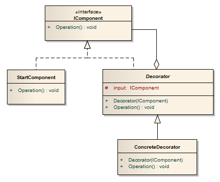
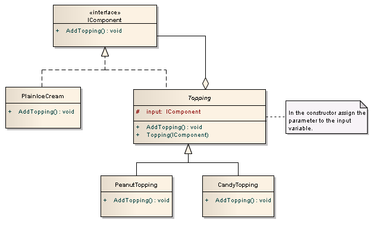

# Decorator

> O padrão do Decorator é um padrão de design que amplia a funcionalidade de objetos individuais envolvendo-os com uma ou mais classes de Decorator. Esses decoradores podem modificar membros existentes e adicionar novos métodos e propriedades em tempo de execução. A funcionalidade de extensão do objeto pode ser feita de forma estática (em tempo de compilação) usando a herança ou, ou dinamicamente (em tempo de execução), envolvendo-os em um objeto de uma classe de Decorator. O padrão do Decorator é aplicado em objetos individuais, e não em classes. O padrão do Decorator é uma alternativa à subclasse. Esse padrão permite que você crie vários decoradores que podem ser empilhados um ao lado do outro, cada vez que adiciona uma nova funcionalidade ao método substituído.

> Permite adicionar recursos a um objeto dinamicamente.

> No padrão _Decorator_ cada característica é representada por uma classe. Portanto, se tiver 10 recursos, existirá 10 classes de Decorator.

- É usado para adicionar características ou comportamentos adicionais a uma instância específica de uma classe, enquanto não modifica as outras instâncias da mesma classe.

- A decoração de um objeto altera seu comportamento, não a sua interface.

- Usa a composição em vez da herança para estender a funcionalidade de um objeto em tempo de execução.

- Permite adicionar novas funcionalidades a um objeto existente sem alterar sua estrutura.

- Esse padrão cria uma classe de Decorator que envolve a classe original e fornece funcionalidade adicional mantendo a assinatura dos métodos de classe intacta.

- Anexa responsabilidades adicionais a um objeto dinamicamente. Os decoradores oferecem uma alternativa flexível à subclasse para ampliar a funcionalidade.



- A interface `IComponent` define as operações ou os recursos que os decoradores podem executar.

- A classe `StartComponent` é o objeto inicial para o qual você pode adicionar recursos dinamicamente. _Você criará este objeto primeiro e adicionará recursos a ele._

- A classe `Decorator` é uma classe abstrata e é a classe pai de todos os decoradores. Enquanto implementa a interface `IComponent` para definir as operações, ela também contém uma variável `input` privada que aponta para o objeto a ser decorado. A variável `input` é simplesmente atribuída no construtor.

- O construtor da classe `Decorator` é:

```csharp
public Decorator(IComponent i)
{
    input = i;
}
```

- A classe `ConcreteDecorator` é a classe Decorator real que pode adicionar recursos. Pode existir quantas classe `ConcreteDecorator` forem necessárias, onde cada uma representará um recurso que pode ser adicionado.

Vamos ver um exemplo de como esse padrão funciona. No nosso exemplo, você tem um simples sorvete onde pode ser adicionado diferentes combinações de coberturas.



- A interface `IComponent` possui o método `AddTopping` que todas as classes implementam.

- A classe `PlainIceCream` é o objeto inicial.

- A classe abstrata `Topping` é a classe pai de todos os decoradores. Em seu construtor atribui o parâmetro do tipo `IComponente` à variável de `input`, que aponta para o objeto a ser decorado.

- As classes `PeanutTopping` e o `CandyTopping` são os decoradores, onde cada Decorator possui sua própria implementação sobre como adicionar as coberturas.

O código do cliente para usar os decoradores será:

```csharp
IComponent a = new PlainIceCream();
IComponent b = new PeanutTopping(a);
IComponent c = new CandyTopping(b);

c.AddTopping(); // Do all the operations of AddTopping() of PlainIceCream, PeanutTopping, and CandyTopping in one call
```

O código acima permite que você adicione recursos dinamicamente usando as combinações que o usuário pode escolher.

O método `AddTopping` dos decoradores chamará os decoradores anteriores primeiro, seguido da decoração que você define:

```csharp
public void AddTopping()
{
    input.AddTopping();     // Make the previous object do the decorations first
                            // Then add the implementation here to add the new feature
}
```

Abaixo estão o código de implementação e a saída do padrão de design do Decorator do nosso exemplo. Observe que você pode adicionar qualquer combinação de recursos dinamicamente no código do cliente:

```csharp
using System;

namespace Decorator
{
    public class Program
    {
        static void Main(string[] args)
        {
            IComponent plainIceCream = new PlainIceCream();
            IComponent candyTopping = new CandyTopping(plainIceCream);
            IComponent peanutTopping = new PeanutTopping(candyTopping);
            IComponent nutsTopping = new NutsTopping(peanutTopping);

            nutsTopping.AddTopping();
        }
    }

    public interface IComponent
    {
        void AddTopping();
    }

    public class PlainIceCream : IComponent
    {
        public void AddTopping()
        {
            Console.WriteLine("Plain Ice Cream ready for some toppings");
        }
    }

    public abstract class Topping : IComponent
    {
        protected IComponent input;

        public Topping(IComponent component)
        {
            input = component;
        }

        public virtual void AddTopping()
        {
        }
    }

    public class CandyTopping : Topping, IComponent
    {
        public CandyTopping(IComponent component) : base(component)
        {
        }

        public override void AddTopping()
        {
            input.AddTopping();

            Console.WriteLine("Candy Topping added");
        }
    }

    public class PeanutTopping : Topping, IComponent
    {
        public PeanutTopping(IComponent component) : base(component)
        {
        }

        public override void AddTopping()
        {
            input.AddTopping();

            Console.WriteLine("Peanut Topping added");
        }
    }

    public class NutsTopping : Topping, IComponent
    {
        public NutsTopping(IComponent component) : base(component)
        {
        }

        public override void AddTopping()
        {
            input.AddTopping();

            Console.WriteLine("Nuts Topping added");
        }
    }
}
```

**Output**

```
Plain Ice Cream ready for some toppings
Candy Topping added
Peanut Topping added
Nuts Topping added
```

## Participantes


- **`Component|ComponentBase`**
    - É uma classe que pode ter responsabilidades adicionais associadas a ele em tempo de execução.
    - Interface dos objetos que terão recursos acrescentadas dinamicamente.
    - É uma classe abstrata base para todos os componentes e decoradores concretos. Esta classe define membros padrão, que devem ser implementados por este tipo de classes.

- **`ConcreteComponent`**
    - É o objeto original ao qual as responsabilidades/caracteristicas/recursos adicionais são adicionadas.
    - O objeto aos quais podem ser atribuídas novas responsabilidades.
    - Esta classe herda `ComponentBase`|`Component`. Pode haver várias classes de componentes concreto, cada uma definindo um tipo de objeto que pode ser envolvido pelos decoradores.

- **`Decorator`**
    - É uma classe abstrata que contém uma referência ao objeto `component` e também implementa a interface `Component`.
    - Define uma interface que referencia a interface de `Component`.
    - Classe base abstrata para todos os decoradores. Ele adiciona um construtor que aceita um objeto `ComponentBase` como seu parâmetro. O objeto passado é o componente que será envolvido. Como o objeto envolvido deve herdar `ComponentBase`, pode ser um componente concreto ou outro Decorator. Isso permite que vários Decorators sejam aplicados a um único objeto.

- **`ConcreteDecorator`**
    - Estendem o Decorator e criam funcionalidades adicionais em cima da classe `Component`.
    - Acrescenta responsabilidades ao componente.
    - Representa o Decorator concreto para um componente. Pode incluir alguns métodos adicionais que estendem a funcionalidade dos componentes. Os membros das operações podem ser usados ​​de duas maneiras. Eles podem ser inalterados e, neste caso, o método base do componente é chamado ou a operação pode ser alterada e, neste caso, o método de operação é alterado ou totalmente substituído por nova implementação.

## Vantagens

- Aumenta a extensibilidade do objeto, porque as mudanças são feitas pela codificação de novas classes.
- Simplifica a codificação, permitindo que você desenvolva uma série de funcionalidades a partir de classes específicas em vez de codificar todo o comportamento no objeto.

## Regras de Ouro

O Adapter fornece uma interface diferente para o assunto. Proxy fornece a mesma interface. O Decorator fornece uma interface aprimorada. O Adapter muda a interface de um objeto, o Decorator melhora as responsabilidades de um objeto. O decorador é, portanto, mais transparente para o cliente. Como conseqüência, o Decorator suporta composição recursiva, o que não é possível com Adapters puros.

Composite e Decorator têm diagramas de estrutura semelhantes, refletindo o fato de que ambos dependem de composição recursiva para organizar um número aberto de objetos.
Um Decorador pode ser visto como um degenerate Composite com apenas um componente. No entanto, um decorador adiciona responsabilidades adicionais - não se destina à agregação de objetos.
O Decorator é projetado para permitir que você adicione responsabilidades a objetos sem subclasse. O foco da Composite não é o embelezamento, mas sim a representação. Essas intenções são distintas, mas complementares. Conseqüentemente, Composite e Decorator são freqüentemente usados ​​em concerto.
Composite poderia usar a Cadeia de Responsabilidade para permitir que os componentes acessem propriedades globais através de seus pais. Também pode usar Decorator para substituir essas propriedades em partes da composição.
Decorador e Proxy têm propósitos diferentes, mas estruturas similares. Ambos descrevem como fornecer um nível de indireção para outro objeto, e as implementações mantêm uma referência ao objeto ao qual encaminham pedidos.
Decorator lets you change the skin of an object. Strategy lets you change the guts.


## Uso do Padrão

- Quando desejar adicionar de forma transparente e dinamicamente responsabilidades a objetos sem afetar outros objetos.

- Quando desejar adicionar responsabilidades a um objeto que pode ter mudanças no futuro.

- As responsabilidades e comportamentos do objeto devem ser dinamicamente modificáveis.

- As implementações concretas devem ser desacopladas de responsabilidades e comportamentos.

- A funcionalidade específica não deve residir no alto da hierarquia de objetos.

- Muitos objetos pequenos envolvendo uma implementação concreta são aceitáveis.

## Exemplos


Decorator tem o trabalho de delegar todos os métodos da interface do Componente para a instância do Componente envolvido e decorar alguns deles com comportamento adicional. Uma vez que o código de envolvimento e delegação é comum a todos os ConcretDecorators do mesmo Componente, geralmente é compartilhado em uma classe base.

### Structural code in C#


This structural code demonstrates the Decorator pattern which dynamically adds extra functionality to an existing object.

```csharp
using System;

namespace Decorator
{
    public class Program
    {
        static void Main(string[] args)
        {
            // Create ConcreteComponent and two Decorators
            ConcreteComponent concreteComponent = new ConcreteComponent();
            ConcreteDecoratorA concreteDecoratorA = new ConcreteDecoratorA();
            ConcreteDecoratorB concreteDecoratorB = new ConcreteDecoratorB();

            // Link decorators
            concreteDecoratorA.SetComponent(concreteComponent);
            concreteDecoratorB.SetComponent(concreteDecoratorA);

            concreteDecoratorB.Operation();
        }
    }

    // The 'Component' abstract class
    abstract class Component
    {
        public abstract void Operation();
    }

    // The 'ConcreteComponent' class
    class ConcreteComponent : Component
    {
        public override void Operation()
        {
            Console.WriteLine("ConcreteComponent.Operation()");
        }
    }

    // The 'Decorator' abstract class
    abstract class Decorator : Component
    {
        protected Component component;

        public void SetComponent(Component component)
        {
            this.component = component;
        }

        public override void Operation()
        {
            if (component != null) {
                component.Operation();
            }
        }
    }

    // The 'ConcreteDecoratorA' class
    class ConcreteDecoratorA : Decorator
    {
        public override void Operation()
        {
            base.Operation();

            Console.WriteLine("ConcreteDecoratorA.Operation()");
        }
    }

    // The 'ConcreteDecoratorB' class
    class ConcreteDecoratorB : Decorator
    {
        public override void Operation()
        {
            base.Operation();

            AddedBehavior();

            Console.WriteLine("ConcreteDecoratorB.Operation()");
        }

        private void AddedBehavior()
        {
        }
    }
}
```

**Output**

```
ConcreteComponent.Operation()
ConcreteDecoratorA.Operation()
ConcreteDecoratorB.Operation()
```

---------------

```csharp
using System;
using System.Collections.Generic;

namespace Decorator
{
    public class Program
    {
        static void Main(string[] args)
        {
            var component = new ConcreteComponent();
            var decorator = new ConcreteDecorator(component);

            decorator.Operation();
        }
    }

    public abstract class ComponentBase
    {
        public abstract void Operation();
    }

    class ConcreteComponent : ComponentBase
    {
        public override void Operation()
        {
            Console.WriteLine("ConcreteComponent.Operation()");
        }
    }

    public abstract class DecoratorBase : ComponentBase
    {
        private readonly ComponentBase _component;

        protected DecoratorBase(ComponentBase component)
        {
            _component = component;
        }

        public override void Operation()
        {
            _component.Operation();
        }
    }

    public class ConcreteDecorator : DecoratorBase
    {
        public ConcreteDecorator(ComponentBase component) : base(component) { }

        public override void Operation()
        {
            base.Operation();

            Console.WriteLine("[ADDITIONAL CODE BLOCK]");
        }
    }
}
```

**Output**

```
ConcreteComponent.Operation()
[ADDITIONAL CODE BLOCK]
```

### Modelo de empréstimos de livros e vídeos

#### Participantes:

_As classes e objetos que participam deste padrão são:_

-   **`Component`** (**`LibraryItem`**)
    -  Define a interface para os objetos que podem ter responsabilidades adicionadas dinamicamente.
-   **`ConcreteComponent`** (**`Book`**, **`Video`**)
    -  Define um objeto ao qual as responsabilidades adicionais podem ser anexadas.
-   **`Decorator`** (**`Decorator`**)
    -  Mantém uma referência a um objeto `Component` e define uma interface que está em conformidade com a interface do _Component's_.
-   **`ConcreteDecorator`** (**`Borrowable`**)
    -  Acrescenta responsabilidades ao componente.

#### Implementação

```csharp
using System;
using System.Collections.Generic;

namespace Decorator
{
    public class Program
    {
        static void Main(string[] args)
        {
            // Create book
            Book book = new Book("Worley", "Inside ASP.NET", 10);
            book.Display();

            // Create video
            Video video = new Video("Spielberg", "Jaws", 23, 92);
            video.Display();

            // Make video borrowable, then borrow and display
            Console.WriteLine("\nMaking video borrowable:");

            Borrowable borrowvideo = new Borrowable(video);

            borrowvideo.BorrowItem("Customer #1");
            borrowvideo.BorrowItem("Customer #2");

            borrowvideo.Display();
        }
    }

    // The 'Component' abstract class
    abstract class LibraryItem
    {
        private int _numCopies;

        public int NumCopies
        {
            get { return _numCopies; }
            set { _numCopies = value; }
        }

        public abstract void Display();
    }

    // The 'ConcreteComponent' class
    class Book : LibraryItem
    {
        private string _author;
        private string _title;

        public Book(string author, string title, int numCopies)
        {
            this._author = author;
            this._title = title;
            this.NumCopies = numCopies;
        }

        public override void Display()
        {
            Console.WriteLine("\nBook ------ ");
            Console.WriteLine("  Author: {0}", _author);
            Console.WriteLine("  Title: {0}", _title);
            Console.WriteLine("  # Copies: {0}", NumCopies);
        }
    }

    // The 'ConcreteComponent' class
    class Video : LibraryItem
    {
        private string _director;
        private string _title;
        private int _playTime;

        public Video(string director, string title, int numCopies, int playTime)
        {
            this._director = director;
            this._title = title;
            this.NumCopies = numCopies;
            this._playTime = playTime;
        }

        public override void Display()
        {
            Console.WriteLine("\nVideo ----- ");
            Console.WriteLine("  Director: {0}", _director);
            Console.WriteLine("  Title: {0}", _title);
            Console.WriteLine("  # Copies: {0}", NumCopies);
            Console.WriteLine("  Playtime: {0}\n", _playTime);
        }
    }

    // The 'Decorator' abstract class
    abstract class Decorator : LibraryItem
    {
        protected LibraryItem libraryItem;

        // Constructor
        public Decorator(LibraryItem libraryItem)
        {
            this.libraryItem = libraryItem;
        }

        public override void Display()
        {
            libraryItem.Display();
        }
    }

    // The 'ConcreteDecorator' class
    class Borrowable : Decorator
    {
        protected List<string> borrowers = new List<string>();

        // Constructor
        public Borrowable(LibraryItem libraryItem) : base(libraryItem)
        {
        }

        public void BorrowItem(string name)
        {
            borrowers.Add(name);

            libraryItem.NumCopies--;
        }

        public void ReturnItem(string name)
        {
            borrowers.Remove(name);

            libraryItem.NumCopies++;
        }

        public override void Display()
        {
            base.Display();

            foreach (string borrower in borrowers) {
                Console.WriteLine(" Borrower: " + borrower);
            }
        }
    }
}
```

**Output**

```
Book ------
  Author: Worley
  Title: Inside ASP.NET
  # Copies: 10

Video -----
  Director: Spielberg
  Title: Jaws
  # Copies: 23
  Playtime: 92

Making video borrowable:

Video -----
  Director: Spielberg
  Title: Jaws
  # Copies: 21
  Playtime: 92

 Borrower: Customer #1
 Borrower: Customer #2
```

### Modelo de HTML customizado

```php
/**
 * The smallest cohesive interface we can think of for this type of Decorator.
 *
 * This is the Component interface.
 */
interface HtmlElement
{
    /**
     * @return string    Html code.
     */
    public function __toString(): string;

    /**
     * @return string    The name of the POST request key for this element, aka the "name" attribute.
     */
    public function getName(): string;
}

/**
 * Represents a <input type="text" /> html element.
 * It can be created programmatically and then printed.
 *
 * This is the only ConcreteComponent.
 */
class InputText implements HtmlElement
{
    protected $name;

    public function __construct(string $name)
    {
        $this->name = $name;
    }

    public function getName(): string
    {
        return $this->name;
    }

    public function __toString(): string
    {
        return "<input type=\"text\" id=\"{$this->name}\" name=\"{$this->name}\" />\n";
    }
}

/**
 * Very simple base class to share the wrapping code between Decorators.
 *
 * This is the Decorator participant.
 */
abstract class HtmlDecorator implements HtmlElement
{
    protected $element;

    public function __construct(HtmlElement $input)
    {
        $this->element = $input;
    }

    /**
     * All operations are delegated by default, not changing anything of the original behavior.
     *
     * ConcreteDecorators will override the methods they are interested in.
     */
    public function getName(): string
    {
        return $this->element->getName();
    }

    public function __toString(): string
    {
        return $this->element->__toString();
    }
}

/**
 * Adds a custom <label> element alongside the <input> one.
 *
 * Example of ConcreteDecorator.
 */
class LabelDecorator extends HtmlDecorator
{
    protected $label;

    public function setLabel(string $label): void
    {
        $this->label = $label;
    }

    public function __toString(): string
    {
        return "<label for=\"{$this->getName()}\">{$this->label}</label>\n" . $this->element->__toString();
    }
}

/**
 * Adds a <span> containing an error message after the <input> element.
 *
 * Example of ConcreteDecorator.
 */
class ErrorDecorator extends HtmlDecorator
{
    protected $error;

    public function setError(string $message)
    {
        $this->error = $message;
    }

    public function __toString(): string
    {
        return $this->element->__toString() . "<span>{$this->error}</span>\n";
    }
}

$input = new InputText('nickname');
$labelled = new LabelDecorator($input);
$labelled->setLabel('Nick:');
echo $labelled, "\n";

$input = new InputText('nickname');
$error = new ErrorDecorator($input);
$error->setError('You must enter a unique nickname');
echo $error, "\n";

// how can we obtain a LabelledErrorInputText, which has both the <label>
// and <span> elements?
$input = new InputText('nickname');
$labelled = new LabelDecorator($input);
$labelled->setLabel('Nick:');
$error = new ErrorDecorator($labelled); // a Decorator wrapping another one
$error->setError('You must enter a unique nickname');
echo $error;
```

**Output**

```
<label for="nickname">Nick:</label>
<input type="text" id="nickname" name="nickname" />

<input type="text" id="nickname" name="nickname" />
<span>You must enter a unique nickname</span>

<label for="nickname">Nick:</label>
<input type="text" id="nickname" name="nickname" />
<span>You must enter a unique nickname</span>
```

### Modelo de sanduíche personalizado

Nesse caso, temos uma classe `Sandwich` que é uma classe base de componentes. Esta classe possui dois métodos abstratos públicos. O método `GetDescription` que retorna o nome completo do sanduíche com todos os ingredientes. Segundo método chamado `GetPrice` preço de retorno do sanduíche atual.

**Criando dois sanduíches: `TunaSandwich` e `VeggieSandwich`**

Ambas as classes herdam da classe `Sandwich`. `SandwichDecorator` é uma classe básica para todos os decoradores. Esta classe também herda da classe `Sandwich`. Foram preparados três decoradores: `Cheese`, `Corn`, `Olives`. Este decorador substitui os métodos `GetDescription` e `GetPrice` da classe `Sandwich`. O primeiro passo é criar um sanduíche concreto. Você pode escolher entre duas opções: `VeggieSandwich` e `TunaSandwich`. Quando for criado, você pode adicionar alguns ingredientes criando um decorador apropriado e envolvendo seu sanduíche por esse decorador. Se você quiser adicionar outro ingrediente, basta criar uma nova instância de decorador e envolver o sanduíche por este novo decorador. Ao chamar de método, `GetDescription` você receberá o nome do sanduíche com todos os ingredientes.

```csharp
using System;

namespace Decorator
{
    public class Program
    {
        static void Main(string[] args)
        {
            Sandwich mySandwich = new VeggieSandwich();
            Console.WriteLine(mySandwich.GetPrice());
            Console.WriteLine(mySandwich.GetDescription());

            mySandwich = new Cheese(mySandwich);
            Console.WriteLine(mySandwich.GetPrice());
            Console.WriteLine(mySandwich.GetDescription());

            mySandwich = new Corn(mySandwich);
            Console.WriteLine(mySandwich.GetPrice());
            Console.WriteLine(mySandwich.GetDescription());

            mySandwich = new Olives(mySandwich);
            Console.WriteLine(mySandwich.GetPrice());
            Console.WriteLine(mySandwich.GetDescription());
        }
    }

    public abstract class Sandwich
    {
        public abstract string GetDescription();

        public abstract double GetPrice();

        public string Description { get; set; }
    }

    public class TunaSandwich : Sandwich
    {
        public TunaSandwich()
        {
            Description = "Tuna Sandwich";
        }

        public override string GetDescription()
        {
            return Description;
        }

        public override double GetPrice()
        {
            return 4.10;
        }
    }

    public class VeggieSandwich : Sandwich
    {
        public VeggieSandwich()
        {
            Description = "Veggie Sandwich";
        }

        public override string GetDescription()
        {
            return Description;
        }

        public override double GetPrice()
        {
            return 3.45;
        }
    }

    public class SandwichDecorator : Sandwich
    {
        protected Sandwich Sandwich;

        public SandwichDecorator(Sandwich sandwich)
        {
            Sandwich = sandwich;
        }

        public override string GetDescription()
        {
            return Sandwich.GetDescription();
        }

        public override double GetPrice()
        {
            return Sandwich.GetPrice();
        }
    }

    public class Cheese : SandwichDecorator
    {
        public Cheese(Sandwich sandwich) : base(sandwich)
        {
            Description = "Cheese";
        }

        public override string GetDescription()
        {
            return Sandwich.GetDescription() + ", " + Description;
        }

        public override double GetPrice()
        {
            return Sandwich.GetPrice() + 1.23;
        }
    }

    public class Corn : SandwichDecorator
    {
        public Corn(Sandwich sandwich) : base(sandwich)
        {
            Description = "Corn";
        }

        public override string GetDescription()
        {
            return Sandwich.GetDescription() + ", " + Description;
        }

        public override double GetPrice()
        {
            return Sandwich.GetPrice() + 0.35;
        }
    }

    public class Olives : SandwichDecorator
    {
        public Olives(Sandwich sandwich) : base(sandwich)
        {
            Description = "Olives";
        }

        public override string GetDescription()
        {
            return Sandwich.GetDescription() + ", " + Description;
        }

        public override double GetPrice()
        {
            return Sandwich.GetPrice() + 0.89;
        }
    }
}
```

**Output**

```
3.45
Veggie Sandwich
4.68
Veggie Sandwich, Cheese
5.03
Veggie Sandwich, Cheese, Corn
5.92
Veggie Sandwich, Cheese, Corn, Olives
```
