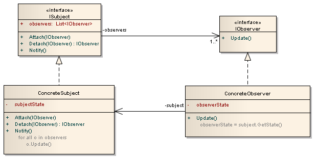

# Observer

> _**Os observadores são registrados para ouvir as mudanças no subject e são notificados quando o subject muda.**_


> Permite que você tenha uma estrutura _publisher-subscriber_ onde uma alteração em um _publisher_ notificará todos os seus _subscribers_ automaticamente. Os subscribers são registrados no publisher para que, quando uma alteração ocorrer no publisher, todos os subscribers sejam notificados. Os publishers e os subscribers são dissociados através do uso de interfaces para que o desenvolvimento de cada um possa variar de forma independente.

- O _Observer_ define um relacionamento um-para-muitos, de modo que quando um objeto muda de estado, os outros são notificados e atualizados automaticamente. Alguns leilões demonstram esse padrão. Cada licitante possui uma raquete numerada que é usada para indicar um lance. O leiloeiro inicia a licitação e "observa" quando uma raquete é levantada para aceitar o lance. A aceitação da oferta altera o preço da oferta que é transmitido para todos os licitantes na forma de um novo lance.


- Usar esse padrão de design permite monitorar e publicar alterações de um único objeto chamado subject. Quando ocorre uma mudança, outros objetos chamados observers podem ser automaticamente notificados chamando um de seus métodos. Esse padrão fornece um acoplamento flexível entre subjects e observers. Os subjects mantêm referências a todos os observers que devem ser notificados quando ocorrem mudanças.

## Organização

Existem duas partes que são:

1. A primeira parte são os _**subjects**_. _Eles são os **publishers**_. Quando ocorre uma mudança em um _subject_, ele deve notificar todos os seus _subscribers_.

2. O segundo são os _**observers**_. _Eles são os **subscribers**_. Eles simplesmente listen/ouvem as mudanças nos _subjects_.

Os _subjects_ são os _publishers_ e os _observers_ são os _subscribers_. É apenas uma terminologia diferente. Abaixo está a UML do **Observer Design Pattern**, a parte esquerda são os _subjects_, e a parte direita são os _observers_:



- `ISubject`: É a interface que todos os publishers implementam e possui as seguintes propriedades e métodos:
    - _`observers`_ - Lista de observadores que ouvem as mudanças no subject;
    - _`Attach`_(_`IObserver`_) - Adiciona um observador para ouvir as alterações no subject;
    - `Detach`(_`IObserver`_) - Remove um observador das alterações, operações de listening no subject;
    - _`Notify()`_ - Enviar atualizações para todos os observadores subscribed/inscreveram;

- `ConcreteSubject`: É a classe do publisher e implementa a interface `ISubject`. Além da implementação da interface `ISubject`, também possui a variável `subjectState`:
    - _`subjectState`_ - Representa o estado do subject;

- `IObserver`: É a interface que todos os subscribers implementam e possui o método `Update`:
    - _`Update()`_ - Atualiza o subscriber e é chamado pelo subject (publisher);

- `ConcreteObserver`: É a classe de subscriber e implementa a interface `IObserver`. Abaixo estão suas variáveis ​​e métodos:
    - _`observerState`_ - Representa o estado do observer;
    - _`Update()`_ - Atualiza o estado do observer. Observe que o método simplesmente atribui a variável `observerState` do estado do subject. Portanto, quando ocorre uma mudança no estado do subject, o estado do observer se tornará o mesmo que o estado do subject.

## Use quando

- Alterações de estado em um ou mais objetos devem acionar o comportamento em outros objetos.
- Recursos de Broadcasting são necessários.
- Quando uma abstração tem dois aspectos, um dependente do outro;
- Quando uma mudança em um objeto exige mudanças em outros;
- Quando um objeto deveria ser capaz de notificar outros objetos sem fazer hipóteses, ou usar informações, sobre quem são esses objetos;

## Vantagens

- Acoplamento fraco entre `Subject` e `Observer`: Tudo que o subject sabe é que ele tem uma lista de observers;
- Suporte para comunicação do tipo broadcast.
- Liberdade de acrescentar e remover observers a qualquer momento.

## Participantes

- `Subject`
    - Conhece seus observadores. Qualquer número de objetos observadores pode observar um subject.
    - Fornece uma interface para anexar e desanexar objetos `Observer`.
    - Pode ser uma classe base abstrata para todos os subjects. Ele contém uma lista protegida de observadores que estão subscribed/inscritos no subject e os métodos permitem adicionar ou remover observadores. Ele também contém um método `Notify` que percorre a lista de observadores e chama seu método `Notify`.

- `ConcreteSubject`
    - Armazena o estado de interesse do `ConcreteObserver`.
    - Envia uma notificação a seus observadores quando seu estado muda.
    - Esta é a implementação concreta da classe/interface `SubjectBase`. Ele mantém seu próprio estado e, quando ocorre uma mudança, ele chama o método `Notify` que percorre todos os observadores e chama seu método `Notify`.

- `Observer`
    - Define uma interface de atualização para objetos que devem ser notificados de alterações em um subject.
    - Pode ser uma classe abstrata para todos os observadores. Ele contém o método que é chamado quando o estado de um subject’s é alterado.

- `ConcreteObserver`
    - Mantém uma referência a um objeto `ConcreteSubject`.
    - Implementa a interface de atualização do `Observer` para manter seu estado consistente com o subject.

## Exemplos

### Código estruturais de exemplos

#### 01

```csharp
using System;
using System.Collections.Generic;

namespace Observer
{
    class Program
    {
        static void Main(string[] args)
        {
            // Configure Observer pattern
            ConcreteSubject s = new ConcreteSubject();

            s.Attach(new ConcreteObserver(s, "X"));
            s.Attach(new ConcreteObserver(s, "Y"));
            s.Attach(new ConcreteObserver(s, "Z"));

            // Change subject and notify observers
            s.SubjectState = "ABC";
            s.Notify();
        }
    }

    // The 'Subject' abstract class
    abstract class Subject
    {
        private List<Observer> _observers = new List<Observer>();

        public void Attach(Observer observer)
        {
            _observers.Add(observer);
        }

        public void Detach(Observer observer)
        {
            _observers.Remove(observer);
        }

        public void Notify()
        {
            foreach (Observer o in _observers) {
                o.Update();
            }
        }
    }

    // The 'ConcreteSubject' class
    class ConcreteSubject : Subject
    {
        private string _subjectState;

        // Gets or sets subject state
        public string SubjectState
        {
            get { return _subjectState; }
            set { _subjectState = value; }
        }
    }

    /// The 'Observer' abstract class
    abstract class Observer
    {
        public abstract void Update();
    }

    // The 'ConcreteObserver' class
    class ConcreteObserver : Observer
    {
        private string _name;
        private string _observerState;
        private ConcreteSubject _subject;

        public ConcreteObserver(ConcreteSubject subject, string name)
        {
            this._subject = subject;
            this._name = name;
        }

        public override void Update()
        {
            _observerState = _subject.SubjectState;

            Console.WriteLine("Observer {0}'s new state is {1}", _name, _observerState);
        }

        // Gets or sets subject
        public ConcreteSubject Subject
        {
            get { return _subject; }
            set { _subject = value; }
        }
    }
}
```

**Output**

```
Observer X's new state is ABC
Observer Y's new state is ABC
Observer Z's new state is ABC
```

#### 02

```csharp
using System;
using System.Collections.Generic;

namespace Observer
{
    class Program
    {
        static void Main(string[] args)
        {
            // One subject and two observers
            ISubject<string> subject = new ConcreteSubject<string>();

            IObserver<string> observer1 = new ConcreteObserver<string>("observer1");
            IObserver<string> observer2 = new ConcreteObserver<string>("observer2");

            // Register the observers to the subject
            subject.Attach(observer1);
            subject.Attach(observer2);

            // A change to the subject automatically notifies all the observers
            subject.SetState("stateX");
        }
    }

    public interface ISubject<T>
    {
        List<IObserver<T>> Observers { get; }
        void Attach(IObserver<T> i);
        IObserver<T> Detach(IObserver<T> i);
        void Notify();
        T GetState();
        void SetState(T state);
    }

    public class ConcreteSubject<T> : ISubject<T>
    {
        private List<IObserver<T>> Observers = new List<IObserver<T>>();
        private T SubjectState;

        List<IObserver<T>> ISubject<T>.Observers
        {
            get { return Observers; }
        }

        void ISubject<T>.Attach(IObserver<T> i)
        {
            Observers.Add(i);
        }

        IObserver<T> ISubject<T>.Detach(IObserver<T> i)
        {
            Observers.Remove(i);
            return i;
        }

        void ISubject<T>.Notify()
        {
            foreach (IObserver<T> o in Observers)
                o.Update(SubjectState);   // Update the observer
        }

        T ISubject<T>.GetState()
        {
            return SubjectState;
        }

        void ISubject<T>.SetState(T state)
        {
            SubjectState = state;
            ((ISubject<T>)this).Notify();  // Notify the observers of the change
        }
    }

    public interface IObserver<T>
    {
        void Update(T subjectState);
        // T GetState();
    }

    public class ConcreteObserver<T> : IObserver<T>
    {
        private T observerState;
        private string name;

        public ConcreteObserver(string name)
        {
            this.name = name;
        }

        void IObserver<T>.Update(T subjectState)
        {
            observerState = subjectState;
            Console.WriteLine(this.name + " is now " + this.observerState);
        }
    }
}
```

**Output**

```
observer1 is now stateX
observer2 is now stateX
```

#### 03

```csharp
using System;
using System.Collections;
using System.Collections.Generic;

namespace Observer
{
    class Program
    {
        static void Main(string[] args)
        {
            var subject = new ConcreteSubject();

            subject.Attach(new ConcreteObserver(subject, "Observer 1"));
            subject.Attach(new ConcreteObserver(subject, "Observer 2"));
            subject.Attach(new ConcreteObserver(subject, "Observer 3"));

            subject.SetState("STATE");
        }
    }


    public abstract class SubjectBase
    {
        private ArrayList _observers = new ArrayList();

        public void Attach(ObserverBase o)
        {
            _observers.Add(o);
        }

        public void Detach(ObserverBase o)
        {
            _observers.Remove(o);
        }

        public void Notify()
        {
            foreach (ObserverBase o in _observers) {
                o.Update();
            }
        }
    }

    public class ConcreteSubject : SubjectBase
    {
        private string _state;

        public string GetState()
        {
            return _state;
        }

        public void SetState(string newState)
        {
            _state = newState;
            Notify();
        }
    }

    public abstract class ObserverBase
    {
        public abstract void Update();
    }


    public class ConcreteObserver : ObserverBase
    {
        private ConcreteSubject _subject;
        private string _name;

        public ConcreteObserver(ConcreteSubject subject, string name)
        {
            _subject = subject;
            _name = name;
        }

        public override void Update()
        {
            string subjectState = _subject.GetState();
            Console.WriteLine(_name + ": " + subjectState);
        }
    }
}
```

**Output**

```
Observer 1: STATE
Observer 2: STATE
Observer 3: STATE
```

### Exemplo em que investidores registrados são notificados quando uma ação muda de valor

```csharp
using System;
using System.Collections.Generic;

namespace Observer
{
    class Program
    {
        static void Main(string[] args)
        {
            // Create IBM stock and attach investors
            IBM ibm = new IBM("IBM", 120.00);
            ibm.Attach(new Investor("Allyson"));
            ibm.Attach(new Investor("Silva"));

            // Fluctuating prices will notify investors
            ibm.Price = 120.10;
            ibm.Price = 121.00;
            ibm.Price = 120.50;
            ibm.Price = 120.75;
        }
    }

    // The 'Subject' abstract class
    abstract class Stock
    {
        private string _symbol;
        private double _price;
        private List<IInvestor> _investors = new List<IInvestor>();

        // Constructor

        public Stock(string symbol, double price)
        {
            this._symbol = symbol;
            this._price = price;
        }

        public void Attach(IInvestor investor)
        {
            _investors.Add(investor);
        }

        public void Detach(IInvestor investor)
        {
            _investors.Remove(investor);
        }

        public void Notify()
        {
            foreach (IInvestor investor in _investors) {
                investor.Update(this);
            }

            Console.WriteLine("");
        }

        // Gets or sets the price
        public double Price
        {
            get { return _price; }
            set
            {
                if (_price != value) {
                    _price = value;
                    Notify();
                }
            }
        }

        // Gets the symbol
        public string Symbol
        {
            get { return _symbol; }
        }
    }

    // The 'ConcreteSubject' class
    class IBM : Stock
    {
        public IBM(string symbol, double price) : base(symbol, price)
        {
        }
    }

    // The 'Observer' interface
    interface IInvestor
    {
        void Update(Stock stock);
    }

    // The 'ConcreteObserver' class
    class Investor : IInvestor
    {
        private string _name;
        private Stock _stock;

        public Investor(string name)
        {
            this._name = name;
        }

        public void Update(Stock stock)
        {
            Console.WriteLine("Notified {0} of {1}'s change to {2:C}", _name, stock.Symbol, stock.Price);
        }

        // Gets or sets the stock
        public Stock Stock
        {
            get { return _stock; }
            set { _stock = value; }
        }
    }
}
```

**Output**

```
Notified Allyson of IBM's change to $120.10
Notified Silva of IBM's change to $120.10

Notified Allyson of IBM's change to $121.00
Notified Silva of IBM's change to $121.00

Notified Allyson of IBM's change to $120.50
Notified Silva of IBM's change to $120.50

Notified Allyson of IBM's change to $120.75
Notified Silva of IBM's change to $120.75
```
