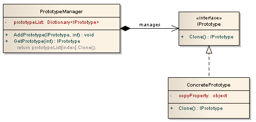
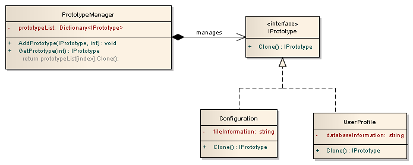

# Prototype


- Permite evitar rotinas de inicialização custosas quando você constrói objetos que são muito parecidos.

- Objetivo de minimizar a quantidade de trabalho necessário na criação de novos objetos quando as rotinas de inicialização são custosas.

- Quando falamos sobre a criação de objetos, podemos encontrar uma maneira melhor de ter novos objetos: a clonagem. Para esta ideia, um padrão de design específico está relacionado: em vez da criação, ele usa a clonagem. Se o custo de criação de um novo objeto for grande e a criação seja intensiva em recursos, clonamos o objeto.

- Prototype é um padrão que possibilita a criação de objetos utilizando um modelo, ou protótipo, seja ele aplicado em uma classe simples ou em outro pattern.

- Sua finalidade é a de especificar os tipos de objetos para criar usando uma protótipo de instância e então criar novos objetos copiando este protótipo. Prototype pode ser usado quando um sistema tiver que ser independente de como os seus produtos são criados, ou quando as classes a instanciar serem especificadas em tempo de execução.

- O padrão é bastante simples: a interface `Prototype` declara métodos para clonagem, enquanto o `ConcretePrototype` implementa a operação para clonagem propriamente dita.

## Organização

**UML**



- A classe `PrototypeManager` é apenas uma classe gerenciadora que é usada para adicionar e recuperar protótipos por um número de índice, ela tem a seguinte variável e métodos:
    - `PrototypeList` é uma variável de coleção que armazena todos os protótipos.
    - O método `AddPrototype` permite que você adicione um protótipo à coleção e atribua-lhe um número de índice.
    - O método `GetPrototype` permite recuperar um protótipo da coleção usando um número de índice.

- A interface `IPrototype` especifica os métodos que todas as classes protótipos devem implementar. Possui o método `Clone` que retorna uma interface `IPrototype`.

- A classe `ConcretePrototype` é a classe de protótipo real, implementa a interface `IPrototype` e tem a seguinte propriedade e método:
    - A variável `copyProperty` contém a informação que está pré-utilizada. Se o valor da variável for alterado, as novas instâncias criadas terão o novo valor.
    - O método `Clone` fará uma cópia de si mesmo. Se a variável `copyProperty` for um tipo de valor (como `int` ou `string`), você pode usar apenas uma cópia superficial. Se o `copyProperty` for um tipo de referência (como um objeto que contenha outros objetos), você precisará fazer uma cópia profunda da variável.

A chave para o padrão de protótipo é que você criará seu primeiro objeto com inicializações com alto custo, em seguida, armazenará os valores como um protótipo no repositório. Quando você precisa criar o mesmo objeto novamente, você pode simplesmente obter a cópia do protótipo do repositório com todos os valores pré-populados.

**_UML-Exemplo_**


```csharp
using System;
using System.Threading;
using System.Collections.Generic;

namespace Prototype
{
    class Program
    {
        static void Main(string[] args)
        {
            DateTime startTime, endTime;

            startTime = DateTime.Now;
            Configuration configuration = new Configuration();
            configuration.GetFileInformation();  // Takes long time to create the first time
            endTime = DateTime.Now;

            Console.WriteLine($"First Configuration object took {endTime.Subtract(startTime).TotalSeconds} seconds");

            UserProfile userProfile = new UserProfile();
            startTime = DateTime.Now;
            userProfile.GetDatabaseInformation();  // Takes long time to create the first time
            endTime = DateTime.Now;

            Console.WriteLine($"First UserProfile object took {endTime.Subtract(startTime).TotalSeconds} seconds");

            // Add prototypes to the manager
            PrototypeManager manager = new PrototypeManager();
            manager.AddPrototype(configuration, 0);
            manager.AddPrototype(userProfile, 1);

            startTime = DateTime.Now;
            (manager.GetPrototype(0).Clone() as Configuration).ShowInformation();  // New prototype copy
            endTime = DateTime.Now;

            Console.WriteLine($"Second Configuration object took {endTime.Subtract(startTime).TotalSeconds} seconds");

            startTime = DateTime.Now;
            (manager.GetPrototype(1).Clone() as UserProfile).ShowInformation();  // New prototype copy
            endTime = DateTime.Now;

            Console.WriteLine($"Second UserProfile object took {endTime.Subtract(startTime).TotalSeconds} seconds");
        }
    }

    public interface IPrototype
    {
        IPrototype Clone();
    }

    public class PrototypeManager
    {
        // Dictionary that holds the list of prototypes
        private Dictionary<int, IPrototype> list = new Dictionary<int, IPrototype>();

        public void AddPrototype(IPrototype prototype, int index)
        {
            list.Add(index, prototype);  // Add prototype to collection
        }

        public IPrototype GetPrototype(int index)
        {
            //return prototype from collection
            return list[index].Clone();
        }
    }

    public class Configuration : IPrototype
    {
        private string fileInformation;

        public void GetFileInformation()
        {
            Thread.Sleep(5000);  // Takes 5 seconds to get information
            fileInformation = "Long file information";
        }

        public IPrototype Clone()
        {
            Configuration configuration = new Configuration();   // Create new object
            configuration.fileInformation = this.fileInformation; // Copy value
            return configuration;
        }

        public void ShowInformation()
        {
            Console.WriteLine("Showing " + fileInformation);
        }
    }

    public class UserProfile : IPrototype
    {
        private string databaseInformation;

        public void GetDatabaseInformation()
        {
            Thread.Sleep(5000);  // Takes 5 seconds to get information
            databaseInformation = "Long database information";
        }

        public IPrototype Clone()
        {
            UserProfile userProfile = new UserProfile();  // Create new object
            userProfile.databaseInformation = this.databaseInformation; // Copy value
            return userProfile;
        }

        public void ShowInformation()
        {
            Console.WriteLine("Showing " + databaseInformation);
        }
    }
}
```

**Output**

```
First Configuration object took 5.014284 seconds
First UserProfile object took 5.005499 seconds
Showing Long file information
Second Configuration object took 0.000718 seconds
Showing Long database information
Second UserProfile object took 0.000504 seconds
```

## Vantagens

> A principal vantagem desse padrão é ter um processo mínimo de criação de instâncias, que tem um custo muito alto do que o processo de clonagem.

- Reduz a necessidade de sub-classificação.
- Esconde complexidades de criação de objetos.
- Os clientes podem obter novos objetos sem saber qual o tipo de objeto que será.
- Permite adicionar ou remover objetos em tempo de execução.
- Reduz o número de subclasses.
- Configura dinamicamente uma aplicação com classes.

## Uso do padrão

- Quando as classes são instanciadas no tempo de execução.
- Quando o custo da criação de um objeto é caro ou complicado.
- Quando você deseja manter o número de aulas em um mínimo de aplicação.
- Quando o aplicativo cliente precisa desconhecer a criação e representação de objetos.
- Composição, criação e representação de objetos devem ser desacoplados de um sistema.
- As classes a serem criadas são especificadas em tempo de execução.
- Existe um número limitado de combinações de estados em um objeto.
- São necessários objetos ou estruturas de objetos idênticos ou parecidos com outros objetos ou estruturas de objetos existentes.
- A criação inicial de cada objeto é uma operação cara.
- *Desejar incluir apenas o necessário ao objeto, ou realizar alguma personalização ao mesmo*.

Em resumo, em vez de ter problemas para criar objetos a partir do zero, você pode fazer cópias de uma instância original e modificá-la, conforme necessário.

## Participantes

- `Prototype`
    - Declares an interface for cloning itself.
- `ConcretePrototype`
    - Implements an operation for cloning itself.

## Exemplos

### Código estrutural

```csharp
using System;

namespace Prototype
{
    class Program
    {
        static void Main(string[] args)
        {
            // Create two instances and clone each
            ConcretePrototype1 p1 = new ConcretePrototype1("I");
            ConcretePrototype1 c1 = (ConcretePrototype1)p1.Clone();

            Console.WriteLine("Cloned: {0}", c1.Id);

            ConcretePrototype2 p2 = new ConcretePrototype2("II");
            ConcretePrototype2 c2 = (ConcretePrototype2)p2.Clone();

            Console.WriteLine("Cloned: {0}", c2.Id);
        }
    }

    // The 'Prototype' abstract class
    abstract class Prototype
    {
        private string _id;

        public Prototype(string id)
        {
            this._id = id;
        }

        public string Id
        {
            get { return _id; }
        }

        public abstract Prototype Clone();
    }

    // A 'ConcretePrototype' class
    class ConcretePrototype1 : Prototype
    {
        public ConcretePrototype1(string id) : base(id)
        {
        }

        // Returns a shallow copy
        public override Prototype Clone()
        {
            return (Prototype)this.MemberwiseClone();
        }
    }

    // A 'ConcretePrototype' class
    class ConcretePrototype2 : Prototype
    {
        public ConcretePrototype2(string id) : base(id)
        {
        }

        // Returns a shallow copy
        public override Prototype Clone()
        {
            return (Prototype)this.MemberwiseClone();
        }
    }
}
```

**Output**

```
Cloned: I
Cloned: II
```

### Exemplo de cópia de cores

```csharp
using System;
using System.Collections.Generic;

namespace Prototype
{
    class Program
    {
        static void Main(string[] args)
        {
            ColorManager colormanager = new ColorManager();

            // Initialize with standard colors
            colormanager["red"] = new Color(255, 0, 0);
            colormanager["green"] = new Color(0, 255, 0);
            colormanager["blue"] = new Color(0, 0, 255);

            // User adds personalized colors
            colormanager["angry"] = new Color(255, 54, 0);
            colormanager["peace"] = new Color(128, 211, 128);
            colormanager["flame"] = new Color(211, 34, 20);

            // User clones selected colors
            Color color1 = colormanager["red"].Clone() as Color;
            Color color2 = colormanager["peace"].Clone() as Color;
            Color color3 = colormanager["flame"].Clone() as Color;
        }
    }

    // The 'Prototype' abstract class
    abstract class ColorPrototype
    {
        public abstract ColorPrototype Clone();
    }

    // The 'ConcretePrototype' class
    class Color : ColorPrototype
    {
        private int _red;
        private int _green;
        private int _blue;

        public Color(int red, int green, int blue)
        {
            this._red = red;
            this._green = green;
            this._blue = blue;
        }

        // Create a shallow copy
        public override ColorPrototype Clone()
        {
            Console.WriteLine("Cloning color RGB: {0,3},{1,3},{2,3}", _red, _green, _blue);

            return this.MemberwiseClone() as ColorPrototype;
        }
    }

    // Prototype manager
    class ColorManager
    {
        private Dictionary<string, ColorPrototype> _colors = new Dictionary<string, ColorPrototype>();

        // Indexer
        public ColorPrototype this[string key]
        {
            get { return _colors[key]; }
            set { _colors.Add(key, value); }
        }
    }
}
```

**Output**

```
Cloning color RGB: 255,  0,  0
Cloning color RGB: 128,211,128
Cloning color RGB: 211, 34, 20
```

### Exemplo de estrutura de Widget

O padrão Prototype permite:

- Gerenciamento de instâncias disponíveis em tempo de execução, executado simplesmente adicionando e removendo operações em uma coleção de objetos cloneáveis.

- Especificação de novos objetos muito semelhantes uns aos outros, clonando um existente e alterando suas propriedades usando setters.

```php
/**
 * SECTION 1: a Widget interface and two different implementations.
 *
 * Unlike in previous examples, where the Product was an Helper which generated widgets, the actual instance created here is the Widget itself.
 *
 * The problem solved, though, is the same: managing creation of widgets in the middle of business logic.
 *
 * This class purpose is to generate blinking text in spite of all usability recommendations.
 *
 * This is the Prototype.
 *
 * As always, interfaces in php may be omitted. This is primary here for type hinting.
 */
interface BlinkingWidget
{
}

/**
 * Implementation that generates html tied to a javascript library.
 *
 * This is one ConcretePrototype.
 */
class JavascriptWidget implements BlinkingWidget
{
    public function initialize($text)
    {
        $this->_text = $text;
    }

    public function __toString()
    {
        return '<div dojoType="...">' . $this->_text . '</div>';
    }
}

/**
 * A collaborator for the next ConcretePrototype.
 */
class ObjectTag
{
    private $_html;

    public function setContent($html)
    {
        $this->_html = $html;
    }

    public function __toString()
    {
        return "<object>{$this->_html}</object>\n";
    }
}

/**
 * Implementation that generates html that loads a flash object.
 *
 * This is one ConcretePrototype.
 */
class FlashWidget implements BlinkingWidget
{
    private $_objectTag;

    public function __construct(ObjectTag $objectTag)
    {
        $this->_objectTag = $objectTag;
    }

    public function initialize($text)
    {
        $this->_objectTag->setContent("<param name=\"text\">$text</param>");
    }

    public function __toString()
    {
        return (string) $this->_objectTag;
    }

    /**
     * When using the clone operator, php will perform a shallow copy of the original object, duplicating references to the same collaborators.
     *
     * Then this method will be called on the newly created object; it's time
     * to perform a cloning of the collaborators which cannot be shared with the original instance.
     *
     * This is NOT an override: it's a post-cloning hook which completes the
     * new instance substituting some shallow copies with deep ones.
     */
    public function __clone()
    {
        $this->_objectTag = clone $this->_objectTag;
    }
}

/**
 * SECTION 2: a Client class which clones instances of BlinkingWidget.
 *
 * We cannot instantiate all the BlinkingWidgets in advance, so we need a base
 * one which will be cloned every time a new one is needed.
 */
class LoginPage
{
    private $_widget;

    public function __construct(BlinkingWidget $toClone)
    {
        $this->_widget = $toClone;
    }

    public function render()
    {
        $userId = uniqid('User ');

        // insert all the logic needed here...
        if (true or $complexBusinessLogicRules) {

            $widget = clone $this->_widget;
            $widget->initialize("Welcome, $userId");

            return (string) $widget;
        }
    }
}

$prototypeWidget = new FlashWidget(new ObjectTag);
$page = new LoginPage($prototypeWidget);
echo $page->render(), "\n";

$page = new LoginPage(new JavascriptWidget);
echo $page->render(), "\n";
```

**Output**

```
<object><param name="text">Welcome, User 5b8321ed1e750</param></object>

<div dojoType="...">Welcome, User 5b8321ed1e79c</div>
```
