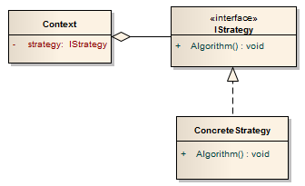
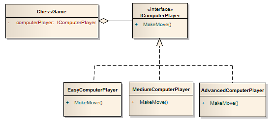

# Strategy


> Definir uma família de algoritmos, encapsular cada uma delas e torná-las intercambiáveis. _Strategy_ permite que o algoritmo varie independentemente dos clientes que o utilizam.

> _Strategy_ permite que você altere o comportamento de um aplicativo quando recebe um contexto. O contexto é o shell externo que o código do cliente chama e o comportamento é definido pelas classes de strategy. O padrão permite separar o contexto externo dos comportamentos internos.

> Define um conjunto de algoritmos encapsulados que podem ser trocados para realizar um comportamento específico.

- Defina uma família de algoritmos, encapsule cada um deles e torne-os intercambiáveis. _Strategy_ permite que o algoritmo varie independentemente dos clientes que o usam.

- Cria-se objetos que representam várias _Strategies_ e um objeto de contexto cujo comportamento varia de acordo com seu objeto de _Strategy_. O objeto de _Strategy_ altera o algoritmo de execução do objeto de contexto.

- Uma comparação entre a UML do padrão de _Strategy_ e o padrão de _State_ mostra semelhanças impressionantes. Ambos os padrões definem os comportamentos como as classes concretas e ambos os padrões definem o contexto no qual o comportamento é executado. Mas existem diferenças claras. O padrão _Strategy_ permite que o código do cliente escolha o comportamento necessário, enquanto o padrão _State_ usa o comportamento para alternar para outros comportamentos.

## Use quando

- Um objeto deve ser parametrizado com um de vários algoritmos;
- A única diferença entre muitas classes relacionadas é seu comportamento.
- Classes relacionadas diferem somente no seu comportamento;
- Várias versões ou variações de um algoritmo são necessárias.
- O comportamento de uma classe deve ser definido em tempo de execução.
- Declarações condicionais são complexas e difíceis de manter.
- Quando necessitar de variantes de um algoritmo;
- Um algoritmo usa dados dos quais os clientes não deveriam ter conhecimento.

## Participantes



- A interface `IStrategy` define os comportamentos suportados.
    - Possui o método `Algorithm` que especifica o comportamento.

- A classe `ConcreteStrategy` são classes que implementam os comportamentos. Você terá várias classes `ConcreteStrategy`, onde cada classe implementa um comportamento.
    - Possui o método `Algorithm` que implementa o comportamento.

- A classe `Context` define a situação para usar os comportamentos.
    - Possui a variável `strategy` que aponta para o comportamento do Contexto.

---------

- `Strategy`: Define uma interface comum a todos os algoritmos suportados. `Context` usa essa interface para chamar o algoritmo definido por um `ConcreteStrategy`.

- `ConcreteStrategy`: Cada `Strategy` concreta implementa um algoritmo.

- `Context`:
    - Contém uma referência a um objeto de `Strategy`.
    - Pode definir uma interface que permita `Strategy` acessar seus dados.

## Vantagens

- O benefício do padrão é permitir que você escolha o comportamento do aplicativo em tempo de execução. Você só precisa definir os comportamentos como classes de _Strategy_, e o código do cliente pode simplesmente escolher qualquer uma das classes para exibir o comportamento.

- Famílias de algoritmos relacionados;
- Uma alternativa ao uso de subclasses;
- Estratégias que eliminam comandos condicionais da linguagem de programação;
- A possibilidade de escolha de implementações;

## Exemplos

### Modelo código estrutural


- `Strategy` (`SortStrategy`)
    - Declara uma interface comum a todos os algoritmos suportados. Contexto usa essa interface para chamar o algoritmo definido por um `ConcreteStrategy`.

- `ConcreteStrategy` (`QuickSort`, `ShellSort`, `MergeSort`)
    - Implementa o algoritmo usando a interface `Strategy`.

- `Context` (`SortedList`)
    - Está configurado com um objeto `ConcreteStrategy`.
    - Mantém uma referência a um objeto `Strategy`.
    - Pode definir uma interface que permita à `Strategy` acessar seus dados.

```csharp
using System;

namespace Strategy
{
    class Program
    {
        static void Main(string[] args)
        {
            Context context;

            // Three contexts following different strategies
            context = new Context(new ConcreteStrategyA());
            context.ContextInterface();

            context = new Context(new ConcreteStrategyB());
            context.ContextInterface();

            context = new Context(new ConcreteStrategyC());
            context.ContextInterface();
        }
    }

    // The 'Strategy' abstract class
    abstract class Strategy
    {
        public abstract void AlgorithmInterface();
    }

    // A 'ConcreteStrategy' class
    class ConcreteStrategyA : Strategy
    {
        public override void AlgorithmInterface()
        {
            Console.WriteLine("Called ConcreteStrategyA.AlgorithmInterface()");
        }
    }

    // A 'ConcreteStrategy' class
    class ConcreteStrategyB : Strategy
    {
        public override void AlgorithmInterface()
        {
            Console.WriteLine("Called ConcreteStrategyB.AlgorithmInterface()");
        }
    }

    // A 'ConcreteStrategy' class
    class ConcreteStrategyC : Strategy
    {
        public override void AlgorithmInterface()
        {
            Console.WriteLine("Called ConcreteStrategyC.AlgorithmInterface()");
        }
    }

    // The 'Context' class
    class Context
    {
        private Strategy _strategy;

        public Context(Strategy strategy)
        {
            this._strategy = strategy;
        }

        public void ContextInterface()
        {
            _strategy.AlgorithmInterface();
        }
    }
}
```

### Exemplo de algoritmo de classificação de objetos

```csharp
using System;
using System.Collections.Generic;

namespace Strategy
{
    class Program
    {
        static void Main(string[] args)
        {
            // Two contexts following different strategies
            SortedLists studentRecords = new SortedLists();

            studentRecords.Add("Allyson");
            studentRecords.Add("Anna");
            studentRecords.Add("Silva");
            studentRecords.Add("Bianca");
            studentRecords.Add("Fernando");

            studentRecords.SetSortStrategy(new QuickSort());
            studentRecords.Sort();

            studentRecords.SetSortStrategy(new ShellSort());
            studentRecords.Sort();

            studentRecords.SetSortStrategy(new MergeSort());
            studentRecords.Sort();
        }
    }

    // The 'Strategy' abstract class
    abstract class SortStrategy
    {
        public abstract void Sort(List<string> list);
    }

    // A 'ConcreteStrategy' class
    class QuickSort : SortStrategy
    {
        public override void Sort(List<string> list)
        {
            list.Sort(); // Default is Quicksort
            Console.WriteLine("QuickSorted list ");
        }
    }

    // A 'ConcreteStrategy' class
    class ShellSort : SortStrategy
    {
        public override void Sort(List<string> list)
        {
            // list.ShellSort(); not-implemented
            Console.WriteLine("ShellSorted list ");
        }
    }

    // A 'ConcreteStrategy' class
    class MergeSort : SortStrategy
    {
        public override void Sort(List<string> list)
        {
            // list.MergeSort(); not-implemented
            Console.WriteLine("MergeSorted list ");
        }
    }

    // The 'Context' class
    class SortedLists
    {
        private List<string> _list = new List<string>();
        private SortStrategy _sortstrategy;

        public void SetSortStrategy(SortStrategy sortstrategy)
        {
            this._sortstrategy = sortstrategy;
        }

        public void Add(string name)
        {
            _list.Add(name);
        }

        public void Sort()
        {
            _sortstrategy.Sort(_list);

            // Iterate over list and display results
            foreach (string name in _list) {
                Console.WriteLine(" " + name);
            }

            Console.WriteLine();
        }
    }
}
```

**Output**

```
QuickSorted list
 Allyson
 Anna
 Bianca
 Fernando
 Silva

ShellSorted list
 Allyson
 Anna
 Bianca
 Fernando
 Silva

MergeSorted list
 Allyson
 Anna
 Bianca
 Fernando
 Silva
```

### Jogo de xadrez com diferentes níveis de dificuldade

Nós gostaríamos de criar um jogo de xadrez com diferentes níveis de dificuldade. O computador responderá com base no nível de dificuldade escolhido pelo usuário. A UML para o jogo de xadrez será:



- A interface `IComputerPlayer` define os comportamentos suportados.
    - Possui o método `MakeMove`, que faz um movimento para o computador.

- As classes `EasyComputerPlayer`, `MediumComputerPlayer` e `AdvancedComputerPlayer` são os diferentes níveis de dificuldade.
    - Possui o método `MakeMove` que implementa o movimento que o computador faz.

- A classe `ChessGame` define a situação para usar os jogadores do computador.
    - Tem a variável `computerPlayer` que contém `IComputerPlayer`, que pode ser qualquer nível de dificuldade.

```csharp
using System;

namespace Strategy
{
    class Program
    {
        static void Main(string[] args)
        {
            ChessGame game = new ChessGame();

            game.ComputerPlayer = new EasyComputerPlayer();
            game.Move();   //move using Easy difficulty

            game.ComputerPlayer = new MediumComputerPlayer();
            game.Move();   //move using Medium difficulty

            game.ComputerPlayer = new AdvancedComputerPlayer();
            game.Move();   //move using Advanced difficulty
        }
    }

    public interface IComputerPlayer
    {
        void MakeMove();
    }

    public class EasyComputerPlayer : IComputerPlayer
    {
        public void MakeMove()
        {
            Console.WriteLine("Computer made an Easy move.");
        }
    }

    public class MediumComputerPlayer : IComputerPlayer
    {
        public void MakeMove()
        {
            Console.WriteLine("Computer made an Medium move.");
        }
    }

    public class AdvancedComputerPlayer : IComputerPlayer
    {
        public void MakeMove()
        {
            Console.WriteLine("Computer made an Advanced move.");
        }

    }

    public class ChessGame
    {
        private IComputerPlayer computerPlayer;

        public IComputerPlayer ComputerPlayer
        {
            get { return computerPlayer; }
            set { computerPlayer = value; }
        }

        public void Move()
        {
            computerPlayer.MakeMove();   // Exhibit the behavior
        }
    }
}
```

**Output**

```
Computer made an Easy move.
Computer made an Medium move.
Computer made an Advanced move.
```

### Exemplo importação de dados

Ao importar dados para um novo sistema, diferentes algoritmos de validação podem ser executados com base no conjunto de dados. Ao configurar a importação para utilizar _Strategies_, a lógica condicional para determinar qual conjunto de validação executar pode ser removida e a importação pode ser desacoplada do código de validação real. Isso nos permitirá chamar dinamicamente uma ou mais _Strategies_ durante a importação.

### Exemplo de tipos de embalagens para objetos postais

As características de um determinado objeto determinarão quais materiais de embalagem são necessários para transportá-lo com segurança. Isto é, a embalagem necessária para enviar uma carta diferirá dramaticamente da embalagem necessária para enviar uma melancia ou um saxofone.

Essas diferentes formas de empacotar objetos podem ser consideradas únicas _packaging strategies_. A estratégia para a maior parte do correio de papel é tipicamente envelopes e selos, enquanto a estratégia para embalar alimentos perecíveis pode exigir uma caixa, espuma de embalagem e possivelmente até gelo seco. O poder do design pattern strategy neste cenário é que a agência postal possa examinar cada objeto individual e implementar a estratégia mais adequada para compactá-lo com segurança e eficiência.

### Modelo de frações matemática


```csharp
using System;

namespace Strategy
{
    class Program
    {
        static void Main(string[] args)
        {
            Context context = new Context(new OperationAdd());
            Console.WriteLine("10 + 5 = " + context.executeStrategy(10, 5));

            context = new Context(new OperationSubstract());
            Console.WriteLine("10 - 5 = " + context.executeStrategy(10, 5));

            context = new Context(new OperationMultiply());
            Console.WriteLine("10 * 5 = " + context.executeStrategy(10, 5));
        }
    }

    public interface Strategy
    {
        int doOperation(int num1, int num2);
    }

    public class OperationAdd : Strategy
    {
        public int doOperation(int num1, int num2)
        {
            return num1 + num2;
        }
    }

    public class OperationSubstract : Strategy
    {
        public int doOperation(int num1, int num2)
        {
            return num1 - num2;
        }
    }

    public class OperationMultiply : Strategy
    {
        public int doOperation(int num1, int num2)
        {
            return num1 * num2;
        }
    }

    public class Context
    {
        private Strategy strategy;

        public Context(Strategy strategy)
        {
            this.strategy = strategy;
        }

        public int executeStrategy(int num1, int num2)
        {
            return strategy.doOperation(num1, num2);
        }
    }
}
```

**Output**

```
10 + 5 = 15
10 - 5 = 5
10 * 5 = 50
```

### Exemplo de compactação de arquivos

```csharp
using System;
using System.IO;
using System.Collections.Generic;

namespace Strategy
{
    class Program
    {
        static void Main(string[] args)
        {
            CompressionContext ctx = new CompressionContext();

            // we could assume context is already set by preferences
            ctx.setCompressionStrategy(new ZipCompressionStrategy());

            // get a list of files...
            ctx.createArchive(new List<FileInfo>());
        }
    }


    // Strategy Interface
    public interface CompressionStrategy
    {
        void compressFiles(List<FileInfo> files);
    }

    // A 'ConcreteStrategy' class
    public class ZipCompressionStrategy : CompressionStrategy
    {
        public void compressFiles(List<FileInfo> files)
        {
            // using ZIP approach
        }
    }

    // A 'ConcreteStrategy' class
    public class RarCompressionStrategy : CompressionStrategy
    {
        public void compressFiles(List<FileInfo> files)
        {
            // using ZIP approach
        }
    }

    public class CompressionContext
    {
        private CompressionStrategy strategy;

        // This can be set at runtime by the application preferences
        public void setCompressionStrategy(CompressionStrategy strategy)
        {
            this.strategy = strategy;
        }

        // Use the strategy
        public void createArchive(List<FileInfo> files)
        {
            strategy.compressFiles(files);
        }
    }
}
```

### Exemplo de classificação de uma coleção, comparação de dois valores

```php
/**
 * The Strategy. Defines a behavior for comparing two objects of the Collection.
 */
interface Comparator
{
    /**
     * @return integer  -1 if $a should precede $b
     *                   1 if $b should precede $a
     *                   0 if considered equal
     */
    public function compare($a, $b);
}

/**
 * The Context where the Strategy is employed.
 * Strategy is stored as a private field which can be initialized only one time.
 */
class Collection implements Countable
{
    private $_elements;
    private $_comparator;

    public function __construct(array $elements = [])
    {
        $this->_elements = $elements;
    }

    public function initComparator(Comparator $comparator)
    {
        if (isset($this->_comparator)) {
            throw new Exception("A Comparator is already present.");
        }

        $this->_comparator = $comparator;
    }

    public function sort()
    {
        uasort($this->_elements, [$this->_comparator, 'compare']);
    }

    /**
     * A representation for a clear output.
     */
    public function __toString()
    {
        $elements = [];

        foreach ($this->_elements as $value) {

            if (is_array($value)) {
                $value = 'Array with ' . count($value) . ' elements';
            }

            $elements[] = $value;
        }

        return '(' . implode(', ', $elements) . ')';
    }

    public function count()
    {
        return count($this->_elements);
    }
}

/**
 * A ConcreteStrategy that compares via the native operator.
 */
class NumericComparator implements Comparator
{
    public function compare($a, $b)
    {
        if ($a == $b) {
            return 0;
        }

        return $a < $b ? -1 : 1;
    }
}

/**
 * A ConcreteStrategy that compares via the result of the count() function.
 */
class CountableObjectComparator implements Comparator
{
    public function compare($a, $b)
    {
        if (count($a) == count($b)) {
            return 0;
        }

        return count($a) < count($b) ? -1 : 1;
    }
}

// Ordering numbers
$numbers = new Collection(array(4, 6, 1, 7, 3));
$numbers->initComparator(new NumericComparator);
$numbers->sort();

echo $numbers, "\n";

// Ordering Countable objects
$first = array(1, 2, 3);
$second = array(1, 2, 3, 4);
$third = new Collection(array(1, 2, 3, 4, 5));
$objects = new Collection(array($third, $second, $first));
$objects->initComparator(new CountableObjectComparator);
$objects->sort();

echo $objects, "\n";
```

**Output**

```
(1, 3, 4, 6, 7)
(Array with 3 elements, Array with 4 elements, (1, 2, 3, 4, 5))
```
