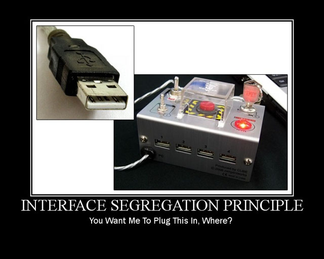
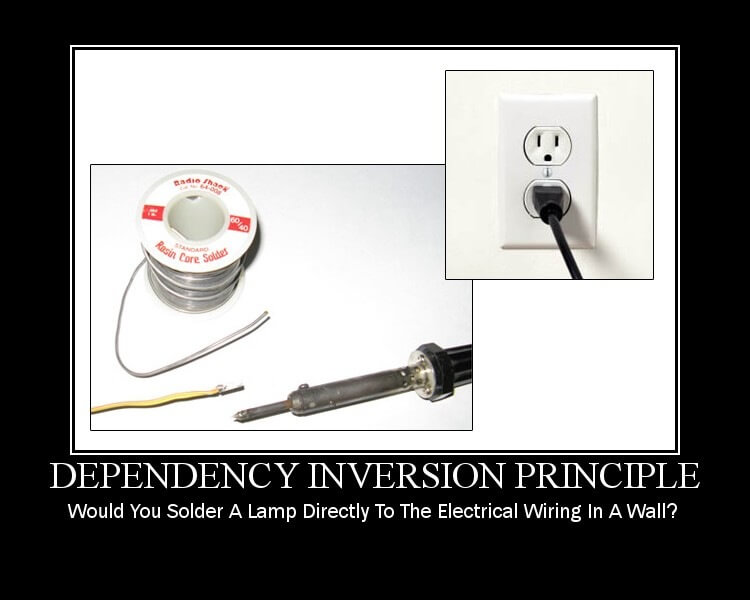

# SOLID

**SOLID** is an acronym for the following five principles:

* **S**: Single responsibility principle (**SRP**)
* **O**: Open/closed principle (**OCP**)
* **L**: Liskov substitution principle (**LSP**)
* **I**: Interface Segregation Principle (**ISP**)
* **D**: Dependency inversion principle (**DIP**)

## [S]: Single Responsibility Principle (SRP)


> Cada classe é responsável por apenas uma única responsabilidade - "Faça uma coisa e faça bem". O **Princípio da Responsabilidade Única** significa que uma classe deve ter um, e quero dizer apenas uma razão/motivo para mudar.

*Criando classes pequenas com responsabilidades bem definidas, faz com que o código seja mais dissociado e fácil de testar e executar.*

O princípio da responsabilidade única lida com classes que tentam fazer muita coisa e não se especializa em nada. A responsabilidade nesse contexto refere-se a razão para mudar. De acordo com a definição de Robert C. Martin:

> "A class should have only one reason to change."

Veja um exemplo de uma classe que viola o princípio da responsabilidade única *SRP*:

```php
class Ticket
{
    const SEVERITY_LOW = 'low';
    const SEVERITY_HIGH = 'high';
    // ...
    protected $title;
    protected $severity;
    protected $status;
    protected $conn;

    public function __construct(\PDO $conn)
    {
        $this->conn = $conn;
    }

    public function setTitle($title)
    {
        $this->title = $title;
    }

    public function setSeverity($severity)
    {
        $this->severity = $severity;
    }

    public function setStatus($status)
    {
        $this->status = $status;
    }

    private function validate()
    {
        // Implementation...
    }

    public function save()
    {
        if ($this->validate()) {
            // Implementation...
        }
    }
}

// Client
$conn = new PDO(/* ... */ );
$ticket = new Ticket($conn);
$ticket->setTitle('Checkout not working!');
$ticket->setStatus(Ticket::STATUS_OPEN);
$ticket->setSeverity(Ticket::SEVERITY_HIGH);
$ticket->save();
```

A classe `Ticket` lida com a validação e também com a persistência da entidade de ticket no banco de dados. Essas duas responsabilidades são suas duas razões para mudar. Sempre que os requisitos mudam em relação à validação do ticket, ou em relação a sua persistência, a classe `Ticket` terá que ser modificada. Para resolver essa violação do *SRP*, podemos usar classes e interfaces de assistências para dividir as responsabilidades.

A seguir, um exemplo refatorado da implementação, que está em conformidade com o *SRP*:

```php
interface KeyValuePersistentMembers
{
    public function toArray();
}

class Ticket implements KeyValuePersistentMembers
{
    const STATUS_OPEN = 'open';
    const SEVERITY_HIGH = 'high';
    //...
    protected $title;
    protected $severity;
    protected $status;

    public function setTitle($title)
    {
        $this->title = $title;
    }

    public function setSeverity($severity)
    {
        $this->severity = $severity;
    }

    public function setStatus($status)
    {
        $this->status = $status;
    }

    public function toArray()
    {
        // Implementation...
    }
}

class EntityManager
{
    protected $conn;

    public function __construct(\PDO $conn)
    {
        $this->conn = $conn;
    }

    public function save(KeyValuePersistentMembers $entity)
    {
        // Implementation...
    }
}

class Validator
{
    public function validate(KeyValuePersistentMembers $entity)
    {
        // Implementation...
    }
}

// Client
$conn = new PDO(/* ... */ );
$ticket = new Ticket();
$ticket->setTitle('Payment not working!');
$ticket->setStatus(Ticket::STATUS_OPEN);
$ticket->setSeverity(Ticket::SEVERITY_HIGH);

$validator = new Validator();

if ($validator->validate($ticket)) {
    $entityManager = new EntityManager($conn);
    $entityManager->save($ticket);
}
```

Aqui nós vemos uma simples interface `KeyValuePersistentMembers` com um único método `toArray`, que é então usado com as classes `EntityManager` e `Validator`, as quais assumem uma única responsabilidade agora. A classe `Ticket` tornou-se um simples modelo de dados, enquanto o *Client* controla a instanciação, validação e persistência em três etapas diferentes. Embora isso não seja uma fórmula universal de como separar as responsabilidades, ela fornece um exemplo simples e claro de como resolvê-la.

Criando arquiteturas de softwares com o princípio de responsabilidades única em mente, produz classes menores com maior legibilidade e mais fácil de serem testadas.

## [O]: Open/Closed Principle (OCP)


**O Princípio Aberto/Fechado significa que uma classe deve estar aberta para extensão, mas fechada para modificação**. Qualquer alteração no comportamento deve ser feita sem modificar a classe BASE. Se você puder fazer a sua implementação sem modificar a classe BASE, então você está seguindo o Princípio Aberto/Fechado! Lembre-se do que o Tio Bob diz: "Separe o comportamento extensível para uma interface e inverta as dependências". A única coisa é que sempre que você modificar seu código, existe a possibilidade de quebrar completamente as funcionalidades antigas, adicionando novos bugs.

O **princípio de open/closed** afirma que uma classe deve estar *aberta para extensão mas fechada para modificação*, conforme a definição encontrada na Wikipedia:

> "Software entities (classes, modules, functions, etc.) should be open for extension, but closed for modification"

* ***Aberta para extensão***: Significa que devemos projetar nossas classes para que novas funcionalidades possam ser adicionadas, se necessário. Significa que quando precisarmos extender o comportamento/responsabilidade de uma classe, você não modifica a classe existente, mas a compõe com (ou a chama de) outras classes. Classes que criam novas funcionalidades estendida.
* ***Fechada para modificação***: Significa que essa nova funcionalidade deve se ajustar/adaptar sem modificar a classe original. A classe só deve ser modificada no caso de uma *correção de bug*, não para adicionar novas funcionalidades.

A seguir, um exemplo de uma classe que viola o princípio *open/closed*:

```php
class CsvExporter
{
    public function export($data)
    {
        // Implementation...
    }
}

class XmlExporter
{
    public function export($data)
    {
        // Implementation...
    }
}

class GenericExporter
{
    public function exportToFormat($data, $format)
    {
        if ('csv' === $format) {
            $exporter = new CsvExporter();
        } elseif ('xml' === $format) {
            $exporter = new XmlExporter();
        } else {
            throw new \Exception('Unknown export format!');
        }

        return $exporter->export($data);
    }
}
```

Aqui temos duas classes concretas, `CsvExporter` e `XmlExporter`, cada uma com uma única responsabilidade. Em seguida, temos uma classe `GenericExporter` com um método de `exportToFormat` que, na verdade, chama a função de `export` em um tipo de instância específica. O problema aqui é que não podemos adicionar um novo tipo de classe de *exporter* sem modificar a classe `GenericExporter`. Assim, `GenericExporter` não está aberto para extensão e fechado para modificação.

A seguir, um exemplo refatorado da implementação, que está em conformidade com o *OCP*:

```php
interface ExporterFactoryInterface
{
    public function buildForFormat($format);
}

interface ExporterInterface
{
    public function export($data);
}

class CsvExporter implements ExporterInterface
{
    public function export($data)
    {
        // Implementation...
    }
}

class XmlExporter implements ExporterInterface
{
    public function export($data)
    {
        // Implementation...
    }
}

class ExporterFactory implements ExporterFactoryInterface
{
    private $factories = array();

    public function addExporterFactory($format, callable $factory)
    {
        $this->factories[$format] = $factory;
    }

    public function buildForFormat($format)
    {
        $factory = $this->factories[$format];

        $exporter = $factory(); // The factory is a callable

        return $exporter;
    }
}

class GenericExporter
{
    private $exporterFactory;

    public function __construct(ExporterFactoryInterface $exporterFactory)
    {
        $this->exporterFactory = $exporterFactory;
    }

    public function exportToFormat($data, $format)
    {
        $exporter = $this->exporterFactory->buildForFormat($format);

        return $exporter->export($data);
    }
}

// Client

$exporterFactory = new ExporterFactory();

$exporterFactory->addExporterFactory('xml',
    function () {
        return new XmlExporter();
    }
);

$exporterFactory->addExporterFactory('csv',
    function () {
        return new CsvExporter();
    }
);

$data = array(/* ... some export data ... */ );

$genericExporter = new GenericExporter($exporterFactory);
$csvEncodedData = $genericExporter->exportToFormat($data, 'csv');
```

Veja na refatoração acima que nós adicionamos duas interfaces, `ExporterFactoryInterface` e `ExporterInterface`. Em seguida, modificamos o `CsvExporter` e o `XmlExporter` para implementar essa interface. O `ExporterFactory` foi adicionado, implementando o `ExportadorFactoryInterface`. Sua função principal é definida pelo método `buildForFormat`, que retorna o exportador como uma função de callback. Finalmente, o `GenericExporter` foi reescrito para aceitar o `ExporterFactoryInterface` por meio de seu construtor, e seu método `exportToFormat` agora build/constrói o exporter pelo uso de uma fábrica de exporters.

O próprio "cliente" assumiu um papel mais robusto agora, primeiro instanciando o `ExporterFactory` e adicionando dois exportadores a ele, o qual passou então para o `GenericExporter`. Adicionar um novo formato de exportação ao `GenericExporter` agora não requer mais a sua modificação, tornando-o aberto para extensão e fechado para modificação. Novamente, isso não é de forma alguma uma fórmula universal, e sim um conceito de possível abordagem para satisfazer o OCP.

Veja mais um exemplo que viola o princípio de *OCP*:

```csharp
class Customer
{
    private int _CustType;

    public int CustType
    {
        get { return _CustType; }
        set { _CustType = value; }
    }

    public double getDiscount(double TotalSales)
    {
        if (_CustType == 1) {
            return TotalSales - 100;
        } else {
            return TotalSales - 50;
        }
    }
}
```

O problema é que se adicionarmos um novo tipo de cliente, precisamos adicionar mais uma condição *"IF"* na função `getDiscount`, em outras palavras, precisamos alterar a classe `Customer`.

Se estivermos mudando a classe `Customer` repetidas vezes, precisamos garantir que as condições anteriores estejam em conformidade com a nova condição que precisam ser testadas novamente. Os clientes existentes que estão fazendo referência a essa classe devem estar funcionando corretamente como antes.

Em outras palavras, estamos "MODIFICANDO" o código atual do cliente para cada alteração e, toda vez que modificamos, precisamos garantir que todas as funcionalidades anteriores e o cliente conectado estejam funcionando como antes.

Que tal em vez de "MODIFICAR", vamos "EXTENDER". Em outras palavras, toda vez que um novo tipo de cliente precisa ser adicionado, criamos uma nova classe, conforme mostrado a seguir. Então, seja qual for o código atual, eles são intocados e só precisamos testar e verificar as novas classes.

```csharp
class Customer
{
    public virtual double getDiscount(double TotalSales)
    {
        return TotalSales;
    }
}

class SilverCustomer : Customer
{
    public override double getDiscount(double TotalSales)
    {
        return base.getDiscount(TotalSales) - 50;
    }
}

class goldCustomer : SilverCustomer
{
    public override double getDiscount(double TotalSales)
    {
        return base.getDiscount(TotalSales) - 100;
    }
}
```

Resumindo em palavras simples, a classe `Customer` está agora fechada para qualquer nova modificação, mas está aberta para extensões quando novos tipos de clientes são adicionados ao projeto.

Veja mais um exemplo que viola o princípio de *OCP*:

```csharp
public class ReportGeneration
{
    public string ReportType { get; set; }

    public void GenerateReport(Employee em)
    {
        if (ReportType == "CRS") {
            //
        }

        if (ReportType == "PDF") {
            //
        }
    }
}
```

Há muitas cláusulas `IF` e se quisermos introduzir outro tipo de relatório como `Excel`, então você precisa escrever outro `if`'. Esta classe deve estar aberta para extensão mas fechada para modificação.

```csharp
public class IReportGeneration
{
    public virtual void GenerateReport(Employee em)
    {
        // From base
    }
}

public class CrystalReportGeneraion : IReportGeneration
{
    public override void GenerateReport(Employee em)
    {
        // Generate crystal report.
    }
}

public class PDFReportGeneraion : IReportGeneration
{
    public override void GenerateReport(Employee em)
    {
        // Generate PDF report.
    }
}
```

## [L]: Liskov Substitution Principle (LSP)


**Para satisfazer o princípio, precisamos garantir que as classes derivadas não alterem, de forma alguma, o comportamento imposto pela classe base.**

Classes derivadas podem ser substituíveis por sua classe base. Isso significa que os objetos devem ser substituíveis com instâncias de seus subtipos sem alterar o comportamento do sistema.

O **princípio da substituição de Liskov** fala sobre herança. Ele especifica como devemos projetar nossas classes para que as dependências do cliente possam ser substituídas por subclasses sem que o cliente veja a diferença, conforme a definição encontrada na Wikipedia:

> "Objects in a program should be replaceable with instances of their subtypes without altering the correctness of that program"

Embora possa haver alguma funcionalidade específica adicionada à subclasse, ela deve estar em conformidade com o mesmo comportamento de sua classe base. Caso contrário, o **princípio de Liskov é violado**.

Quando se trata de PHP e subclasses, temos que olhar além das classes concretas simples e diferenciar: *classe concreta*, *classe abstrata* e *interface*. Cada um dos três tipos pode ser colocado no contexto de uma classe base, enquanto tudo que o estende ou implementa pode ser visto como uma classe derivada.

A seguir, um exemplo de violação do **LSP**, em que a classe derivada não possui uma implementação para todos os métodos da interface:

```php
interface User
{
    public function getEmail();
    public function getName();
    public function getAge();
}

class Employee implements User
{
    public function getEmail()
    {
        // Implementation...
    }

    public function getAge()
    {
        // Implementation...
    }
}
```

Aqui vemos uma classe de `Employee` que não implementa o método `getName` especificado pela interface `User`. Poderíamos facilmente ter usado uma classe abstrata em vez do tipo de método abstrato da interface para o método `getName`, o efeito teria sido o mesmo. Felizmente, o PHP lançaria um erro nesse caso, avisando que não implementamos totalmente a interface.

O seguinte é um exemplo de violação do princípio de *Liskov*, onde diferentes classes derivadas retornam coisas de diferentes tipos:

```php
class UsersCollection implements \Iterator
{
    // Implementation...
}

interface UserList
{
    public function getUsers();
}

class Emloyees implements UserList
{
    public function getUsers()
    {
        $users = new UsersCollection();
        //...
        return $users;
    }
}

class Directors implements UserList
{
    public function getUsers()
    {
        $users = array();
        //...
        return $users;
    }
}
```

Aqui vemos um simples exemplo. Chamar `getUsers` em ambas as classes derivadas retornará um resultado diferente para cada tipo de classe. No entanto, os desenvolvedores PHP tendem a usar o método `count` frequentemente em estruturas de array, e usá-lo em instâncias `Employees` com `getUsers` fará com que o resultado não seja o esperado. Isso ocorre porque a classe `Employees` retorna `UsersCollection`, que implementa o `Iterator`, não a estrutura real do array. Desde que `UsersCollection` não implemente `Countable`, não podemos usar `count` sobre ele, o que leva a potenciais erros/bugs.

Podemos ainda detectar violações do *LSP* nos casos em que a classe derivada se comporta de maneira menos permissiva com relação aos argumentos do método. Geralmente, eles podem ser localizados pelo uso do operador `instanceof`, conforme mostrado no exemplo a seguir:

```php
interface LoggerProcessor
{
    public function log(LoggerInterface $logger);
}

class XmlLogger implements LoggerInterface
{
    // Implementation...
}

class JsonLogger implements LoggerInterface
{
    // Implementation...
}

class FileLogger implements LoggerInterface
{
    // Implementation...
}

class Processor implements LoggerProcessor
{
    public function log(LoggerInterface $logger)
    {
        if ($logger instanceof XmlLogger) {
            throw new \Exception('This processor does not work with XmlLogger');
        } else {
            // Implementation...
        }
    }
}
```

No exemplo acima, a classe derivada `Processor` coloca restrições nos argumentos do método, enquanto deveria aceitar qualquer coisa conforme a `LoggerInterface`.

**A classe filha não deve quebrar a definição de tipo e o comportamento da classe pai**. Veja o exemplo de `Employee` para você entender melhor esse princípio.`Employee` é uma classe pai e `CasualEmployee` e `ContractualEmployee` são suas classes filhas.

```csharp
public abstract class Employee
{
    public virtual string GetProjectDetails(int employeeId)
    {
        return "Base Project";
    }

    public virtual string GetEmployeeDetails(int employeeId)
    {
        return "Base Employee";
    }
}

public class CasualEmployee : Employee
{
    public override string GetProjectDetails(int employeeId)
    {
        return "Child Project";
    }

    // May be for contractual employee we do not need to store the details into database.
    public override string GetEmployeeDetails(int employeeId)
    {
        return "Child Employee";
    }
}

public class ContractualEmployee : Employee
{
    public override string GetProjectDetails(int employeeId)
    {
        return "Child Project";
    }

    // May be for contractual employee we do not need to store the details into database.
    public override string GetEmployeeDetails(int employeeId)
    {
        throw new NotImplementedException();
    }
}
```

Veja que o código abaixo viola o princípio do *LSP*.

```csharp
List<Employee> employeeList = new List<Employee>();

employeeList.Add(new ContractualEmployee());
employeeList.Add(new CasualEmployee());

foreach (Employee e in employeeList) {
    e.GetEmployeeDetails(1234);
}
```

Parece que não temos nenhum problema nessa implementação, mais acontece que`ContractualEmployee` emitirá uma exceção de `NotImplementedException` e estará violando o *LSP*. Então qual é a solução? Quebre a implementação em 2 interfaces diferentes, 1. `IProject` 2. `IEmployee` e implemente de acordo com o tipo de `Employee`.

```csharp
public interface IEmployee
{
    string GetEmployeeDetails(int employeeId);
}

public interface IProject
{
    string GetProjectDetails(int employeeId);
}
```

Agora, `ContractualEmployee` implementará `IEmployee` assim como `CasualEmployee` implementará `IProject`. Isso manterá o princípio do *LSP*.

## [I]: Interface Segregation Principle (ISP)



Nenhuma implementação de interface deve ser forçada a usar métodos que não são utilizados. Assim, divida em pequenas interfaces conforme necessário para sua implementação.

O **Princípio de Segregação de Interface** diz que as classes só devem implementar as interfaces que realmente usam. Eles não devem ser forçados a implementar interfaces que não usam. De acordo com a definição encontrada na Wikipedia:

> "Many client-specific interfaces are better than one general-purpose interface"

O que isto significa é que devemos dividir interfaces grandes e gordas em várias pequenas e mais leves, segregando-as de forma que as interfaces menores sejam baseadas em grupos de métodos, cada um servindo uma funcionalidade específica.

Interfaces devem ser divididas o mais especificamente possível, em vez de fornecer interfaces gerais que contenham métodos não relevantes para a intenção do código da classe que a implementa.

A seguir, um exemplo de classes que violam o princípio *ISP*:

```php
interface Appliance
{
    public function powerOn();
    public function powerOff();
    public function bake();
    public function mix();
    public function wash();
}

class Oven implements Appliance
{
    public function powerOn() { /* Implement ... */ }
    public function powerOff() { /* Implement ... */ }
    public function bake() { /* Implement... */ }
    public function mix() { /* Nothing to implement ... */ }
    public function wash() { /* Cannot implement... */ }
}

class Mixer implements Appliance
{
    public function powerOn() { /* Implement... */ }
    public function powerOff() { /* Implement... */ }
    public function bake() { /* Cannot implement... */ }
    public function mix() { /* Implement... */}
    public function wash() { /* Cannot implement... */ }
}

class WashingMachine implements Appliance
{
    public function powerOn() { /* Implement... */ }
    public function powerOff() { /* Implement... */ }
    public function bake() { /* Cannot implement... */ }
    public function mix() { /* Implement... */}
    public function wash() { /* Cannot implement... */ }
}
```

No exemplo acima temos uma configuração de interface `Appliance` que contêm vários métodos. Então temos várias classes implementando essa interface. O problema é bastante óbvio; nem todos os `appliances` podem ser comprimidos, usados na mesma interface. Não faz sentido que uma máquina de lavar roupa seja forçada a implementar métodos de `bake` e `mix`. Esses métodos precisam ser divididos em sua própria interface. Dessa forma, as classes concretas de eletrodomésticos implementam apenas os métodos que realmente fazem sentido.

Este princípio estabelece que qualquer cliente não deve ser forçado a usar uma interface que seja irrelevante para ele. Agora, o que isso significa, suponha que haja um banco de dados para armazenar dados de todos os tipos de funcionários (ou seja, Permanente, não permanente), agora qual será a melhor abordagem para a nossa interface?

```csharp
public interface IEmployee
{
    bool AddEmployeeDetails();
}
```

E todos os tipos de classe `Employee` herdarão essa interface para salvar dados. Isso está bem, certo? Agora, suponha que a empresa um dia tenha dito a você que deseja ler apenas dados de funcionários permanentes. O que você fará, basta adicionar um método a essa interface?

```csharp
public interface IEmployeeDatabase
{
    bool AddEmployeeDetails();
    bool ShowEmployeeDetails(int employeeId);
}
```

Mas agora estamos quebrando alguma coisa. Estamos forçando a classe `Employee` não permanente a mostrar seus detalhes do banco de dados. Então, a solução é dar essa responsabilidade para outra interface.

```csharp
public interface IAddOperation
{
    bool AddEmployeeDetails();
}

public interface IGetOperation
{
    bool ShowEmployeeDetails(int employeeId);
}
```

O funcionário não permanente irá implementar apenas `IAddOperation` e funcionário permanente implementará ambas as interfaces.

## [D]: Dependency Inversion Principle (DIP)



> Finalmente, o Princípio de Inversão de Dependência afirma que códigos de alto nível não devem depender de códigos de baixo nível. Em vez disso, o código de alto nível deve depender de "Abstrações", que atua como intermediário entre o código de alto e baixo nível. O segundo aspecto é que as abstrações não depende de detalhes, mas os detalhes devem dependem das abstrações.

*This principle states the following:*

* **High-level modules should not depend on low-level modules. Both should depend on abstractions.**
* **Abstractions should not depend on details. Details should depend on abstractions.**

O **princípio da inversão de dependência** afirma que as entidades devem depender de abstrações e não de classes concreções. Ou seja, um módulo de alto nível não deve depender de um módulo de baixo nível, mais ambos devem depender de abstrações.

A seguir, um exemplo de uma classe que viola o *DIP*:

```php
class Mailer
{
    // Implementation...
}

class NotifySubscriber
{
    public function notify($emailTo)
    {
        $mailer = new Mailer();

        $mailer->send('Thank you for...', $emailTo);
    }
}
```

Vemos um método `notify` dentro da classe `NotifySubscriber` que tem uma dependência em relação à classe `Mailer`. Isso cria um código fortemente acoplado, que é o que estamos tentando evitar. Para corrigir o problema, podemos passar a dependência através do construtor de classe, ou possivelmente através de algum outro método ou por meio da assinatura do mesmo método.

```php
interface MailerInterface
{
    // Implementation...
}

class Mailer implements MailerInterface
{
    // Implementation...
}

class NotifySubscriber
{
    private $mailer;

    public function __construct(MailerInterface $mailer)
    {
        $this->mailer = $mailer;
    }

    public function notify($emailTo)
    {
        $this->mailer->send('Thank you for...', $emailTo);
    }
}
```

Aqui vemos uma dependência sendo injetada através do construtor. A injeção é abstraída por uma interface e implementada por meio de uma classe concreta real. Isso faz com que nosso código seja fracamente acoplado, cumprindo assim o princípio do *DIP*.

Seguindo outro exemplo: Suponha que há um sistema de notificação que é executado depois de salvar alguns detalhes no banco de dados.

```csharp
public class Email
{
    public void SendEmail()
    {
        // code to send mail
    }
}

public class Notification
{
    private Email _email;

    public Notification()
    {
        _email = new Email();
    }

    public void PromotionalNotification()
    {
        _email.SendEmail();
    }
}
```

Agora a classe de `Notification` depende totalmente da classe de `Email`, porque ele só envia um tipo de notificação. Se quisermos introduzir qualquer outro como SMS, o que faremos? Precisamos mudar o sistema de notificação também. Isso é chamado de **forte acoplado**. Veja o que podemos fazer para ter um **baixo acoplamento** entre os componentes/módulos:

```csharp
public interface IMessenger
{
    void SendMessage();
}

public class Email : IMessenger
{
    public void SendMessage()
    {
        // code to send email
    }
}

public class SMS : IMessenger
{
    public void SendMessage()
    {
        // code to send SMS
    }
}

public class Notification
{
    private IMessenger _iMessenger;

    public Notification()
    {
        _ iMessenger = new Email();
    }

    public void DoNotify()
    {
        _ iMessenger.SendMessage();
    }
}
```

A classe de `Notification` ainda depende de classe de `Email`. Agora, podemos usar a injeção de dependência para que possamos torná-lo com um baixo acoplado. Há 3 tipos de *DI*, injeção por meio do construtor, injeção por propriedade(`C#`) e injeção por meio da assinatura do método.

**Constructor Injection**

```csharp
public class Notification
{
    private IMessenger _iMessenger;

    public Notification(Imessenger pMessenger)
    {
        _ iMessenger = pMessenger;
    }

    public void DoNotify()
    {
        _ iMessenger.SendMessage();
    }
}
```

**Property Injection**

```csharp
public class Notification
{
    private IMessenger _iMessenger;

    public Notification()
    {
    }

    public IMessenger MessageService
    {
       private get;
       set
       {
           _ iMessenger = value;
       }
     }

    public void DoNotify()
    {
        _ iMessenger.SendMessage();
    }
}
```

**Method Injection**

```csharp
public class Notification
{
    public void DoNotify(IMessenger pMessenger)
    {
        pMessenger.SendMessage();
    }
}
```

## Resumo

Abraçar os princípios do SOLID para o design de classes prepara nosso código para mudanças futuras. Isso é feito localizando e minimizando essas alterações em nossas classes, portanto, qualquer integração que o utilize não sente o impacto significativo da alteração.

**S** (*SRP*) (*Single responsibility principle*) - A class should take care of only one responsibility. <br>
**O** (*OCP*) (*Open closed principle*) - Extension should be preferred over modification. <br>
**L** (*LSP*) (*Liskov substitution principle*) - A parent class object should be able to refer child objects seamlessly during runtime polymorphism. <br>
**I** (*ISP*) (*Interface segregation principle*) - Client should not be forced to use a interface if it does not need it. <br>
**D** (*DIP*) (*Dependency inversion principle*) - High level modules should not depend on low level modules but should depend on abstraction. <br>
