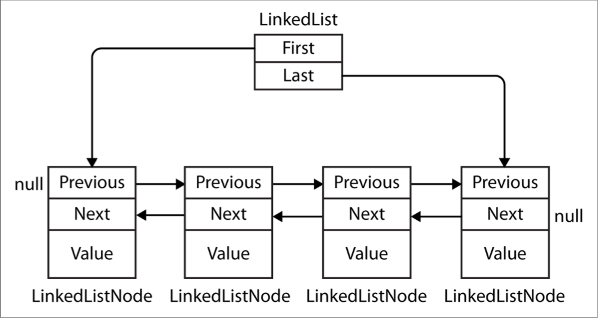

# Collections

| **Namespace**                    | **Contains**                                   |
| -------------------------------- | ---------------------------------------------- |
| `System.Collections`             | *Nongeneric collection classes and interfaces* |
| `System.Collections.Specialized` | *Strongly typed nongeneric collection classes* |
| `System.Collections.Generic`     | *Generic collection classes and interfaces*    |
| `System.Collections.ObjectModel` | *Proxies and bases for custom collections*     |
| `System.Collections.Concurrent`  | *Thread-safe collections*                      |

## Enumeration

In computing, there are many different kinds of collections ranging from simple data structures, such as arrays or linked lists, to more complex ones, such as red/black trees and hashtables. Although the internal implementation and external characteristics of these data structures vary widely, the ability to traverse the contents of the collection is an almost universal need. The Framework supports this need via a pair of interfaces(`IEnumerable`, `IEnumerator`, and their generic counterparts) that allow different data structures to expose a common traversal API.


### IEnumerable and IEnumerator

The `IEnumerator` interface defines the basic low-level protocol by which elements in a collection are traversed—or enumerated—in a forward-only manner. Its declaration is as follows:

```csharp
public interface IEnumerator
{
    bool MoveNext();
    object Current { get; }
    void Reset();
}
```

- `MoveNext`: Avança o elemento atual ou "cursor" para a próxima posição, retornando `false` se não houver mais elementos na coleção.
- `MoveNext`: Deve ser chamado antes de recuperar o primeiro elemento presente - isto é para permitir uma coleção vazia.
- `Current`: Retorna o elemento na posição atual(geralmente feito `cast` do objeto atual para o tipo um tipo mais específico).
- `Reset`: Se implementado, volta para o início, permitindo que a coleção seja enumerada novamente.

`MoveNext` advances the current element or “cursor” to the next position, returning false if there are no more elements in the collection. Current returns the element at the current position(usually cast from object to a more specific type). `MoveNext` must be called before retrieving the first element—this is to allow for an empty collection. The `Reset` method, if implemented, moves back to the start, allowing the collection to be enumerated again. `Reset` exists mainly for COM interop; calling it directly is generally avoided because it’s not universally supported(and is unnecessary in that it’s usually just as easy to instantiate a new enumerator).

Collections do not usually implement enumerators; instead, they *provide* enumerators, via the interface `IEnumerable`:

```csharp
public interface IEnumerable
{
    IEnumerator GetEnumerator();
}
```

By defining a single method retuning an enumerator, `IEnumerable` provides flexibility in that the iteration logic can be farmed off to another class. Moreover, it means that several consumers can enumerate the collection at once without interfering with each other. `IEnumerable` can be thought of as “IEnumeratorProvider,” and it is the most basic interface that collection classes implement.

The following example illustrates low-level use of `IEnumerable` and `IEnumerator`:

```csharp
string s = "Hello";

// Because string implements IEnumerable, we can call GetEnumerator():
IEnumerator rator = s.GetEnumerator();

while(rator.MoveNext())
{
    char c = (char) rator.Current;
    Console.Write(c + ".");
}

// Output: H.e.l.l.o.
```

However, it’s rare to call methods on enumerators directly in this manner, because C# provides a syntactic shortcut: the foreach statement. Here’s the same example rewritten using foreach:

```csharp
string s = "Hello"; // The String class implements IEnumerable

foreach (char c in s)
    Console.Write(c + ".");
```

### IEnumerable<T> and IEnumerator<T>

`IEnumerator` and `IEnumerable` are nearly always implemented in conjunction with their extended generic versions:

```csharp
public interface IEnumerator<T> : IEnumerator, IDisposable
{
    T Current { get; }
}

public interface IEnumerable<T> : IEnumerable
{
    IEnumerator<T> GetEnumerator();
}
```

By defining a typed version of `Current` and `GetEnumerator`, these interfaces strengthen static type safety, avoid the overhead of boxing with value-type elements, and are more convenient to the consumer. Arrays automatically implement `IEnumerable<T>`(where `T` is the member type of the array).

Thanks to the improved static type safety, calling the following method with an array of characters will generate a compile-time error:

```csharp
void Test(IEnumerable<int> numbers) { ... }
```

It’s a standard practice for collection classes to publicly expose `IEnumerable<T>`, while “hiding” the nongeneric `IEnumerable` through explicit interface implementation. This is so that if you directly call `GetEnumerator()`, you get back the type-safe generic `IEnumerator<T>`. There are times, though, when this rule is broken for reasons of backward compatibility(generics did not exist prior to C# 2.0). A good example is arrays—these must return the nongeneric(the nice way of putting it is “classic”) IEnumerator to avoid breaking earlier code. In order to get a generic `IEnumerator<T>`, you must cast to expose the explicit interface:

```csharp
int[] data = { 1, 2, 3 };
var rator = ((IEnumerable <int>)data).GetEnumerator();
```

Fortunately, you rarely need to write this sort of code, thanks to the foreach statement.

#### IEnumerable<T> and IDisposable

`IEnumerator<T>` inherits from `IDisposable`. This allows enumerators to hold references to resources such as database connections—and ensure that those resources are released when enumeration is complete(or abandoned partway through). The foreach statement recognizes this detail and translates this:

```csharp
foreach (var element in somethingEnumerable) { ... }
```

into the logical equivalent of this:

```csharp
using (var rator = somethingEnumerable.GetEnumerator())
    while (rator.MoveNext())
    {
        var element = rator.Current;
        ...
    }
```

-----------

### When to Use the Nongeneric Interfaces

Given the extra type safety of the generic collection interfaces such as `IEnumerable<T>`, the question arises: do you ever need to use the nongeneric `IEnumerable`(or ICollection or IList)?

In the case of `IEnumerable`, you must implement this interface in conjunction with `IEnumerable<T>`—because the latter derives from the former. However, it’s very rare that you actually implement these interfaces from scratch: in nearly all cases, you can take the higher-level approach of using iterator methods, `Collection<T>`, and LINQ.

So, what about as a consumer? In nearly all cases, you can manage entirely with the generic interfaces. The nongeneric interfaces are still occasionally useful, though, in their ability to provide type unification for collections across all element types. The following method, for instance, counts elements in any collection recursively:

```csharp
public static int Count(IEnumerable e)
{
    int count = 0;

    foreach (object element in e)
    {
        var subCollection = element as IEnumerable;
        if (subCollection != null)
            count += Count(subCollection);
        else
            count++;
    }

    return count;
}
```

Because C# offers covariance with generic interfaces, it might seem valid to have this method instead accept `IEnumerable<object>`. This, however, would fail with value-type elements and with legacy collections that don’t implement `IEnumerable<T>`—an example is ControlCollection in Windows Forms.

(On a slight tangent, you might have noticed a potential bug in our example: *cyclic* references will cause infinite recursion and crash the method.

-----------

### Implementing the Enumeration Interfaces

You might want to implement `IEnumerable` or `IEnumerable<T>` for one or more of the following reasons:

- To support the foreach statement
- To interoperate with anything expecting a standard collection
- To meet the requirements of a more sophisticated collection interface
- To support collection initializers

To implement `IEnumerable`/`IEnumerable<T>`, you must provide an enumerator. You can do this in one of three ways:

- If the class is “wrapping” another collection, by returning the wrapped collection’s enumerator
- Via an iterator using `yield return`
- By instantiating your own `IEnumerator`/`IEnumerator<T>` implementation

Returning another collection’s enumerator is just a matter of calling `GetEnumerator` on the inner collection. However, this is viable only in the simplest scenarios, where the items in the inner collection are exactly what are required. A more flexible approach is to write an iterator, using C#’s `yield` return statement. An *iterator* is a C# language feature that assists in writing collections, in the same way the foreach statement assists in consuming collections. An iterator automatically handles the implementation of IEnumerable and `IEnumerator—or` their generic versions. Here’s a simple example:

```csharp
public class MyCollection : IEnumerable
{
    int[] data = { 1, 2, 3 };

    public IEnumerator GetEnumerator()
    {
        foreach (int i in data)
            yield return i;
    }
}
```

Notice the “black magic”: `GetEnumerator` doesn’t appear to return an enumerator at all! Upon parsing the `yield` return statement, the compiler writes a hidden nested enumerator class behind the scenes, and then refactors `GetEnumerator` to instantiate and return that class. Iterators are powerful and simple(and are used extensively in the implementation of LINQ-to-Object’s standard query operators).

Keeping with this approach, we can also implement the generic interface `IEnumerable<T>`:

```csharp
public class MyGenCollection : IEnumerable<int>
{
    int[] data = { 1, 2, 3 };

    public IEnumerator<int> GetEnumerator()
    {
        foreach (int i in data)
            yield return i;
    }

    IEnumerator IEnumerable.GetEnumerator()
    {
        return GetEnumerator();
    }
}
```

Because `IEnumerable<T>` inherits from `IEnumerable`, we must implement both the generic and the nongeneric versions of `GetEnumerator`. In accordance with standard practice, we’ve implemented the nongeneric version explicitly. It can simply call the generic `GetEnumerator` because `IEnumerator<T>` inherits from `IEnumerator`.

The class we’ve just written would be suitable as a basis from which to write a more sophisticated collection. However, if we need nothing above a simple `IEnumerable<T>` implementation, the `yield` return statement allows for an easier variation. Rather than writing a class, you can move the iteration logic into a method returning a generic `IEnumerable<T>` and let the compiler take care of the rest. Here’s an example:

```csharp
public class Test
{
    public static IEnumerable <int> GetSomeIntegers()
    {
        yield return 1;
        yield return 2;
        yield return 3;
    }
}
```

Here’s our method in use:

```csharp
foreach (int i in Test.GetSomeIntegers())
    Console.WriteLine(i);

// Output
// 1
// 2
// 3
```

The final approach in writing `GetEnumerator` is to write a class that implements `IEnumerator` directly. This is exactly what the compiler does behind the scenes, in resolving iterators. (Fortunately, it’s rare that you’ll need to go this far yourself.) The following example defines a collection that’s hardcoded to contain the integers 1, 2, and 3:

```csharp
public class MyIntList : IEnumerable
{
    int[] data = { 1, 2, 3 };

    public IEnumerator GetEnumerator()
    {
        return new Enumerator(this);
    }

    class Enumerator : IEnumerator // Define an inner class for the enumerator.
    {
        MyIntList collection;
        int currentIndex = -1;

        public Enumerator(MyIntList collection)
        {
            this.collection = collection;
        }

        public object Current
        {
            get
            {
                if (currentIndex == -1)
                    throw new InvalidOperationException("Enumeration not started!");
                if (currentIndex == collection.data.Length)
                    throw new InvalidOperationException("Past end of list!");
                return collection.data [currentIndex];
            }
        }

        public bool MoveNext()
        {
            if (currentIndex >= collection.data.Length - 1) return false;
            return ++currentIndex < collection.data.Length;
        }

        public void Reset() { currentIndex = -1; }
    }
}
```

Note that the first call to MoveNext should move to the first(and not the second) item in the list.

To get on par with an iterator in functionality, we must also implement `IEnumerator<T>`. Here’s an example with bounds checking omitted for brevity:

```csharp
class MyIntList : IEnumerable<int>
{
    int[] data = { 1, 2, 3 };

    // The generic enumerator is compatible with both IEnumerable and
    // IEnumerable<T>. We implement the nongeneric GetEnumerator method
    // explicitly to avoid a naming conflict.

    public IEnumerator<int>GetEnumerator() { return new Enumerator(this); }
    IEnumerator IEnumerable.GetEnumerator() { return new Enumerator(this); }

    class Enumerator : IEnumerator<int>
    {
        int currentIndex = -1;
        MyIntList collection;

        public Enumerator(MyIntList collection)
        {
            this.collection = collection;
        }

        public int Current => collection.data [currentIndex];

        object IEnumerator.Current => Current;

        public bool MoveNext() => ++currentIndex < collection.data.Length;

        public void Reset() => currentIndex = -1;

        // Given we don't need a Dispose method, it's good practice to
        // implement it explicitly, so it's hidden from the public interface.
        void IDisposable.Dispose() {}
    }
}
```

The example with generics is faster because `IEnumerator<int>`.Current doesn’t require casting from int to object, and so avoids the overhead of boxing.

## The ICollection and IList Interfaces

Although the enumeration interfaces provide a protocol for forward-only iteration over a collection, they don’t provide a mechanism to determine the size of the collection, access a member by index, search, or modify the collection. For such functionality, the .NET Framework defines the `ICollection`, `IList`, and `IDictionary` interfaces. Each comes in both generic and nongeneric versions; however, the nongeneric versions exist mostly for legacy support.

The inheritance hierarchy for these interfaces was shown in Figure. The easiest way to summarize them is as follows:

`IEnumerable<T>`(and `IEnumerable`)
    Provides minimum functionality(enumeration only)

`ICollection<T>`(and `ICollection`)
    Provides medium functionality(e.g., the Count property)

IList <T>/`IDictionary` <K,V> and their nongeneric versions
    Provide maximum functionality(including “random” access by index/key

The generic and nongeneric versions differ in ways over and above what you might expect, particularly in the case of `ICollection`. The reasons for this are mostly historical: because generics came later, the generic interfaces were developed with the benefit of hindsight, leading to a different(and better) choice of members. For this reason, `ICollection<T>` does not extend `ICollection`, `IList<T>` does not extend `IList`, and `IDictionary<TKey, TValue>` does not extend IDictionary. Of course, a collection class itself is free to implement both versions of an interface if beneficial(which it often is).

*Another, subtler reason for `IList<T>` not extending `IList` is that casting to `IList<T>` would then return an interface with both `Add(T)` and `Add(object)` members. This would effectively defeat static type safety, because you could call Add with an object of any type.*

*There is no consistent rationale in the way the words collection and list are applied throughout the .NET Framework. For instance, since `IList<T>` is a more functional version of `ICollection<T>`, you might expect the class `List<T>` to be correspondingly more functional than the class `Collection<T>`. This is not the case. It’s best to consider the terms collection and list as broadly synonymous, except when a specific type is involved.*

### ICollection<T> and ICollection

`ICollection<T>` is the standard interface for countable collections of objects. It provides the ability to determine the size of a collection(`Count`), determine whether an item exists in the collection(`Contains`), copy the collection into an array(`ToArray`), and determine whether the collection is read-only(`IsReadOnly`). For writable collections, you can also `Add`, `Remove`, and `Clear` items from the collection. And since it extends `IEnumerable<T>`, it can also be traversed via the foreach statement.

```csharp
public interface ICollection<T> : IEnumerable<T>, IEnumerable
{
    int Count { get; }
    bool Contains(T item);
    void CopyTo(T[] array, int arrayIndex);
    bool IsReadOnly { get; }
    void Add(T item);
    bool Remove(T item);
    void Clear();
}
```

The nongeneric `ICollection` is similar in providing a countable collection, but doesn’t provide functionality for altering the list or checking for element membership:

```csharp
public interface ICollection : IEnumerable
{
    int Count { get; }
    bool IsSynchronized { get; }
    object SyncRoot { get; }
    void CopyTo(Array array, int index);
}
```

The nongeneric interface also defines properties to assist with synchronization—these were dumped in the generic version because thread safety is no longer considered intrinsic to the collection.

Both interfaces are fairly straightforward to implement. If implementing a read-only `ICollection<T>`, the `Add`, `Remove`, and `Clear` methods should throw a `NotSupportedException`.

These interfaces are usually implemented in conjunction with either the `IList` or the `IDictionary` interface.

### IList<T> and IList

`IList<T>` is the standard interface for collections indexable by position. In addition to the functionality inherited from `ICollection<T>` and `IEnumerable<T>`, it provides the ability to read or write an element by position(via an indexer) and insert/remove by position:

```csharp
public interface IList<T> : ICollection<T>, IEnumerable<T>, IEnumerable
{
    T this [int index] { get; set; }
    int IndexOf(T item);
    void Insert(int index, T item);
    void RemoveAt(int index);
}
```

The IndexOf methods perform a linear search on the list, returning `-1` if the specified item is not found.

The nongeneric version of `IList` has more members because it inherits less from `ICollection`:

```csharp
public interface IList : ICollection, IEnumerable
{
    object this [int index] { get; set }
    bool IsFixedSize { get; }
    bool IsReadOnly { get; }
    int Add(object value);
    void Clear();
    bool Contains(object value);
    int IndexOf(object value);
    void Insert(int index, object value);
    void Remove(object value);
    void RemoveAt(int index);
}
```

The `Add` method on the nongeneric `IList` interface returns an integer—this is the index of the newly added item. In contrast, the `Add` method on `ICollection<T>` has a void return type.

The general-purpose `List<T>` class is the quintessential implementation of both `IList<T>` and `IList`. C# arrays also implement both the generic and nongeneric `ILists`(although the methods that add or remove elements are hidden via explicit interface implementation and throw a `NotSupportedException` if called).

### IReadOnlyList<T>

In order to interoperate with read-only Windows Runtime collections, Framework 4.5 introduced a new collection interface called `IReadOnlyList<T>`. This interface is useful in and of itself, and can be considered a cut-down version of `IList<T>`, exposing just the members required for read-only operations on lists:

```csharp
public interface IReadOnlyList<out T> : IEnumerable<T>, IEnumerable
{
    int Count { get; }
    T this[int index] { get; }
}
```

Because its type parameter is used only in output positions, it’s marked as covariant. This allows a list of cats, for instance, to be treated as a read-only list of animals. In contrast, `T` is not marked as covariant with `IList<T>`, because `T` is used in both input and output positions.

*`IReadOnlyList<T>` represents a read-only view of a list. It doesn’t necessarily imply that the underlying implementation is read-only.*

It would be logical for `IList<T>` to derive from `IReadOnlyList<T>`. However, Microsoft was unable to make this change because doing so would require moving members from `IList<T>` to `IReadOnlyList<T>`, which would introduce a breaking change into CLR 4.5(consumers would need to re-compile their programs to avoid runtime errors). Instead, implementers of `IList<T>` need to manually add `IReadOnlyList<T>` to their list of implemented interfaces.

`IReadOnlyList<T>` maps to the Windows Runtime type `IVectorView<T>`.

## The Array Class

The Array class is the implicit base class for all single and multidimensional arrays, and it is one of the most fundamental types implementing the standard collection interfaces. The `Array` class provides type unification, so a common set of methods is available to all arrays, regardless of their declaration or underlying element type.

Since arrays are so fundamental, C# provides explicit syntax for their declaration and initialization. When an array is declared using C#’s syntax, the CLR implicitly subtypes the Array class—synthesizing a *pseudotype* appropriate to the array’s dimensions and element types. This pseudotype implements the typed generic collection interfaces, such as `IList<string>`.

The CLR also treats array types specially upon construction, assigning them a contiguous space in memory. This makes indexing into arrays highly efficient, but prevents them from being resized later on.

`Array` implements the collection interfaces up to `IList<T>` in both their generic and nongeneric forms. `IList<T>` itself is implemented explicitly, though, to keep Array’s public interface clean of methods such as `Add` or `Remove`, which throw an exception on fixed-length collections such as arrays. The `Array` class does actually offer a static `Resize` method, although this works by creating a new array and then copying over each element. As well as being inefficient, references to the array elsewhere in the program will still point to the original version. A better solution for resizable collections is to use the `List<T>` class(described in the following section).

An array can contain value-type or reference-type elements. Value-type elements are stored in place in the array, so an array of three long integers(each 8 bytes) will occupy 24 bytes of contiguous memory. A reference-type element, however, occupies only as much space in the array as a reference(4 bytes in a 32-bit environment or 8 bytes in a 64-bit environment). Figure illustrates the effect, in memory, of the following program:

```csharp
StringBuilder[] builders = new StringBuilder [5];
builders [0] = new StringBuilder("builder1");
builders [1] = new StringBuilder("builder2");
builders [2] = new StringBuilder("builder3");

long[] numbers = new long [3];
numbers [0] = 12345;
numbers [1] = 54321;
```


Because `Array` is a class, arrays are always(themselves) reference types—regardless of the array’s element type. This means that the statement `arrayB = arrayA` results in two variables that reference the same array. Similarly, two distinct arrays will always fail an equality test—unless you use a custom equality comparer. Framework 4.0 introduced one for the purpose of comparing elements in arrays which you can access via the `StructuralComparisons` type:

```csharp
object[] a1 = { "string", 123, true };
object[] a2 = { "string", 123, true };

Console.WriteLine(a1 == a2); // False
Console.WriteLine(a1.Equals(a2)); // False

IStructuralEquatable se1 = a1;
Console.WriteLine(se1.Equals(a2, StructuralComparisons.StructuralEqualityComparer)); // True
```

Arrays can be duplicated with the `Clone` method: `arrayB = arrayA.Clone()`. However, this results in a shallow clone, meaning that only the memory represented by the array itself is copied. If the array contains value-type objects, the values themselves are copied; if the array contains reference-type objects, just the references are copied(resulting in two arrays whose members reference the same objects). Figure demonstrates the effect of adding the following code to our example:

```csharp
StringBuilder[] builders2 = builders;
StringBuilder[] shallowClone = (StringBuilder[]) builders.Clone();
```


To create a deep copy—where reference-type subobjects are duplicated—you must loop through the array and clone each element manually. The same rules apply to other .NET collection types.

Although Array is designed primarily for use with 32-bit indexers, it also has limited support for 64-bit indexers(allowing an array to theoretically address up to 2 64 elements) via several methods that accept both Int32 and Int64 parameters. These overloads are useless in practice, because the CLR does not permit any objectincluding arrays—to exceed 2GB in size(whether running on a 32- or 64-bit environment).

*Many of the methods on the `Array` class that you expect to be instance methods are in fact static methods. This is an odd design decision, and means you should check for both static and instance methods when looking for a method on `Array`.*

### Construction and Indexing

The easiest way to create and index arrays is through C#’s language constructs:

```csharp
int[] myArray = { 1, 2, 3 };
int first = myArray [0];
int last = myArray [myArray.Length - 1];
```

Alternatively, you can instantiate an array dynamically by calling `Array.CreateIn` stance. This allows you to specify element type and rank(number of dimensions) at runtime—as well as allowing nonzero-based arrays through specifying a lower bound. Nonzero-based arrays are not CLS(Common Language Specification)compliant.

The `GetValue` and `SetValue` methods let you access elements in a dynamically created array(they also work on ordinary arrays):

```csharp
// Create a string array 2 elements in length:
Array a = Array.CreateInstance(typeof(string), 2);
a.SetValue("hi", 0); // → a[0] = "hi";
a.SetValue("there", 1); // → a[1] = "there";
string s = (string) a.GetValue(0); // → s = a[0];

// We can also cast to a C# array as follows:
string[] cSharpArray = (string[]) a;
string s2 = cSharpArray [0];
```

Zero-indexed arrays created dynamically can be cast to a C# array of a matching or compatible type(compatible by standard array-variance rules). For example, if `Apple` subclasses `Fruit`, `Apple[]` can be cast to `Fruit[]`. This leads to the issue of why `object[]` was not used as the unifying array type rather the Array class. The answer is that `object[]` is incompatible with both multidimensional and value-type arrays(and nonzero-based arrays). An `int[]` array cannot be cast to `object[]`. Hence, we require the Array class for full type unification.

`GetValue` and `SetValue` also work on compiler-created arrays, and they are useful when writing methods that can deal with an array of any type and rank. For multidimensional arrays, they accept an array of indexers:

```csharp
public object GetValue(params int[] indices)
public void SetValue(object value, params int[] indices)
```

The following method prints the first element of any array, regardless of rank:

```csharp
void WriteFirstValue(Array a)
{
    Console.Write(a.Rank + "-dimensional;");
    // The indexers array will automatically initialize to all zeros, so
    // passing it into GetValue or SetValue will get/set the zero-based
    // (i.e., first) element in the array.

    int[] indexers = new int[a.Rank];
    Console.WriteLine("First value is " + a.GetValue(indexers));
}

void Demo()
{
    int[] oneD = { 1, 2, 3 };
    int[,] twoD = { {5,6}, {8,9} };

    WriteFirstValue(oneD); // 1-dimensional; first value is 1
    WriteFirstValue(twoD); // 2-dimensional; first value is 5
}
```

`SetValue` throws an exception if the element is of an incompatible type for the array.

When an array is instantiated, whether via language syntax or `Array.CreateIn` stance, its elements are automatically initialized. For arrays with reference-type elements, this means writing nulls; for arrays with value-type elements, this means calling the value-type’s default constructor(effectively “zeroing” the members). The `Array` class also provides this functionality on demand via the `Clear` method:

```csharp
public static void Clear(Array array, int index, int length);
```

This method doesn’t affect the size of the array. This is in contrast to the usual use of `Clear`(such as in `ICollection<T>.Clear`) where the collection is reduced to zero elements.

### Enumeration

Arrays are easily enumerated with a `foreach` statement:

```csharp
int[] myArray = { 1, 2, 3};

foreach (int val in myArray)
    Console.WriteLine(val);
```

You can also enumerate using the static `Array.ForEach` method, defined as follows:

```csharp
public static void ForEach<T>(T[] array, Action<T> action);
```

This uses an `Action` delegate, with this signature:

```csharp
public delegate void Action<T>(T obj);
```

Here’s the first example rewritten with `Array.ForEach`:

```csharp
Array.ForEach(new[] { 1, 2, 3 }, Console.WriteLine);
```

### Searching

The `Array` class offers a range of methods for finding elements within a one-dimensional array:

`BinarySearch` methods
    For rapidly searching a sorted array for a particular item

`IndexOf`/`LastIndex` methods
    For searching unsorted arrays for a particular item

`Find`/`FindLast`/`FindIndex`/`FindLastIndex`/`FindAll`/`Exists`/`TrueForAll`
    For searching unsorted arrays for item(s) that satisfy a given `Predicate<T>`

None of the array searching methods throws an exception if the specified value is not found. Instead, if an item is not found, methods returning an integer return `-1`(assuming a zero-indexed array), and methods returning a generic type return the type’s default value(e.g., `0` for an `int`, or `null` for a `string`).

The binary search methods are fast, but they work only on sorted arrays and require that the elements be compared for *order*, rather than simply *equality*. To this effect, the binary search methods can accept an `IComparer` or `IComparer<T>` object to arbitrate on ordering decisions(see the section “Plugging in Equality and Order” later in this chapter). This must be consistent with any comparer used in originally sorting the array. If no comparer is provided, the type’s default ordering algorithm will be applied, based on its implementation of `IComparable`/`IComparable<T>`.

The `IndexOf` and `LastIndexOf` methods perform a simple enumeration over the array, returning the position of the first(or last) element that matches the given value.

The predicate-based searching methods allow a method delegate or lambda expression to arbitrate on whether a given element is a “match.” A predicate is simply a delegate accepting an object and returning true or `false`:

```csharp
public delegate bool Predicate<T>(T object);
```

In the following example, we search an array of strings for a name containing the letter “a”:

```csharp
static void Main()
{
    string[] names = { "Rodney", "Jack", "Jill" };
    string match = Array.Find(names, ContainsA);
    Console.WriteLine(match); // Jack
}

static bool ContainsA(string name) { return name.Contains("a"); }
```

Here’s the same code shortened with an anonymous method:

```csharp
string[] names = { "Rodney", "Jack", "Jill" };
string match = Array.Find(names, delegate(string name)
    { return name.Contains("a"); } );
```

A lambda expression shortens it further:

```csharp
string[] names = { "Rodney", "Jack", "Jill" };
string match = Array.Find(names, n => n.Contains("a")); // Jack
```

`FindAll` returns an array of all items satisfying the predicate. In fact, it’s equivalent to `Enumerable.Where` in the `System.Linq` namespace, except that `FindAll` returns an array of matching items rather than an `IEnumerable<T>` of the same.

Exists returns true if any array member satisfies the given predicate, and is equivalent to Any in `System.Linq.Enumerable`.

`TrueForAll` returns true if all items satisfy the predicate, and is equivalent to `All` in `System.Linq.Enumerable`.

### Sorting

`Array` has the following built-in sorting methods:

```csharp
// For sorting a single array:
public static void Sort<T>(T[] array);
public static void Sort(Array array);

// For sorting a pair of arrays:
public static void Sort<TKey,TValue>(TKey[] keys, TValue[] items);
public static void Sort(Array keys, Array items);
```

Each of these methods is additionally overloaded to also accept:

```csharp
int index // Starting index at which to begin sorting
int length // Number of elements to sort
IComparer<T> comparer // Object making ordering decisions
Comparison<T> comparison // Delegate making ordering decisions
```

The following illustrates the simplest use of `Sort`:

```csharp
int[] numbers = { 3, 2, 1 };
Array.Sort(numbers); // Array is now { 1, 2, 3 }
```

The methods accepting a pair of arrays work by rearranging the items of each array in tandem, basing the ordering decisions on the first array. In the next example, both the numbers and their corresponding words are sorted into numerical order:

```csharp
int[] numbers = { 3, 2, 1 };
string[] words = { "three", "two", "one" };
Array.Sort(numbers, words);

// numbers array is now { 1, 2, 3 }
// words array is now { "one", "two", "three" }
```

`Array.Sort` requires that the elements in the array implement `IComparable`. This means that most built-in C# types(such as integers, as in the preceding example) can be sorted. If the elements are not intrinsically comparable, or you want to override the default ordering, you must provide `Sort` with a custom comparison provider that reports on the relative position of two elements. There are ways to do this:

- Via a helper object that implements `IComparer`/`IComparer<T>`.
- Via a Comparison delegate:

```csharp
public delegate int Comparison<T>(T x, T y);
```

The `Comparison` delegate follows the same semantics as `IComparer<T>.CompareTo`: if `x` comes before `y`, a *negative* integer is returned; if `x` comes after `y`, a *positive* integer is returned; if `x` and `y` have the same sorting position, `0` is returned.

In the following example, we sort an array of integers such that the odd numbers come first:

```csharp
int[] numbers = { 1, 2, 3, 4, 5 };
Array.Sort(numbers, (x, y) => x % 2 == y % 2 ? 0 : x % 2 == 1 ? -1 : 1);
// numbers array is now { 1, 3, 5, 2, 4 }
```

*As an alternative to calling `Sort`, you can use LINQ’s `OrderBy` and `ThenBy` operators. Unlike `Array.Sort`, the LINQ operators don’t alter the original array, instead emitting the sorted result in a fresh `IEnumerable<T>` sequence.*

## Lists, Queues, Stacks, and Sets

### List<T> and ArrayList

- Fornece uma matriz de objetos de tamanho dinâmico.
- Estão entre as mais utilizadas entre as collections.
- `ArrayList` implements `IList`.
- Ao contrário dos arrays, todas as interfaces são implementadas publicamente e métodos como Adicionar e Remover são Expostos e funcionam como seria de esperar.
- `List<T>` is up to several times faster than `ArrayList` if `T` is a value type because `List<T>` avoids the overhead of boxing and unboxing elements.

The generic List and nongeneric `ArrayList` classes provide a dynamically sized array of objects and are among the most commonly used of the collection classes. `ArrayList` implements `IList`, whereas `List<T>` implements both `IList` and `IList<T>`(and the new read-only version, `IReadOnlyList<T>`). Unlike with arrays, all interfaces are implemented publicly, and methods such as Add and Remove are exposed and work as you would expect.

Internally, `List<T>` and `ArrayList` work by maintaining an internal array of objects, replaced with a larger array upon reaching capacity. Appending elements is efficient(since there is usually a free slot at the end), but inserting elements can be slow(since all elements after the insertion point have to be shifted to make a free slot). As with arrays, searching is efficient if the `BinarySearch` method is used on a list that has been sorted, but is otherwise inefficient because each item must be individually checked.

*`List<T>` is up to several times faster than `ArrayList` if `T` is a value type, because `List<T>` avoids the overhead of boxing and unboxing elements.*

`List<T>` and `ArrayList` provide constructors that accept an existing collection of elements—these copy each element from the existing collection into the new `List<T>` or `ArrayList`:

```csharp
public class List<T> : IList<T>, IReadOnlyList<T>
{
    public List();
    public List(IEnumerable<T> collection);
    public List(int capacity);

    // Add+Insert
    public void Add(T item);
    public void AddRange(IEnumerable<T> collection);
    public void Insert(int index, T item);
    public void InsertRange(int index, IEnumerable<T> collection);

    // Remove
    public bool Remove(T item);
    public void RemoveAt(int index);
    public void RemoveRange(int index, int count);
    public int RemoveAll(Predicate<T> match);

    // Indexing
    public T this [int index] { get; set; }
    public List<T> GetRange(int index, int count);
    public Enumerator<T> GetEnumerator();

    // Exporting, copying and converting:
    public T[] ToArray();
    public void CopyTo(T[] array);
    public void CopyTo(T[] array, int arrayIndex);
    public void CopyTo(int index, T[] array, int arrayIndex, int count);
    public ReadOnlyCollection<T> AsReadOnly();
    public List<TOutput> ConvertAll<TOutput>(Converter <T,TOutput> converter);

    // Other:
    public void Reverse(); // Reverses order of elements in list.
    public int Capacity { get;set; } // Forces expansion of internal array.
    public void TrimExcess(); // Trims internal array back to size.
    public void Clear(); // Removes all elements, so Count=0.
}

public delegate TOutput Converter<TInput, TOutput>(TInput input);
```

In addition to these members, `List<T>` provides instance versions of all of `Array’s` searching and sorting methods.

The following code demonstrates `List’s` properties and methods:

```csharp
List<string> words = new List<string>(); // New string-typed list

words.Add("melon");
words.Add("avocado");
words.AddRange(new[] { "banana", "plum" } );
words.Insert(0, "lemon"); // Insert at start
words.InsertRange(0, new[] { "peach", "nashi" }); // Insert at start

words.Remove("melon");
words.RemoveAt(3); // Remove the 4th element
words.RemoveRange(0, 2); // Remove first 2 elements

// Remove all strings starting in 'n':
words.RemoveAll(s => s.StartsWith("n"));

Console.WriteLine(words [0]); // first word
Console.WriteLine(words [words.Count - 1]); // last word
foreach(string s in words) Console.WriteLine(s); // all words
List<string> subset = words.GetRange(1, 2); // 2nd->3rd words

string[] wordsArray = words.ToArray(); // Creates a new typed array

// Copy first two elements to the end of an existing array:
string[] existing = new string [1000];
words.CopyTo(0, existing, 998, 2);

List<string> upperCastWords = words.ConvertAll(s => s.ToUpper());
List<int> lengths = words.ConvertAll(s => s.Length);
```

The nongeneric `ArrayList` class is used mainly for backward compatibility with Framework 1.x code and requires clumsy casts—as the following example demonstrates:

```csharp
ArrayList al = new ArrayList();
al.Add("hello");
string first = (string) al [0];
string[] strArr = (string[]) al.ToArray(typeof(string));
```

Such casts cannot be verified by the compiler; the following compiles successfully but then fails at runtime:

```csharp
int first = (int) al[0]; // Runtime exception
```

*An `ArrayList` is functionally similar to `List<object>`. Both are useful when you need a list of mixed-type elements that share no common base type(other than object). A possible advantage of choosing an `ArrayList`, in this case, would be if you need to deal with the list using reflection. Reflection is easier with a nongeneric `ArrayList` than a `List<object>`.*

If you import the `System.Linq` namespace, you can convert an `ArrayList` to a generic `List` by calling `Cast` and then `ToList`:

```csharp
ArrayList al = new ArrayList();
al.AddRange(new[] { 1, 5, 9 } );
List<int> list = al.Cast<int>().ToList();
```

`Cast` and `ToList` are extension methods in the `System.Linq.Enumerable` class.

### LinkedList<T>

- `LinkedList<T>` is a generic doubly linked list.
- A doubly linked list is a chain of nodes in which each references the node before, the node after, and the actual element.
- O principal benefício é que um elemento sempre pode ser inserido eficientemente em qualquer lugar da lista, pois envolve apenas a criação de um novo nó e a atualização de algumas referências.
- No entanto, encontrar onde inserir o nó em primeiro lugar pode ser lento, pois não há mecanismo intrínseco para indexar diretamente em uma lista vinculada; Cada nó deve ser  percorrido e as buscas binárias não são possíveis.
- `LinkedList<T>` implements `IEnumerable<T>` and `ICollection<T>`(and their nongeneric versions), but not `IList<T>`, since access by index is not supported.

`LinkedList<T>` is a generic doubly linked list(see Figure). A doubly linked list is a chain of nodes in which each references the node before, the node after, and the actual element. Its main benefit is that an element can always be inserted efficiently anywhere in the list, since it just involves creating a new node and updating a few references. However, finding where to insert the node in the first place can be slow, as there’s no intrinsic mechanism to index directly into a linked list; each node must be traversed, and binary-chop searches are not possible.



`LinkedList<T>` implements `IEnumerable<T>` and `ICollection<T>`(and their nongeneric versions), but not `IList<T>` since access by index is not supported. List nodes are implemented via the following class:

```csharp
public sealed class LinkedListNode<T>
{
    public LinkedList<T> List { get; }
    public LinkedListNode<T> Next { get; }
    public LinkedListNode<T> Previous { get; }
    public T Value { get; set; }
}
```

When adding a node, you can specify its position either relative to another node or at the start/end of the list. `LinkedList<T>` provides the following methods for this:

```csharp
public void AddFirst(LinkedListNode<T> node);
public LinkedListNode<T> AddFirst(T value);

public void AddLast(LinkedListNode<T> node);
public LinkedListNode<T> AddLast(T value);

public void AddAfter(LinkedListNode<T> node, LinkedListNode<T> newNode);
public LinkedListNode<T> AddAfter(LinkedListNode<T> node, T value);

public void AddBefore(LinkedListNode<T> node, LinkedListNode<T> newNode);
public LinkedListNode<T> AddBefore(LinkedListNode<T> node, T value);
```

Similar methods are provided to remove elements:

```csharp
public void Clear();

public void RemoveFirst();
public void RemoveLast();

public bool Remove(T value);
public void Remove(LinkedListNode<T> node);
```

`LinkedList<T>` has internal fields to keep track of the number of elements in the list, as well as the head and tail of the list. These are exposed in the following public properties:

```csharp
public int Count { get; } // Fast
public LinkedListNode<T> First { get; } // Fast
public LinkedListNode<T> Last { get; } // Fast
```

`LinkedList<T>` also supports the following searching methods(each requiring that the list be internally enumerated):

```csharp
public bool Contains(T value);
public LinkedListNode<T> Find(T value);
public LinkedListNode<T> FindLast(T value);
```

Finally, `LinkedList<T>` supports copying to an array for indexed processing and obtaining an enumerator to support the `foreach` statement:

```csharp
public void CopyTo(T[] array, int index);
public Enumerator<T> GetEnumerator();
```

Here’s a demonstration on the use of `LinkedList<string>`:

```csharp
var tune = new LinkedList<string>();
tune.AddFirst("do"); // do
tune.AddLast("so"); // do - so

tune.AddAfter(tune.First, "re"); // do - re- so
tune.AddAfter(tune.First.Next, "mi"); // do - re - mi- so
tune.AddBefore(tune.Last, "fa"); // do - re - mi - fa- so

tune.RemoveFirst(); // re - mi - fa - so
tune.RemoveLast(); // re - mi - fa

LinkedListNode<string> miNode = tune.Find("mi");
tune.Remove(miNode); // re - fa
tune.AddFirst(miNode); // mi- re - fa

foreach(string s in tune) Console.WriteLine(s);
```

### Queue<T> and Queue

`Queue<T>` and Queue are first-in, first-out(FIFO) data structures, providing methods to `Enqueue`(add an item to the tail of the queue) and Dequeue(retrieve and remove the item at the head of the queue). A Peek method is also provided to return the element at the head of the queue without removing it, and a Count property(useful in checking that elements are present before dequeuing).

Although queues are enumerable, they do not implement `IList<T>`/`IList`, since members cannot be accessed directly by index. A `ToArray` method is provided, however, for copying the elements to an array where they can be randomly accessed:

```csharp
public class Queue<T> : IEnumerable<T>, ICollection, IEnumerable
{
    public Queue();
    public Queue(IEnumerable<T> collection); // Copies existing elements
    public Queue(int capacity); // To lessen auto-resizing
    public void Clear();
    public bool Contains(T item);
    public void CopyTo(T[] array, int arrayIndex);
    public int Count { get; }
    public T Dequeue();
    public void Enqueue(T item);
    public Enumerator<T> GetEnumerator(); // To support foreach
    public T Peek();
    public T[] ToArray();
    public void TrimExcess();
}
```

The following is an example of using `Queue<int>`:

```csharp
var q = new Queue<int>();
q.Enqueue(10);
q.Enqueue(20);
int[] data = q.ToArray(); // Exports to an array
Console.WriteLine(q.Count); // "2"
Console.WriteLine(q.Peek()); // "10"
Console.WriteLine(q.Dequeue()); // "10"
Console.WriteLine(q.Dequeue()); // "20"
Console.WriteLine(q.Dequeue()); // throws an exception(queue empty)
```

Queues are implemented internally using an array that’s resized as required—much like the generic `List` class. The queue maintains indexes that point directly to the head and tail elements; therefore, enqueuing and dequeuing are extremely quick operations(except when an internal resize is required).

### Stack<T> and Stack

`Stack<T>` and `Stack` are last-in, first-out(LIFO) data structures, providing methods to Push(add an item to the top of the stack) and Pop(retrieve and remove an element from the top of the stack). A nondestructive Peek method is also provided, as is a Count property and a ToArray method for exporting the data for random access:

```csharp
public class Stack<T> : IEnumerable<T>, ICollection, IEnumerable
{
    public Stack();
    public Stack(IEnumerable<T> collection); // Copies existing elements
    public Stack(int capacity); // Lessens auto-resizing
    public void Clear();
    public bool Contains(T item);
    public void CopyTo(T[] array, int arrayIndex);
    public int Count { get; }
    public Enumerator<T> GetEnumerator(); // To support foreach
    public T Peek();
    public T Pop();
    public void Push(T item);
    public T[] ToArray();
    public void TrimExcess();
}
```

The following example demonstrates `Stack<int>`:

```csharp
var s = new Stack<int>();
s.Push(1); // Stack = 1
s.Push(2); // Stack = 1,2
s.Push(3); // Stack = 1,2,3
Console.WriteLine(s.Count); // Prints 3
Console.WriteLine(s.Peek()); // Prints 3, Stack = 1,2,3
Console.WriteLine(s.Pop()); // Prints 3, Stack = 1,2
Console.WriteLine(s.Pop()); // Prints 2, Stack = 1
Console.WriteLine(s.Pop()); // Prints 1, Stack = <empty>
Console.WriteLine(s.Pop()); // throws exception
```

Stacks are implemented internally with an array that’s resized as required, as with `Queue<T>` and `List<T>`.

### HashSet<T> and SortedSet<T>

`HashSet<T>` and `SortedSet<T>` are generic collections new to Framework 3.5 and 4.0, respectively. Both have the following distinguishing features:

- Their Contains methods execute quickly using a hash-based lookup.
- They do not store duplicate elements and silently ignore requests to add duplicates.
- You cannot access an element by position.

`SortedSet<T>` keeps elements in order whereas `HashSet<T>` does not.

*The commonality of these types is captured by the interface `ISet<T>`. For historical reasons, `HashSet<T>` lives in `System.Core.dll`(whereas `SortedSet<T>` and `ISet<T>` live in `System.dll`).*

`HashSet<T>` is implemented with a hashtable that stores just keys; `SortedSet<T>` is implemented with a red/black tree.

Both collections implement `ICollection<T>` and offer methods that you would expect, such as Contains, Add, and Remove. In addition, there’s a predicate-based removal method called `RemoveWhere`.

The following constructs a `HashSet<char>` from an existing collection, tests for membership, and then enumerates the collection(notice the absence of duplicates):

```csharp
var letters = new HashSet<char>("the quick brown fox");

Console.WriteLine(letters.Contains('t')); // true
Console.WriteLine(letters.Contains('j')); // false

foreach (char c in letters) Console.Write(c); // the quickbrownfx
```

(The reason we can pass a string into `HashSet<char>`’s constructor is because string implements `IEnumerable<char>`.)

The really interesting methods are the set operations. The following set operations are *destructive*, in that they modify the set:

```csharp
public void UnionWith(IEnumerable<T> other); // Adds
public void IntersectWith(IEnumerable<T> other); // Removes
public void ExceptWith(IEnumerable<T> other); // Removes
public void SymmetricExceptWith(IEnumerable<T> other); // Removes
```

whereas the following methods simply query the set and so are nondestructive:

```csharp
public bool IsSubsetOf(IEnumerable<T> other);
public bool IsProperSubsetOf(IEnumerable<T> other);
public bool IsSupersetOf(IEnumerable<T> other);
public bool IsProperSupersetOf(IEnumerable<T> other);
public bool Overlaps(IEnumerable<T> other);
public bool SetEquals(IEnumerable<T> other);
```

`UnionWith` adds all the elements in the second set to the original set(excluding duplicates). `IntersectWith` removes the elements that are not in both sets. We can extract all the vowels from our set of characters as follows:

```csharp
var letters = new HashSet<char>("the quick brown fox");
letters.IntersectWith("aeiou");
foreach (char c in letters) Console.Write(c); // euio
```

`ExceptWith` removes the specified elements from the source set. Here, we strip all vowels from the set:

```csharp
var letters = new HashSet<char>("the quick brown fox");
letters.ExceptWith("aeiou");
foreach (char c in letters) Console.Write(c); // th qckbrwnfx
```

`SymmetricExceptWith` removes all but the elements that are unique to one set or the other:

```csharp
var letters = new HashSet<char>("the quick brown fox");
letters.SymmetricExceptWith("the lazy brown fox");
foreach (char c in letters) Console.Write(c); // quicklazy
```

Note that because `HashSet<T>` and `SortedSet<T>` implement `IEnumerable<T>`, you can use another type of set(or collection) as the argument to any of the set operation methods.

`SortedSet<T>` offers all the members of `HashSet<T>`, plus the following:

```csharp
public virtual SortedSet<T> GetViewBetween(T lowerValue, T upperValue)
public IEnumerable<T> Reverse()
public T Min { get; }
public T Max { get; }
```

`SortedSet<T>` also accepts an optional `IComparer<T>` in its constructor(rather than an equality comparer).

Here’s an example of loading the same letters into a `SortedSet<char>`:

```csharp
var letters = new SortedSet<char>("the quick brown fox");
foreach (char c in letters) Console.Write(c); // bcefhiknoqrtuwx
```

Following on from this, we can obtain the letters between `f` and `j` as follows:

```csharp
foreach (char c in letters.GetViewBetween('f', 'j'))
    Console.Write(c);  // fhi
```

## Dictionaries

A dictionary is a collection in which each element is a key/value pair. Dictionaries are most commonly used for lookups and sorted lists.

The Framework defines a standard protocol for dictionaries, via the interfaces `IDictionary` and `IDictionary <TKey, TValue>`, as well as a set of general-purpose dictionary classes. The classes each differ in the following regard:

- Whether or not items are stored in sorted sequence
- Whether or not items can be accessed by position(index) as well as by key
- Whether generic or nongeneric
- Whether it’s fast or slow to retrieve items by key from a large dictionary

### IDictionary<TKey,TValue>

`IDictionary<TKey,TValue>` defines the standard protocol for all key/value-based collections. It extends `ICollection<T>` by adding methods and properties to access elements based on a key of arbitrary type:

```csharp
public interface IDictionary <TKey, TValue> : ICollection <KeyValuePair <TKey, TValue>>, IEnumerable
{
    bool ContainsKey(TKey key);
    bool TryGetValue(TKey key, out TValue value);
    void Add(TKey key, TValue value);
    bool Remove(TKey key);
    TValue this [TKey key] { get; set; } // Main indexer - by key
    ICollection <TKey> Keys { get; } // Returns just keys
    ICollection <TValue> Values { get; } // Returns just values
}
```

To add an item to a dictionary, you either call Add or use the index’s set accessorthe latter adds an item to the dictionary if the key is not already present(or updates the item if it is present). Duplicate keys are forbidden in all dictionary implementations, so calling Add twice with the same key throws an exception.

To retrieve an item from a dictionary, use either the indexer or the `TryGetValue` method. If the key doesn’t exist, the indexer throws an exception whereas `TryGet` Value returns false. You can test for membership explicitly by calling `ContainsKey`; however, this incurs the cost of two lookups if you then subsequently retrieve the item.

Enumerating directly over an `IDictionary<TKey,TValue>` returns a sequence of `KeyValuePair` structs:

```csharp
public struct KeyValuePair <TKey, TValue>
{
    public TKey Key { get; }
    public TValue Value { get; }
}
```

You can enumerate over just the keys or values via the dictionary’s Keys/Values properties.

We demonstrate the use of this interface with the generic `Dictionary` class in the following section.

### IDictionary

The nongeneric `IDictionary` interface is the same in principle as `IDictionary <TKey,TValue>`, apart from two important functional differences. It’s important to be aware of these differences, because `IDictionary` appears in legacy code(including the .NET Framework itself in places):

- Retrieving a nonexistent key via the indexer returns `null`(rather than throwing an exception).
- Contains tests for membership rather than `ContainsKey`.

Enumerating over a nongeneric `IDictionary` returns a sequence of `Dictionary` Entry structs:

```csharp
public struct DictionaryEntry
{
    public object Key { get; set; }
    public object Value { get; set; }
}
```

### Dictionary<TKey,TValue> and Hashtable

The generic `Dictionary` class is one of the most commonly used collections(along with the `List<T>` collection). It uses a hashtable data structure to store keys and values, and it is fast and efficient.

*The nongeneric version of `Dictionary<TKey,TValue>` is called `Hashtable`; there is no nongeneric class called Dictio nary. When we refer simply to `Dictionary`, we mean the generic `Dictionary<TKey,TValue>` class.*

Here’s how to use it:

```csharp
var d = new Dictionary<string, int>();

d.Add("One", 1);
d["Two"] = 2; // adds to dictionary because "two" not already present
d["Two"] = 22; // updates dictionary because "two" is now present
d["Three"] = 3;

Console.WriteLine(d["Two"]); // Prints "22"
Console.WriteLine(d.ContainsKey("One")); // true (fast operation)
Console.WriteLine(d.ContainsValue(3)); // true (slow operation)
int val = 0;

if (!d.TryGetValue("onE", out val))
    Console.WriteLine("No val"); // "No val" (case sensitive)

// Three different ways to enumerate the dictionary:

foreach (KeyValuePair<string, int> kv in d) // One ; 1
    Console.WriteLine(kv.Key + "; " + kv.Value); // Two ; 22
                                                  // Three ; 3

foreach (string s in d.Keys) Console.Write(s); // OneTwoThree
Console.WriteLine();
foreach (int i in d.Values) Console.Write(i); // 1223
```

Its underlying hashtable works by converting each element’s key into an integer hashcode—a pseudo-unique value—and then applying an algorithm to convert the hashcode into a hash key. This hash key is used internally to determine which “bucket” an entry belongs to. If the bucket contains more than one value, a linear search is performed on the bucket. A good hash function does not strive to return strictly unique hashcodes (which would usually be impossible); it strives to return hashcodes that are evenly distributed across the 32-bit integer space. This avoids the scenario of ending up with a few very large(and inefficient) buckets.

A dictionary can work with keys of any type, providing it’s able to determine equality between keys and obtain hashcodes. By default, equality is determined via the key’s object.Equals method, and the pseudo-unique hashcode is obtained via the key’s GetHashCode method. This behavior can be changed, either by overriding these methods or by providing an IEqualityComparer object when constructing the dictionary. A common application of this is to specify a case-insensitive equality comparer when using string keys:

```csharp
var d = new Dictionary<string, int>(StringComparer.OrdinalIgnoreCase);
```

As with many other types of collections, the performance of a dictionary can be improved slightly by specifying the collection’s expected size in the constructor, avoiding or lessening the need for internal resizing operations.

The nongeneric version is named Hashtable and is functionally similar apart from differences stemming from it exposing the nongeneric `IDictionary` interface discussed previously.

The downside to Dictionary and Hashtable is that the items are not sorted. Furthermore, the original order in which the items were added is not retained. As with all dictionaries, duplicate keys are not allowed.

*When the generic collections were introduced in Framework 2.0, the CLR team chose to name them according to what they represent(`Dictionary`, `List`) rather than how they are internally implemented(`Hashtable`, `ArrayList`). While this is good because it gives them the freedom to later change the implementation, it also means that the performance contract(often the most important criteria in choosing one kind of collection over another) is no longer captured in the name.*

### OrderedDictionary

An `OrderedDictionary` is a nongeneric dictionary that maintains elements in the same order that they were added. With an `OrderedDictionary`, you can access elements both by index and by key.

*An `OrderedDictionary` is not a sorted dictionary.*

An `OrderedDictionary` is a combination of a `Hashtable` and an `ArrayList`. This means it has all the functionality of a `Hashtable`, plus functions such as `RemoveAt`, as well as an integer indexer. It also exposes `Keys` and `Values` properties that return elements in their original order.

This class was introduced in .NET 2.0, yet peculiarly, there’s no generic version.

### Sorted Dictionaries

The Framework provides two dictionary classes internally structured such that their content is always sorted by key:

- SortedDictionary<TKey,TValue>
- SortedList<TKey,TValue>

(In this section, we will abbreviate `<TKey,TValue>` to <,>.)

`SortedDictionary<,>` uses a red/black tree: a data structure designed to perform consistently well in any insertion or retrieval scenario.

`SortedList<,>` is implemented internally with an ordered array pair, providing fast retrieval(via a binary-chop search) but poor insertion performance(because existing values have to be shifted to make room for a new entry).

`SortedDictionary<,>` is much faster than `SortedList<,>` at inserting elements in a random sequence(particularly with large lists). `SortedList<,>`, however, has an extra ability: to access items by index as well as by key. With a sorted list, you can go directly to the nth element in the sorting sequence(via the indexer on the Keys/Values properties). To do the same with a `SortedDictionary<,>`, you must manually enumerate over n items. (Alternatively, you could write a class that combines a sorted dictionary with a list class.)

The following example uses reflection to load all the methods defined in `System.Object` into a sorted list keyed by name, and then enumerates their keys and values:

```csharp
// MethodInfo is in the System.Reflection namespace

var sorted = new SortedList <string, MethodInfo>();

foreach (MethodInfo m in typeof(object).GetMethods())
    sorted [m.Name] = m;

foreach (string name in sorted.Keys)
    Console.WriteLine(name);

foreach (MethodInfo m in sorted.Values)
    Console.WriteLine(m.Name + " returns a " + m.ReturnType);
```

Here’s the result of the first enumeration:

```
Equals
GetHashCode
GetType
ReferenceEquals
ToString
```

Here’s the result of the second enumeration:

```
Equals returns a System.Boolean
GetHashCode returns a System.Int32
GetType returns a System.Type
ReferenceEquals returns a System.Boolean
ToString returns a System.String
```

Notice that we populated the dictionary through its indexer. If we instead used the Add method, it would throw an exception because the `object` class upon which we’re reflecting overloads the `Equals` method, and you can’t add the same key twice to a dictionary. By using the indexer, the later entry overwrites the earlier entry, preventing this error.

*You can store multiple members of the same key by making each value element a list: `SortedList <string, List<MethodInfo>>`.*

## Customizable Collections and Proxies

The collection classes discussed in previous sections are convenient in that they can be directly instantiated, but they don’t allow you to control what happens when an item is added to or removed from the collection. With strongly typed collections in an application, you sometimes need this control—for instance:

- To fire an event when an item is added or removed
- To update properties because of the added or removed item
- To detect an “illegal” add/remove operation and throw an exception(for example, if the operation violates a business rule)

The .NET Framework provides collection classes for this exact purpose, in the `System.Collections.ObjectModel` namespace. These are essentially proxies or wrappers that implement `IList<T>` or `IDictionary<,>` by forwarding the methods through to an underlying collection. Each `Add`, `Remove`, or `Clear` operation is routed via a virtual method that acts as a “gateway” when overridden.

Customizable collection classes are commonly used for publicly exposed collections; for instance, a collection of controls exposed publicly on a `System.Windows.Form` class.

### Collection<T> and CollectionBase

The `Collection<T>` class is a customizable wrapper for `List<T>`.

As well as implementing `IList<T>` and `IList`, it defines four additional virtual methods and a protected property as follows:

```csharp
public class Collection<T> : IList<T>, ICollection<T>, IEnumerable<T>, IList, ICollection, IEnumerable
{
    // ...
    protected virtual void ClearItems();
    protected virtual void InsertItem(int index, T item);
    protected virtual void RemoveItem(int index);
    protected virtual void SetItem(int index, T item);
    protected IList<T> Items { get; }
}
```

The virtual methods provide the gateway by which you can “hook in” to change or enhance the list’s normal behavior. The protected Items property allows the implementer to directly access the “inner list”—this is used to make changes internally without the virtual methods firing.

The virtual methods need not be overridden; they can be left alone until there’s a requirement to alter the list’s default behavior. The following example demonstrates the typical “skeleton” use of `Collection<T>`:

```csharp
public class Animal
{
    public string Name;
    public int Popularity;

    public Animal(string name, int popularity)
    {
        Name = name;
        Popularity = popularity;
    }
}

public class AnimalCollection : Collection <Animal>
{
    // AnimalCollection is already a fully functioning list of animals.
    // No extra code is required.
}

public class Zoo
{
    // The class that will expose AnimalCollection.
    // This would typically have additional members.
    public readonly AnimalCollection Animals = new AnimalCollection();
}

class Program
{
    static void Main()
    {
        Zoo zoo = new Zoo();

        zoo.Animals.Add(new Animal("Kangaroo", 10));
        zoo.Animals.Add(new Animal("Mr Sea Lion", 20));

        foreach (Animal a in zoo.Animals)
            Console.WriteLine(a.Name);
    }
}
```

As it stands, `AnimalCollection` is no more functional than a simple `List<Animal>` ; its role is to provide a base for future extension. To illustrate, we’ll now add a Zoo property to Animal, so it can reference the Zoo in which it lives and override each of the virtual methods in `Collection<Animal>` to maintain that property automatically:

```csharp
public class Animal
{
    public string Name;
    public int Popularity;
    public Zoo Zoo { get; internal set; }

    public Animal(string name, int popularity)
    {
        Name = name;
        Popularity = popularity;
    }
}

public class AnimalCollection : Collection <Animal>
{
    Zoo zoo;

    public AnimalCollection(Zoo zoo)
    {
        this.zoo = zoo;
    }

    protected override void InsertItem(int index, Animal item)
    {
        base.InsertItem(index, item);
        item.Zoo = zoo;
    }

    protected override void SetItem(int index, Animal item)
    {
        base.SetItem(index, item);
        item.Zoo = zoo;
    }

    protected override void RemoveItem(int index)
    {
        this [index].Zoo = null;
        base.RemoveItem(index);
    }

    protected override void ClearItems()
    {
        foreach (Animal a in this)
            a.Zoo = null;

        base.ClearItems();
    }
}

public class Zoo
{
    public readonly AnimalCollection Animals;

    public Zoo()
    {
        Animals = new AnimalCollection(this);
    }
}
```

`Collection<T>` also has a constructor accepting an existing `IList<T>`. Unlike with other collection classes, the supplied list is proxied rather than copied, meaning that subsequent changes will be reflected in the wrapping `Collection<T>`(although without `Collection<T>`’s virtual methods firing). Conversely, changes made via the `Collection<T>` will change the underlying list.

#### CollectionBase

`CollectionBase` is the nongeneric version of `Collection<T>` introduced in Framework 1.0. This provides most of the same features as `Collection<T>`, but is clumsier to use. Instead of the template methods `InsertItem`, `RemoveItem` `SetItem`, and `ClearItem`, `CollectionBase` has “hook” methods that double the number of methods required: `OnInsert`, `OnInsertComplete`, `OnSet`, `OnSetComplete`, `OnRemove`, `OnRemoveComplete`, `OnClear`, and `OnClearComplete`. Because `CollectionBase` is nongeneric, you must also implement typed methods when subclassing it—at a minimum, a typed indexer and Add method.

### ReadOnlyCollection<T>

`ReadOnlyCollection<T>` is a wrapper, or proxy, that provides a read-only view of a collection. This is useful in allowing a class to publicly expose read-only access to a collection that the class can still update internally.

A read-only collection accepts the input collection in its constructor, to which it maintains a permanent reference. It doesn’t take a static copy of the input collection, so subsequent changes to the input collection are visible through the read-only wrapper.

To illustrate, suppose your class wants to provide read-only public access to a list of strings called `Names`:

```csharp
public class Test
{
    public List<string> Names { get; private set; }
}
```

This does only half the job. Although other types cannot reassign the Names property, they can still call `Add`, `Remove`, or `Clear` on the list. The `ReadOnlyCollection<T>` class resolves this:

```csharp
public class Test
{
    List<string> names;
    public ReadOnlyCollection<string> Names { get; private set; }

    public Test()
    {
        names = new List<string>();
        Names = new ReadOnlyCollection<string>(names);
    }

    public void AddInternally()
    {
        names.Add("test");
    }
}
```

Now, only members within the Test class can alter the list of names:

```csharp
Test t = new Test();

Console.WriteLine(t.Names.Count);   // 0
t.AddInternally();
Console.WriteLine(t.Names.Count);   // 1

t.Names.Add("test");    // Compiler error
((IList<string>) t.Names).Add("test");  // NotSupportedException
```

## Plugging in Equality and Order

- A type for which `Equals` and `GetHashCode` return meaningful results can be used as a key in a `Dictionary` or `Hashtable`.
- A type that implements `IComparable`/`IComparable<T>` can be used as a key in any of the sorted dictionaries or lists.

A type’s default equating or comparison implementation typically reflects what is most “natural” for that type. Sometimes, however, the default behavior is not what you want. You might need a dictionary whose string-type key is treated caseinsensitively. Or you might want a sorted list of customers, sorted by each customer’s postcode. For this reason, the .NET Framework also defines a matching set of “plug-in” protocols. The plug-in protocols achieve two things:

- They allow you to switch in alternative equating or comparison behavior.
- They allow you to use a dictionary or sorted collection with a key type that’s not intrinsically equatable or comparable.

The plug-in protocols consist of the following interfaces:

`IEqualityComparer and IEqualityComparer<T>`
- Performs plug-in equality comparison and hashing
- Recognized by Hashtable and Dictionary

`IComparer` and `IComparer<T>`
- Performs plug-in order comparison
- Recognized by the sorted dictionaries and collections; also, `Array.Sort`

Each interface comes in both generic and nongeneric forms. The `IEqualityComparer` interfaces also have a default implementation in a class called `EqualityComparer`.

In addition, in Framework 4.0 we got two new interfaces called `IStructuralEquatable` and `IStructuralComparable`, which allow for the option of structural comparisons on classes and arrays.

### IEqualityComparer and EqualityComparer

An equality comparer switches in nondefault equality and hashing behavior, primarily for the `Dictionary` and `Hashtable` classes.

Recall the requirements of a hashtable-based dictionary. It needs answers to two questions for any given key:

- Is it the same as another?
- What is its integer hashcode?

An equality comparer answers these questions by implementing the IEqualityCom parer interfaces:

```csharp
public interface IEqualityComparer<T>
{
    bool Equals(T x, T y);
    int GetHashCode(T obj);
}

public interface IEqualityComparer // Nongeneric version
{
    bool Equals(object x, object y);
    int GetHashCode(object obj);
}
```

To write a custom comparer, you implement one or both of these interfaces(implementing both gives maximum interoperability). As this is somewhat tedious, an alternative is to subclass the abstract `EqualityComparer` class, defined as follows:

```csharp
public abstract class EqualityComparer<T> : IEqualityComparer, IEqualityComparer<T>
{
    public abstract bool Equals(T x, T y);
    public abstract int GetHashCode(T obj);

    bool IEqualityComparer.Equals(object x, object y);
    int IEqualityComparer.GetHashCode(object obj);

    public static EqualityComparer<T> Default { get; }
}
```

`EqualityComparer` implements both interfaces; your job is simply to override the two abstract methods.

The semantics for `Equals` and `GetHashCode` follow the same rules for `object.Equals` and `object.GetHashCode`. In the following example, we define a `Customer` class with two fields, and then write an equality comparer that matches both the first and last names:

```csharp
public class Customer
{
    public string LastName;
    public string FirstName;

    public Customer(string last, string first)
    {
        LastName = last;
        FirstName = first;
    }
}

public class LastFirstEqComparer : EqualityComparer <Customer>
{
    public override bool Equals(Customer x, Customer y) => x.LastName == y.LastName && x.FirstName == y.FirstName;

    public override int GetHashCode(Customer obj) =>(obj.LastName + ";" + obj.FirstName).GetHashCode();
}
```

To illustrate how this works, we’ll create two customers:

```csharp
Customer c1 = new Customer("Bloggs", "Joe");
Customer c2 = new Customer("Bloggs", "Joe");
```

Because we’ve not overridden `object.Equals`, normal reference type equality semantics apply:

```csharp
Console.WriteLine(c1 == c2); // False
Console.WriteLine(c1.Equals(c2)); // False
```

The same default equality semantics apply when using these customers in a `Dictionary` without specifying an equality comparer:

```csharp
var d = new Dictionary<Customer, string>();
d [c1] = "Joe";
Console.WriteLine(d.ContainsKey(c2)); // False
```

Now with the custom equality comparer:

```csharp
var eqComparer = new LastFirstEqComparer();
var d = new Dictionary<Customer, string>(eqComparer);
d [c1] = "Joe";
Console.WriteLine(d.ContainsKey(c2)); // True
```

In this example, we would have to be careful not to change the customer’s First Name or `LastName` while it was in use in the dictionary. Otherwise, its hashcode would change and the `Dictionary` would break.

#### EqualityComparer<T>.Default

Calling `EqualityComparer<T>.Default` returns a general-purpose equality comparer that can be used as an alternative to the static `object.Equals` method. The advantage is that first checks if `T` implements `IEquatable<T>` and if so, calls that implementation instead, avoiding the boxing overhead. This is particularly useful in generic methods:

```csharp
static bool Foo<T>(T x, T y)
{
    bool same = EqualityComparer<T>.Default.Equals(x, y);
    ...
}
```

### IComparer and Comparer

Comparers are used to switch in custom ordering logic for sorted dictionaries and collections.

Note that a comparer is useless to the unsorted dictionaries such as Dictionary and Hashtable—these require an `IEqualityComparer` to get hashcodes. Similarly, an equality comparer is useless for sorted dictionaries and collections.

Here are the `IComparer` interface definitions:

```csharp
public interface IComparer
{
    int Compare(object x, object y);
}

public interface IComparer<in T>
{
    int Compare(T x, T y);
}
```

As with equality comparers, there’s an abstract class you can subtype instead of implementing the interfaces:

```csharp
public abstract class Comparer<T> : IComparer, IComparer<T>
{
    public static Comparer<T> Default { get; }

    public abstract int Compare(T x, T y); // Implemented by you
    int IComparer.Compare(object x, object y); // Implemented for you
}
```

The following example illustrates a class that describes a wish, and a comparer that sorts wishes by priority:

```csharp
class Wish
{
    public string Name;
    public int Priority;

    public Wish(string name, int priority)
    {
        Name = name;
        Priority = priority;
    }
}

class PriorityComparer : Comparer<Wish>
{
    public override int Compare(Wish x, Wish y)
    {
        if (object.Equals(x, y))
            return 0;

        return x.Priority.CompareTo(y.Priority);
    }
}
```

The `object.Equals` check ensures that we can never contradict the `Equals` method. Calling the static `object.Equals` method in this case is better than calling `x`.Equals because it still works if `x` is `null`!

Here’s how our `PriorityComparer` is used to sort a List:

```csharp
var wishList = new List<Wish>();

wishList.Add(new Wish("Peace", 2));
wishList.Add(new Wish("Wealth", 3));
wishList.Add(new Wish("Love", 2));
wishList.Add(new Wish("3 more wishes", 1));

wishList.Sort(new PriorityComparer());

foreach (Wish w in wishList)
    Console.Write(w.Name + " | ");

// OUTPUT: 3 more wishes | Love | Peace | Wealth |
```

In the next example, `SurnameComparer` allows you to sort surname strings in an order suitable for a phonebook listing:

```csharp
class SurnameComparer : Comparer <string>
{
    string Normalize(string s)
    {
        s = s.Trim().ToUpper();
        if (s.StartsWith("MC"))
            s = "MAC" + s.Substring(2);

        return s;
    }

    public override int Compare(string x, string y) => Normalize(x).CompareTo(Normalize(y));
}
```

Here’s `SurnameComparer` in use in a sorted dictionary:

```csharp
var dic = new SortedDictionary<string,string>(new SurnameComparer());

dic.Add("MacPhail", "second!");
dic.Add("MacWilliam", "third!");
dic.Add("McDonald", "first!");

foreach (string s in dic.Values)
    Console.Write(s + " ");
```

### StringComparer

`StringComparer` is a predefined plug-in class for equating and comparing strings, allowing you to specify language and case sensitivity. `StringComparer` implements both `IEqualityComparer` and `IComparer`(and their generic versions), so it can be used with any type of dictionary or sorted collection:

```csharp
// CultureInfo is defined in System.Globalization

public abstract class StringComparer : IComparer, IComparer<string>, IEqualityComparer, IEqualityComparer<string>
{
    public abstract int Compare(string x, string y);
    public abstract bool Equals(string x, string y);
    public abstract int GetHashCode(string obj);
    public static StringComparer Create(CultureInfo culture, bool ignoreCase);
    public static StringComparer CurrentCulture { get; }
    public static StringComparer CurrentCultureIgnoreCase { get; }
    public static StringComparer InvariantCulture { get; }
    public static StringComparer InvariantCultureIgnoreCase { get; }
    public static StringComparer Ordinal { get; }
    public static StringComparer OrdinalIgnoreCase { get; }
}
```

Because `StringComparer` is abstract, you obtain instances via its static methods and properties. `StringComparer.Ordinal` mirrors the default behavior for string equality comparison and `StringComparer.CurrentCulture` for order comparison.

In the following example, an ordinal case-insensitive dictionary is created, such that `dict["Joe"]` and `dict["JOE"]` mean the same thing:

```csharp
var dict = new Dictionary<string, int>(StringComparer.OrdinalIgnoreCase);
```

In the next example, an array of names is sorted, using Australian English:

```csharp
string[] names = { "Tom", "HARRY", "sheila" };
CultureInfo ci = new CultureInfo("en-AU");
Array.Sort<string>(names, StringComparer.Create(ci, false));
```

The final example is a culture-aware version of the `SurnameComparer` we wrote in the previous section(to compare names suitable for a phonebook listing):

```csharp
class SurnameComparer : Comparer<string>
{
    StringComparer strCmp;

    public SurnameComparer(CultureInfo ci)
    {
        // Create a case-sensitive, culture-sensitive string comparer
        strCmp = StringComparer.Create(ci, false);
    }

    string Normalize(string s)
    {
        s = s.Trim();
        if (s.ToUpper().StartsWith("MC"))
            s = "MAC" + s.Substring(2);

        return s;
    }

    public override int Compare(string x, string y)
    {
        // Directly call Compare on our culture-aware StringComparer
        return strCmp.Compare(Normalize(x), Normalize(y));
    }
}
```

### IStructuralEquatable and IStructuralComparable

As we said in the previous chapter, structs implement structural comparison by default: two structs are equal if all of their fields are equal. Sometimes, however, structural equality and order comparison are useful as plug-in options on other types as well, such as arrays. Framework 4.0 introduced two new interfaces to help with this:

```csharp
public interface IStructuralEquatable
{
    bool Equals(object other, IEqualityComparer comparer);
    int GetHashCode(IEqualityComparer comparer);
}

public interface IStructuralComparable
{
    int CompareTo(object other, IComparer comparer);
}
```

The `IEqualityComparer`/`IComparer` that you pass in are applied to each individual element in the composite object. We can demonstrate this by using arrays. In the following example, we compare two arrays for equality, first using the default Equals method, then using `IStructuralEquatable`’s version:

```csharp
int[] a1 = { 1, 2, 3 };
int[] a2 = { 1, 2, 3 };
IStructuralEquatable se1 = a1;
Console.Write(a1.Equals(a2));   // False
Console.Write(se1.Equals(a2, EqualityComparer<int>.Default));   // True
```

Here’s another example:

```csharp
string[] a1 = "the quick brown fox".Split();
string[] a2 = "THE QUICK BROWN FOX".Split();
IStructuralEquatable se1 = a1;
bool isTrue = se1.Equals(a2, StringComparer.InvariantCultureIgnoreCase);
```
